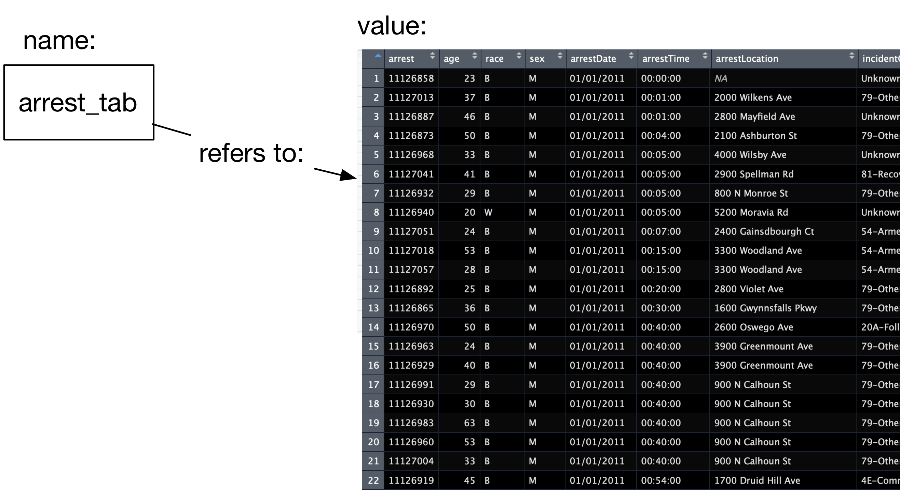

# Setting up the R Data Science Toolbox

Here we setup R, RStudio and anything else
we will use in the course.

## Some history

R is an offspring of S, a language created in AT&T Labs by John Chambers (now at Stanford) and others in 1976 with the goal of creating an environment for statistical computing and data analysis. The standard for the language in current use was settled in 1998. That same year, "S" won the ACM Software System award, awarded to software systems "that have a lasting influence, reflected in contributions to concepts, in commercial acceptance, or both".

In 1991, Robert Gentleman and Ross Ihaka created R to provide an open source implementation of the S language and environment. They also redesigned the language to enforce lexical scoping rules. It has been maintained by the R core group since 1997, and in 2015 an R consortium, including Microsoft, Google, and others, was created.

Along with Python it is one of the most popular environments for data analysis (e.g., figure below from [KDNuggets 2017 software survey](https://www.kdnuggets.com/2017/05/poll-analytics-data-science-machine-learning-software-leaders.html)


We use R for this class because we find that besides it being a state-of-the-art data analysis environment, it provides a clean end-to-end platform for teaching material across the data management-modeling-communication spectrum that we study in class. However, be aware that as you move on in the Data Science field you most likely will need to add Python to your toolbelt.

## Setting up R

R is a free, open source, environment for data analysis. It is available as a free binary download for Mac, Linux and Windows. For the more adventorous, it can also be compiled from source. To install R in your computer go to
https://cran.r-project.org/index.html and download and install the appropriate binary file.


This will install the base R system: the R programming language, a few packages for common data analyses and a development environment. 

## Setting up Rstudio

We will actually use Rstudio to interact with R. Rstudio is a very powerful application to make data analysis with R easier to do. To install go to https://www.rstudio.com/products/rstudio/download/ and download the appropriate version of Rstudio.


## A first look at Rstudio

Let's take a first look at Rstudio. The first thing you will notice is that Rstudio is divided into panes. Let's take a look first at the *Console*.

### Interactive Console

The most immediate way to interact with R is through the interactive console. Here we can write R instructions to perform our data analyses. We want to start using data so the first instructions we will look at deal with loading data.

When you installed R, a few illustrative datasets were installed as well. Let's take a look at the list of datasets you now have access to. Write the following command in the console

```{r, echo=FALSE, eval=FALSE}
data()
```


This will list names and descriptions of datasets available in your R installation. Let's try to find out more information about these datasets. In R, the first attempt to get help with something is to use the `?` operation. So, to get help about the `swiss` dataset we can enter the following in the console

```{r, echo=FALSE, eval=FALSE}
?swiss
```

This will make the documentation for the `swiss` dataset open in another pane.


**On your own:** Find more information about a different dataset using the `?` operator.

### Data Viewer

According to the documentation we just saw for `swiss`, this is a `data.frame` with 47 observations and 6 variables. The `data.frame` is the basic structure we will use to represent data throughout the course. We will see this again repeatedly, and use a couple of other names (e.g., `tibble`) to refer to this. Intuitively, you can think of the `data.frame` like a spreadsheet, with rows representing observations, and columns representing variables that describe those observations. Let's see what the `swiss` data looks like using the Rstudio data viewer.

```{r, echo=FALSE, eval=FALSE}
View(swiss)
```


The Data Viewer lets you reorder data by the values in a column. It also lets you filter rows of the data by values as well.

**On your own**: Use the Data Viewer to explore another of the datasets you saw listed before.

### Names, values and functions

Let's make a very short pause to talk about something you may have noticed. In the console, we've now written a few instructions, e.g. `View(swiss)`. Let's take a closer look at how these instructions are put together.

_expressions_: first of all, we call these instructions _expressions_, which are just text that R can evaluate into a value. `View(swiss)` is an expression.

_values_: so, what's a value? They are numbers, strings, data frames, etc. This is the data we will be working with. The number `2` is a value. So is the string `"Hector"`. 

So, what value is produced when R evaluates the expression `View(swiss)`? Nothing, which we also treat as a value. That wasn't very interesting, but it does have a side effect: it shows the `swiss` dataset in the Data viewer. 

How about a simpler expression: `swiss`, what value is produced when R evaluates the expression `swiss`? The data.frame containing that data. Try it out in the console.

_names_: so if `swiss` isn't a value, what is it? It is a _name_. We use these to refer to values. So, when we write the expression `swiss`, we tell R we want the _value_ referenced by the name `swiss`, that is, the data itself!



_functions_: Besides numbers, strings, data frames, etc. another important type of value is the _function_. Functions are a series of instructions that take some input value and produce a different value. The name `View` refers to the function that takes a data frame as input, and displays it in the Data viewer. Functions are called using the parentheses we saw before: `View(swiss)`, the parentheses say that you are passing input `swiss` to the function `View`. We'll see later how we can write our own functions.

### Plotting

Next, I want to show the _Plots_ pane in Rstudio. Let's make a plot using the `swiss` dataset:

```{R, echo=FALSE, eval=FALSE}
plot(swiss$Education, swiss$Fertility)
```


It's not pretty, but it was very easy to produce. There's a couple of things going on here...

- `plot` is a function, it takes two inputs, the data to put in the x and y axes, evaluates to nothing, but creates a plot of the data

- `swiss$Education` is how we refer to the `Education` column in the `swiss` data frame.

**On your own**: Make a plot using other variables in the `swiss` dataset. 

### Editor

So far, we've made some good progress: we know how to write expressions on the R console so that they are evaluated, we are starting to get a basic understanding of how these expressions are constructed, we can use the Data viewer to explore data frames, and made one plot that was displayed in the Plots pane. To finish this quick tour, I want to look at two more Rstudio panes: the file editor, and the File viewer.

As you have noticed, everytime we want to evaluate an expression on the console, we have to write it in. For example, if we want to change the plot we made above to include a different variable, we have to write the whole thing again. Also, what if I forgot what expression I used to make a specific plot? Even better, what if I wanted somebody else to make the plot I just made?

By far, one of the biggest advantages of using R over Excel or other similar programs, is that we can write expressions in scripts that are easy to share with others, making analyses easier to reproduce. Let's write a script that we can use to make the same plot we just made.

In the Rstudio menu select `File>New File>R Script`


This will open a tab in the File editor in which we can write expressions:


We can then evaluate the expressions in the file one at a time, or all at the same time.

We can then save these expressions in a script. In the Rstudio menu select `File>Save` and save as a text file. The convention is to use the `.R` or `.r` file extension, e.g., `swiss_plot.r`.

**On your own:** Add expressions for additional plots to the script and save again. Run the new expressions.

### Files viewer

Rstudio includes a Files viewer that you can use to find and load files. You can find the Files near the Plots viewer


## R packages

Another of R's advantages for data analysis is that it has attracted a large number of extremely useful additions provided by users worldwide. These are housed in [CRAN](https://cran.r-project.org/web/packages/index.html).

In this course we will make a lot of use of a set of packages bundled together into the `tidyverse` by Hadley Wickham and others. These packages make preparing, modeling and visualizing certain kinds data (which covers the vast majority of use cases) quite fun and pleasent. There is a webpage for the general tidyverse project: http://tidyverse.org, which includes pages for each of the packages included there. 

Let's install the `tidyverse` into your R environment. There are two ways of installing packages. In the console, you can use the expression:

```{r, echo=FALSE, eval=FALSE}
install.packages("tidyverse")
```

In Rstudio, you can use the _Packages_ tab:


**On your own:** Install the following additional packages which we will use later on: `rvest`, `stringr`, `nycflights13` and `broom`.

## Additional R resources

Resources for learning and reading about R are listed in our [here](http://www.hcbravo.org/IntroDataScience/resources/). Of note are the [swirl project](http://swirlstats.com/) and DataCamp's [introduction to R] course.

## Literate Programming

One last note before we get started. R has great support for [literate programming](http://en.wikipedia.org/wiki/Literate_programming), where source code that contains both code, the result of evaluating that code, and text explaining that code co-exist in a single document. This is extremely valuable in data analysis, as many choices made by data analysts are worth explaning in text, and interpretation of the results of analyses can co-exist with the computations used in that analysis. This document you are reading contains both text and code. In class, we will use [Rmarkdown](http://rmarkdown.rstudio.com/) for this purpose.

## Finishing your setup

Complete your exit ticket as instructed.


