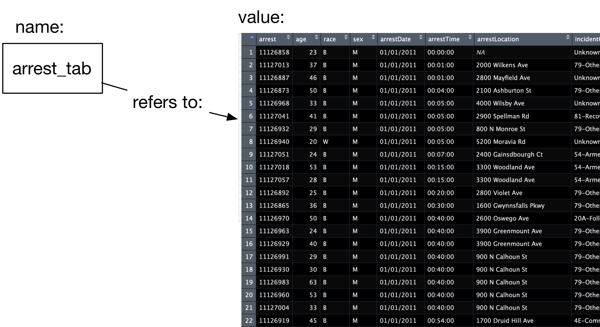

# (Part) Data representation modeling, ingestion and cleaning {-}

# Measurements and Data Types

```{r setup, echo=FALSE}
knitr::opts_chunk$set(cache=TRUE)
```

Now that we have our tools ready, let's start doing some analysis. First, let's go over some principles of R as a data analysis environment. R is a computational environment for data analysis. It is designed around a _functional_ language, as opposed to _procedural_ languages like Java or C, that has desirable properties for the type of operations and workflows that are frequently performed in the course of analyzing datasets. In this exercise we will start learning some of those desirable properties while performing an analysis of a real dataset.

## A data analysis to get us going

I'm going to do an analysis of Baltimore crime to guide our discussion of R. We'll use data downloaded from Baltimore City's awesome open data site (this was downloaded a couple of years ago so if you download now, you will get different results). 

The repository for this particular data is here. [https://data.baltimorecity.gov/Crime/BPD-Arrests/3i3v-ibrt](https://data.baltimorecity.gov/Crime/BPD-Arrests/3i3v-ibrt) 

## Getting data

We've prepared the data previously into a comma-separated value file (`.csv` file): each line contains attribute values (separated by commas) describing arrests in the City of Baltimore. The `read_csv` command is part of the `readr` R package and allows you to read a dataset stored in a csv file. This function is extremely versatile, and you can read more about it by using the standard help system in R: `?read_csv`. The result of running calling this function is the data itself, so, by running the function in the console, the result of the function is printed. 

**Note:** To download this dataset to follow along you can use the following code:

```{r, eval=FALSE}
if (!dir.exists("data")) dir.create("data")

download.file("https://github.com/hcorrada/IntroDataSci/raw/master/materials/lecture-notes/data/BPD_Arrests.csv", destfile="data/BPD_Arrests.csv")
```

To make use of this dataset we want to assign the result of calling `read_csv` (i.e., the dataset) to a variable:

```{r vars1, message=FALSE}
library(tidyverse)
arrest_tab <- read_csv("data/BPD_Arrests.csv")
arrest_tab
```

```{r echo=FALSE, eval=FALSE}
arrest_tab$race <- factor(arrest_tab$race)
arrest_tab$sex <- factor(arrest_tab$sex)
arrest_tab$incidentOffense <- factor(arrest_tab$incidentOffense)
```

Now we can ask what _type_ of value is stored in the `arrest_tab` variable:

```{r type}
class(arrest_tab)
```

The `data.frame` is a workhorse data structure in R. It encapsulates the idea of _entities_ (in rows) and _attribute values_ (in columns). We call these _rectangular datasets_. The other types `tbl_df` and `tbl` are added by `tidyverse` for improved functionality.

We can ask other features of this dataset:

```{r questions}
# This is a comment in R, by the way

# How many rows (entities) does this dataset contain?
nrow(arrest_tab)

# How many columns (attributes)?
ncol(arrest_tab)

# What are the names of those columns?
colnames(arrest_tab)
```

Now, in Rstudio you can view the data frame using `View(arrest_tab)`.

### Names, values and functions

Let's review the concepts of names values and functions again. In the console, we've now written a few instructions, e.g. `View(arrest_tab)`. Let's take a closer look at how these instructions are put together.

**_expressions_**: first of all, we call these instructions _expressions_, which are just text that R can evaluate into a value. `View(arrest_tab)` is an expression.

**_values_**: so, what's a value? They are numbers, strings, data frames, etc. This is the data we will be working with. The number `2` is a value. So is the string `"Hector"`. 

So, what value is produced when R evaluates the expression `View(arrest_tab)`? Nothing, which we also treat as a value. That wasn't very interesting, but it does have a side effect: it shows the `arrest_tab` dataset in the Data viewer. 

How about a simpler expression: `arrest_tab`, what value is produced when R evaluates the expression `arrest_tab`? The data.frame containing that data. Try it out in the console.

**_names_**: so if `arrest_tab` isn't a value, what is it? It is a _name_. We use these to refer to values. So, when we write the expression `arrest_tab`, we tell R we want the _value_ referenced by the name `arrest_tab`, that is, the data itself!



**_functions_**: Besides numbers, strings, data frames, etc. another important type of value is the _function_. Functions are a series of instructions that take some input value and produce a different value. The name `View` refers to the function that takes a data frame as input, and displays it in the Data viewer. Functions are called using the parentheses we saw before: `View(arrest_tab)`, the parentheses say that you are passing input `arrest_tab` to the function `View`. We'll see later how we can write our own functions.

## Entities and attributes

As a reminder, we are using the term _entities_ to refer to the objects to which data in a dataset refers to. For instance, in our example dataset, each arrest is an _entity_. In a rectangular dataset (a data frame) this corresponds to rows in a table. We then say that a dataset contains _attributes_ for each entity. For instance, attributes of each arrest would be the person's _age_, the type of offense, the location, etc. In a rectangular dataset, this corresponds to the columns in a table.

This language of _entities_ and _attributes_ is commonly used in the database literature. In statistics you may see _experimental units_ or _samples_ for _entities_ and _covariates_ for _attributes_. In other instances _observations_ for _entities_ and _variables_ for _attributes_. In Machine Learning you may see _example_ for _entities_ and _features_ for _attributes_. For the most part, all of these are exchangable. This table summarizes the terminology:

| Field | Entities | Attributes |
|-------|----------|------------|
| Databases | Entities | Attributes |
| Machine Learning | Examples | Features |
| Statistics | Observations/Samples | Variables/Covariates |


This chapter is concerned with the types of data we may encounter as _attributes_ in data analyses.

## Categorical attributes

A categorical attribute for a given entity can take only one of a finite set of examples. For example, the `sex` variable can only have value `M`, `F`, or `` (we'll talk about missing data later in the semester).

```{r}
table(arrest_tab$sex)
```

The result of a coin flip is categorical: `heads` or `tails`. The outcome of rolling an 8-sided die is categorical: `one`, `two`, ..., `eight`. Can you think of other examples?

Categorical data may be _unordered_ or _ordered_. In our example dataset all categorical data is _unordered_, e.g., `sex`, `race`, etc. Examples of _ordered categorical data_ are grades in a class, Likert scale categories, e.g., `strongly agree`, `agree`, `neutral`, `disagree`, `strongly disagree`, etc. 

### Factors in R

We said that R is designed for data analysis. My favorite example of how that manifests itself is the `factor` datatype. If you look at your dataset now, `arrest_tab$sex` is a vector of strings:

```{r}
class(arrest_tab$sex)
summary(arrest_tab$sex)
```

However, as a measurement, or attribute, it should only take one of two values (or three depending on how you record missing, unknown or unspecified). So, in R, that categorical data type is called a _factor_. Notice what the `summary` function does after turning the `sex` attribute into a _factor_:

```{r}
arrest_tab$sex <- factor(arrest_tab$sex)
summary(arrest_tab$sex)
```

This distinction shows up in many other places where functions have different behavior when called on different types of values.
The possible values a _factor_ can take are called _levels_:

```{r}
levels(arrest_tab$sex)
```

Exercise: you should transform the `race` attribute into a factor as well. How many levels does it have?

## Discrete numeric attributes

These are attributes that can take specific values from elements of ordered, discrete (possibly infinite) sets. The most common set in this case would be the non-negative positive integers. This data is commonly the result of counting processes. In our example dataset, age, measured in years, is a discrete attribute.

Frequently, we obtain datasets as the result of summarizing, or aggregating other underlying data. In our case, we could construct a new dataset containing the number of arrests per neighborhood (we will see how to do this later) 

```{r, echo=FALSE}
library(dplyr)
arrest_tab %>%
  group_by(neighborhood) %>%
  summarize(number_of_arrests=n()) %>%
  head()
```

In this new dataset, the _entities_ are each neighborhood, the `number_of_arrests` attribute is a _discrete numeric_ attribute.

Other examples: the number of students in a class is discrete, the number of friends for a specific Facebook user. Can you think of other examples?

Distinctions between ordered categorical and discrete numerical data is that ordered categorical data do not have magnitude. For instance, is an 'A' in a class twice as good as a 'C'? Is a 'C' twice as good as a 'D'? Not necessarily. Grades don't have an inherent magnitude. However, if we _encode_ grades as 'F=0,D=1,C=2,B=3,A=4', etc. they do have magnitude. In that case, an 'A' _is_ twice as good as a 'C', and a 'C' _is_ twice as good as a 'D'. So in summary, if ordered data has magnitude, then _discrete numeric_ if not, _ordered categorical_.


## Continuous numeric data

These are attributes that can take any value in a continuous set. For example, a person's height, in say inches, can take any number (within the range of human heights). Here is another dataset we can use to look at this datatype. In this case, entities are cars and we look at continuous numeric attributes `speed` and `stopping distance`:

```{r f04_cars_plot, echo=FALSE}
data(cars)
cars %>%
  ggplot(aes(x=speed, y=dist)) +
    geom_point(size=3) +
    theme_bw() +
    labs(x="speed (mph)", y="stopping distance (ft)")
#plot(cars$speed, cars$dist, pch=19, xlab="speed (mph)", #ylab="stopping distance (ft)")
```

The distinction between continuous and discrete is a bit tricky since measurements that have finite precision are, in a sense, discrete. Remember, however, that continuity is not a property of the specific dataset you have in hand, but rather of the process you are measuring. The number of arrests in a neighborhood cannot, in principle, be fractional, regardless of the precision at which we measure this. If we had the appropriate tool, we could measure a person's height with infinite precision. This distinction is very important when we build statistical models of datasets for analysis. For now, think of discrete data as the result of counting, and continuous data the result of some physical measurement.

## Other examples

Consider a dataset of images like the super-famous [MNIST dataset of handwritten digits](https://www.kaggle.com/c/digit-recognizer). This dataset contains images of handwritten digits. So each image is an _entity_. Each image has a _label_ attribute which states which of the digits 0,1,...9 is represented by the image. What type of data is this (categorical, continuous numeric, or discrete numeric)? 

Now, each image is represented by grayscale values in a 28x28 grid. That's 784 attributes, one for each square in the grid, containing a grayscale value. Now what type of data are these other 784 attributes?

## Other important datatypes

The three datatypes we saw above encompass a fairly large swath of data you will come across. Our arrest dataset contains other important datatypes that we will run across frequently:

- Text: Arbitrary strings that do not encode a categorical attribute.
- Datetime: Date and time of some event or observation (e.g., `arrestDate`, `arrestTime`)  
- Geolocation: Latitude and Longitude of some event or observation (e.g., `Location.`)  

## Units

Something that we tend to forget but is **extremely** important for the modeling and interpretation of data is that attributes are for the most part _measurements_ and that they have _units_. For example, age of a person can be measured in different units: _years_, _months_, etc. These can be converted to one another, but nonetheless in a given dataset, that _attribute_ or measurement will be recorded in some specific units. Similar arguments go for distances and times, for example. In other cases, we may have unitless measurements (we will see later an example of this when we do _dimensionality reduction_). In these cases, it is worth thinking about _why_ your measurements are unit-less.

When performing analyses that try to summarize the effect of some measurement or attribute on another, units matter a lot! We will see the importance of this in our _regression_ section. For now, make sure you make a mental note of units for each measurement you come across. This will force you to think about where and how your data was obtained, which will become very important when modeling and interpreting the results of these models. 

