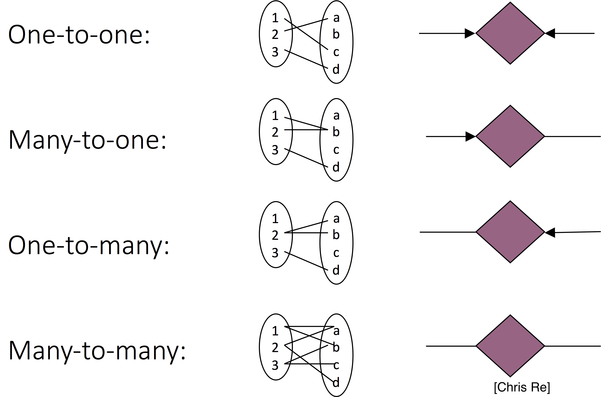
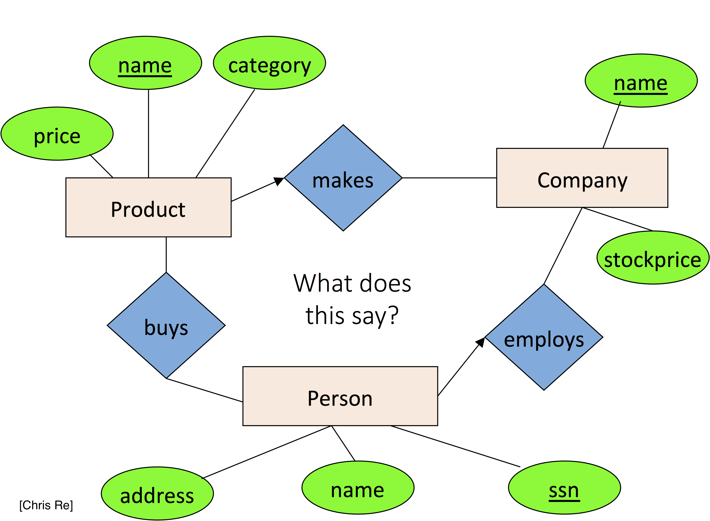
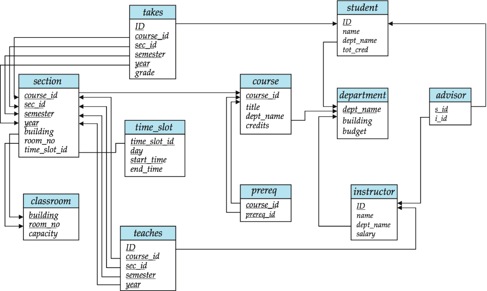

# Tidy Data I: The ER Model

```{r setup10, include=FALSE}
knitr::opts_chunk$set(echo = TRUE, cache=TRUE)
```


Some of this material is based on Amol Deshpande's material: [https://github.com/umddb/datascience-fall14/blob/master/lecture-notes/models.md](https://github.com/umddb/datascience-fall14/blob/master/lecture-notes/models.md)

## Overview

In this section we will discuss principles of preparing and organizing data in a way that is amenable for analysis, both in modeling and visualization. We think of a _data model_ as a collection of concepts that describes how data is represented and accessed. Thinking abstractly of data structure, beyond a specific implementation, makes it easier to share data across programs and systems, and integrate data from different sources.

Once we have thought about structure, we can then think about _semantics_: what does data represent? 

- **Structure**: We have assumed that data is organized in rectangular data structures (tables with rows and columns)
- **Semantics**: We have discussed the notion of _values_, _attributes_, and _entities_. 

So far, we have used the following _data semantics_: a dataset is a collection of _values_, numeric or categorical, organized into _entities_ (_observations_) and _attributes_ (_variables_). Each _attribute_ contains values of a specific measurement across _entities_, and _entities_ collect all measurements across _attributes_. 

In the database literature, we call this exercise of defining structure and semantics as _data modeling_. In this course we use the term _data representational modeling_, to distinguish from _data statistical modeling_. The context should be sufficient to distinguish the two uses of the term _data modeling_.

Data representational modeling is the process of representing/capturing structure in data based on defining:

- **Data model**: A collection of concepts that describes how data is represented and accessed  
- **Schema**: A description of a specific collection of data, using a given data model  
    
The purpose of defining abstract data representation models is that it allows us to
know the structure of the data/information (to some extent) and thus be able to write general purpose code. Lack of a data model makes it difficult to share data across programs, organizations, systems that need to be able to integrate information from multiple sources. We can also design algorithms and code that can significantly increase efficiency if we can assume general data structure. For instance, we can preprocess data to make access efficient (e.g., building a B-Tree on a field).

A data model typically consists of:

- Modeling Constructs: A collection of concepts used to represent the structure in the data. Typically we need to represent types of *entities*, their *attributes*, types of *relationships* between *entities*, and *relationship attributes*  
- Integrity Constraints: Constraints to ensure data integrity (i.e., avoid errors)  
- Manipulation Languages: Constructs for manipulating the data  
    
We desire that models are sufficiently _expressive_ so they can capture real-world data well, _easy to use_, and lend themselves to defining computational methods that have good performance.

Some examples of data models are

- Relational, Entity-relationship model, XML...
- Object-oriented, Object-relational, RDF...
- Current favorites in the industry: JSON, Protocol Buffers, [Avro](http://avro.apache.org/docs/current/), Thrift, Property Graph

Why have so many models been defined? There is an inherent tension between descriptive power and ease of use/efficiency. More powerful, expressive, models can be applied to represent more datasets but also tend to be harder to use and query efficiently.

Typically there are multiple levels of modeling. _Physical modeling_ concerns itself with how the data is physically stored. _Logical or Conceptual modeling_ concerns itself with type of information stored, the different entities, their attributes, and the relationships among those. There may be several layers of logical/conceptual models to restrict the information flow (for security and/or ease-of-use):

- **Data independence:** The idea that you can change the representation of data w/o changing programs that operate on it.  
- **Physical data independence:** I can change the layout of data on disk and my programs won't change
    - index the data
    - partition/distribute/replicate the data
    - compress the data
    - sort the data

## The Entity-Relationship and Relational Models

The fundamental objects in this formalism are _entities_ and their _attributes_, as we have seen before, and _relationships_ and _relationship attributes_ which we saw briefly in a previous example, where 'rankings' and 'songs' are distinct types of entities and we define _relationships_ between them.


Here, rectangles are _entitites_, diamonds and edges indicate _relationships_. Circles describe either entity or relationship _attributes_. Arrows are used indicate multiplicity of relationships (one-to-one, many-to-one, one-to-many, many-to-many):



Think about what relationships are shown in this diagram?



In databases and general datasets we work on, both Entities and Relationships are represented as _Relations_ (tables) such that a unique entity/relationship is represented by a single row. This leads to the natural question of how are unique entities determined or defined. Here is where the concept of a _key_ comes in. This is an essential aspect of the Entity-Relationship and Relational models. 

### Formal introduction to keys



- Attribute set $K$ is a **superkey** of relation $R$ if values for $K$ are sufficient to identify a unique tuple of each possible relation $r(R)$ 
    - Example:  `{ID}` and `{ID,name}` are both superkeys of *instructor*
- Superkey $K$ is a **candidate key** if $K$ is minimal
    - Example:  `{ID}` is a candidate key for Instructor
- One of the candidate keys is selected to be the **primary key**
    - Typically one that is small and immutable (doesn’t change often)
    - Primary key typically highlighted 
- **Foreign key**: Primary key of a relation that appears in another relation
    - `{ID}` from *student* appears in *takes, advisor*
    - *student* called referenced relation
    - *takes* is the referencing relation 
    - Typically shown by an arrow from referencing to referenced
- **Foreign key constraint**: the tuple corresponding to that primary key must exist
    - Imagine:
        - Tuple: `('student101', 'CMSC302') `in *takes*
        - But no tuple corresponding to 'student101' in *student*
    - Also called referential integrity constraint

#### Keys: Examples

- Married(person1-ssn, person2-ssn, date-married, date-divorced)
- Account(cust-ssn, account-number, cust-name, balance, cust-address)
- RA(student-id, project-id, superviser-id, appt-time, appt-start-date, appt-end-date)
- Person(Name, DOB, Born, Education, Religion, ...)
    - Information typically found on Wikipedia Pages
- President(name, start-date, end-date, vice-president, preceded-by, succeeded-by)
    - Info listed on Wikipedia page summary
- Rider(Name, Born, Team-name, Coach, Sponsor, Year)
    - Tour de France: Historical Rider Participation Information  

## Tidy Data

Later in the course we will use the term Tidy Data to refer to datasets that are represented in a form that is amenable for manipulation and statistical modeling. It is very closely related to the concept of _normal forms_ in the ER model and the process of _normalization_ in the database literature.

Here we assume we are working in the ER data model represented as _relations_: rectangular data structures where

1. Each attribute (or variable) forms a column  
2. Each entity (or observation) forms a row  
3. Each type of entity (observational unit) forms a table  

Here is an example of a tidy dataset: 

```{r}
library(nycflights13)
head(flights)
```

it has one entity per row, a single attribute per column. Notice only information about flights are included here (e.g., no airport or airline information other than the name) in these observations.

