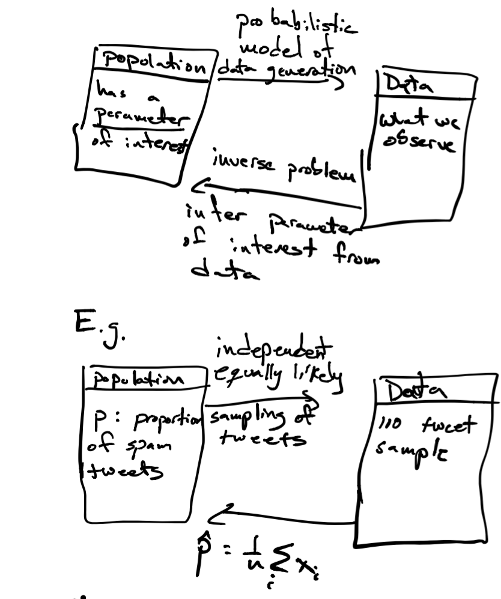
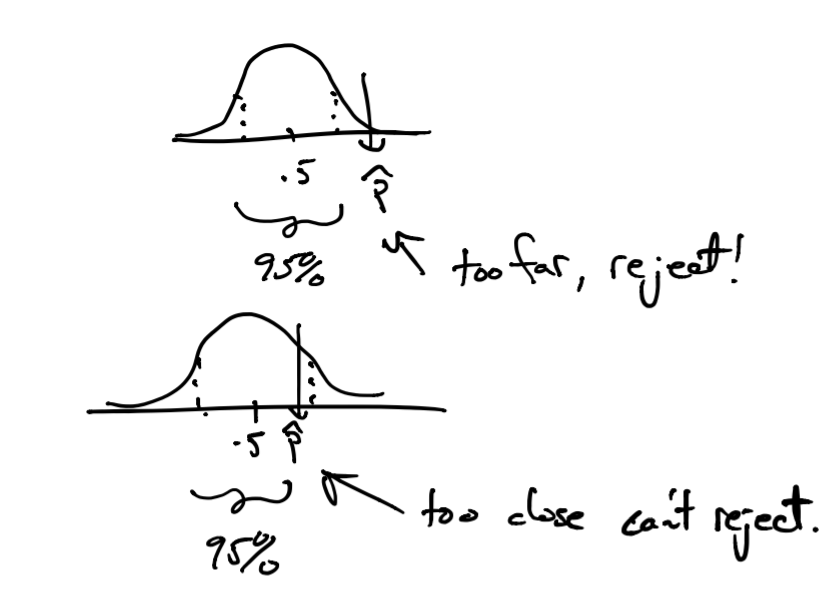

# Experiment design and hypothesis testing

In this section we see one instance in which we can apply the CLT in data analysis.

## Inference

One way to think about how we use probability in data analysis (statistical and machine learning) is like this:



The LLN tells us that our parameter $\hat{p}$ will be close to $p$ on average, the CLT lets us answer how confident are we that we found $p$. We do this by constructing a _confidence interval_ as follows. Since $\hat{p} \sim N(p,\frac{\sqrt{p(1-p)}}{\sqrt{n}})$, we want to find an interval $[\hat{p}_{-}, \hat{p}_{+}]$, with $\hat{p}$ at its center, with 95% of the probability specified by the CLT. Why? In that case, there is 95% that the value of parameter $p$ will be within that interval.

Now, how do we calculate this interval, since we want the interval to contain 95% of the probability? The probability for the tails (values outside this interval) will be $(1-.95)/2$ (since there are two tails). 
So, the lower value of the interval will be one where the normal probability distribution (with mean $\hat{p}$ and standard deviation $\frac{\sqrt{\hat{p}(1-\hat{p})}}{\sqrt{n}}$) is such that $P(Y \leq \hat{p}_{-}) = .05/2$, which we can calculate using the function `qnorm` function in R: 

$$
\begin{align}
\hat{p}_{-} & = \mathtt{qnorm}(.05/2, \hat{p}, \frac{\sqrt{\hat{p}(1-\hat{p})}}{\sqrt{n}}) \\
{} & = \hat{p} + \mathtt{qnorm}(.05/2,0, \frac{\sqrt{\hat{p}(1-\hat{p})}}{\sqrt{n}})
\end{align}
$$

The upper value of the interval is computed with probability $1-(.05/2)$, which by the symmetry of the normal distribution is given by $\hat{p}_{+} = \hat{p} + -\mathtt{qnorm}(.05/2,0, \frac{\sqrt{\hat{p}(1-\hat{p})}}{\sqrt{n}})$.

Let's see how these intervals look for our twitter bot example:

```{r, message=FALSE}
library(dplyr)

get_estimate <- function(n, p=0.7) mean(sample(c(0,1), size=n, replace=TRUE, prob=c(1-p,p)))

set.seed(1)
# let's construct confidence intervals for samples of size n=10,100,500,1000,10000
tab <- data.frame(sample_size=c(10,100,500,1000,10000)) %>%
  mutate(phat = sapply(sample_size,get_estimate)) %>%
  mutate(se = sqrt(phat*(1-phat)) / sqrt(sample_size)) %>%
  mutate(lower = phat + qnorm(.05/2, sd=se)) %>%
  mutate(upper = phat + -qnorm(.05/2, sd=se))

knitr::kable(tab)
```

For our sample of $n=500$, we would say that our estimate of $p$ is $`r round(tab$phat[3],2)` \pm `r round(qnorm(.05/2,sd=tab$se[3]),2)`$. A compact way of writing that is that our estimate of $p$ is ${}_{`r round(tab$lower[3],2)`}`r round(tab$phat[3],2)`_{`r round(tab$upper[3],2)`}$.  

### Hypothesis testing

How else is this framework useful? Suppose that before I sampled tweets I thought (hypothesized) that more than 50% of tweets are bot-generated. One way very popular way of thinking about this problem is to reject the hypothesis that this is not the case. In this, case we have a _null_ hypothesis that 50% or less of tweets are bot-generated), against an _alternative_ hypothesis that more than 50% of tweets are bot-generated. You will see this written in statistics textbooks as:

$$
\begin{align}
H_0: \, & p <= .5 & \textrm{(null)} \\
H_1: \, & p > .5 & \textrm{(alternative)}
\end{align}
$$

Note: this is a _one-sided_ test vs. a _two-sided_ test where the null hypothesis is that $p=.5$ and the alternative is $p \neq .5$. According to the CLT, estimates $\hat{p}$ of $p$ from $n$ samples would be distributed as $N(.5, \frac{\sqrt{.5(1-.5)}}{\sqrt{n}})$ (we use $p=.5$ as this is the worst case for the hypothesis we want to test).

Once we do have our sample of $n$ tweets we can get an estimate $\hat{p}$ as we did before. If we see that $\hat{p}$ (sample mean from our sample of tweets) is _too far_ from $p=.5$ then we could reject the _null_ hypothesis since the estimate we derived from the data we have is not statistically consistent with the _null_ hypothesis. Now, how do we say our estimate $\hat{p}$ is too far? Here, we use the probability model given by the CLT. If $P(Y \geq \hat{p}) \geq .95$ under the null model (of $p=.5$), we say it is too far and we reject.



This 95% rejection threshold is conservative, but somewhat arbitrary. So we use one more metric, $P(|Y| \geq \hat{p})$ (the infamous p-value) to say: we could reject this hypothesis for all thresholds greater than this p-value.

Let's see how testing the hypothesis $p > .5$ would look like for our tweet example

```{r}
tab <- tab %>%
  mutate(p_value = 1-pnorm(phat, mean=.5, sd=se))
knitr::kable(tab)
```

Notice that rejection occurs when the parameter value for the null hypothesis $p=.5$ is outside the 95% confidence interval. Another note, these results hold for $n$ sufficiently large that the normal distribution in the CLT provides a good approximation of the distribution of estimates $\hat{p}$. In cases where $n$ is smaller, the $t$-distribution, as opposed to the normal distribution, provides a better approximation of the distribution of estimates $\hat{p}$. In that case, instead of using `pnorm` in the calculations above, we would use `pt` (for $t$-distribution) and the testing procedure above is referred to as a $t$-test (one-sided or two-sided as above). Now, as $n$ grows, the $t$-distribution approaches a normal distribution which is why analysts use the $t$-test regularly.  

## A/B Testing

A classic experimental design where hypothesis testing is commonly used in A/B testing. Here we are interested in seeing if proposed changes to a webpage has a desired effect. For example, we would like to know if page visitors follow a link more often after a page redesign.  


Here we have two estimates $\hat{p}_A$ and $\hat{p}_B$, the proportion of clicks for design A and B respectively. The null hypothesis we would test is that _there is no difference in proportions_ between the two designs. Mathematically, we would like to know "What is the probability that we observe a difference in proportions this large under the null hypothesis". We will work this out as a homework exercise.

## Summary

**Inference**: estimate parameter from data based on assumed probability model (for example, matching expectation. We'll see later another method called maximum likelihood).

For _averages_ the LLN and CLT tells us how to compute probabilities from a single parameter estimate, that is, derived from one dataset of samples. With these probabilities we can construct confidence intervals for our estimate.

**Testing**: Having a hypothesis about our parameter of interest, we can use probability _under this hypothesis_ to see how statistically consistent our data is with that hypothesis, and reject the hypothesis if data is not statistically consistent enough (again using probability from CLT when dealing with averages).

## Probability Distributions

In this example we saw three distributions:

### Bernoulli

Notation: $X \sim \mathrm{Bernoulli}(p)$.  
Values: $X \in \{0,1\}$  
Parameter: $p$, $p(X=1)=p$ (probability of success).  
Expected Value: $\mathbb{E} X = p$  
Variance: $\mathrm{var}(X) = p(1-p)$.

We can write the probability mass function as 

$$
p(X=x)=p^x(1-p)^{(1-x)}
$$

### Binomial

This corresponds to the number of $1$'s in a draw of $n$ independent $\mathrm{Bernoulli}(p)$ random variables.

Notation: $X \sim \mathrm{Bin(n,p)}$.  
Values: $X \in 0,1,2,\ldots,n$  
Parameters: $p$ (probability of success), $n$ number of Bernoulli draws  
Expected Value: $\mathbb{E} X=np$  
Variance: $\mathrm{var}(X) = np(1-p)$

Here the probability mass function is a little more complicated since we have many different ways in which $n$ draws of independent Bernoulli random variables result in the same number of successess 

$$
p(X=k) = \binom{n}{k} p^k(1-p)^{n-k}
$$

### Normal (Gaussian) distribution

Notation: $X \sim N(\mu,\sigma)$  
Values: $X \in \mathbb{R}$  
Parameters: mean $\mu$, standard deviation $\sigma$  
Expected Value: $\mathbb{E} X = \mu$  
Variance: $\mathrm{var}(X) = \sigma^2$

The probability density function was given above.

A useful reference for probability distributions can be found here: [https://blog.cloudera.com/blog/2015/12/common-probability-distributions-the-data-scientists-crib-sheet/](https://blog.cloudera.com/blog/2015/12/common-probability-distributions-the-data-scientists-crib-sheet/)

### Distributions in R

For a majority of common distributions, R has the so-called `d,p,q,r` family of functions:

| function | use |
|----------|-----|
| `d` | probability density (or mass) function |
| `p` | cumulative probability function |
| `q` | quantile function |
| `r` | random value generator |

For example, to use these for the Binomial distribution:

```{r, eval=FALSE}
# using n=10, p=.3

# compute probability mass function value for k=4 successess
dbinom(4, n=10, p=.3)

# compute cumulative probability function for k=4 successess
pbinom(4, n=10, p=.3)

# compute the number of success corresponding to the .80th quantile
qbinom(.8, n=10, p=.3)

# generate a random value k
rbinom(1, n=10, p=.3)
```

