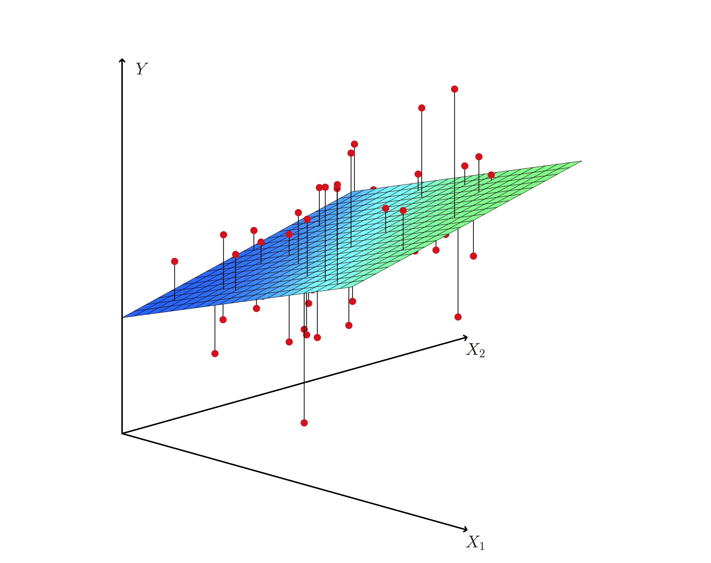

# Linear Regression

```{r regression_setup, include=FALSE}
knitr::opts_chunk$set(echo = TRUE)
```

Linear regression is a very elegant, simple, powerful and commonly used technique for data analysis. We use it extensively in exploratory data analysis (we used in project 2, for example) and in statistical analyses since it fits into the statistical framework we saw in the last unit, and thus lets us do things like construct confidence intervals and hypothesis testing for relationships between variables. It also provides predictions for continuous outcomes of interest.

Note: Much of this development is based on "Introduction to Statistical Learning" by James, Witten, Hastie and Tibshirani. http://www-bcf.usc.edu/~gareth/ISL/

## Simple Regression

Let's start with the simplest linear model. The goal here is to analyze the relationship between a _continuous numerical_ variable $Y$ and another (_numerical_ or _categorical_) variable $X$. We assume that in our population of interest the relationship between the two is given by a linear function:

$$
Y = \beta_0 + \beta_1 X
$$

Here is (simulated) data from an advertising campaign measuring sales and the amount spent in advertising. We think that sales are related to the amount of money spent on TV advertising:

$$
\mathtt{sales} \approx \beta_0 + \beta_1 \times \mathtt{TV}
$$


Given this data, we would say that we _regress_ `sales` on `TV` when we perform this regression analysis. As before, given data we would like to estimate what this relationship is in the _population_ (what is the population in this case?). What do we need to estimate in this case? Values for $\beta_0$ and $\beta_1$. What is the criteria that we use to estimate them?

Just like the previous unit we need to setup an _inverse problem_. What we are stating mathematically in the linear regression problem is that the _conditional expectation_ (or conditional mean, conditional average) of $Y$ given $X=x$ is defined by this linear relationship:

$$
\mathbb{E}[Y|X=x] = \beta_0 + \beta_1 x
$$


Given a dataset, the inverse problem is then to find the values of $\beta_0$ and $\beta_1$ that minimize deviation between data and expectation, and again use squared devation to do this.

**The linear regression problem**

Given data $(x_1, y_1), (x_2, y_2), \ldots, (x_n, y_n)$, find values $\beta_0$ and $\beta_1$ that minimize _objective_ or _loss_ function RSS (residual sum of squares):

$$
\arg \min_{\beta_0,\beta_1} RSS = \frac{1}{2} \sum_i (y_i - (\beta_0 + \beta_1 x_i))^2
$$


Similar to what we did with the derivation of the mean as a measure of central tendency we can derive the values of minimizers$\hat{\beta}_0$ and $\hat{\beta}_1$. We use the same principle, compute derivatives (partial this time) of the objective function RSS, set to zero and solve to obtain:

$$
\begin{aligned}
\hat{\beta}_1 & = \frac{\sum_{i=1}^n (y_i - \overline{y})(x_i - \overline{x})}{\sum_{i=1}^n (x_i - \overline{x})^2} \\
{} & = \frac{\mathrm{cov}(y,x)}{\mathrm{var}(x)} \\
\hat{\beta}_0 & = \overline{y} - \hat{\beta}_1 \overline{x} 
\end{aligned}
$$

Let's take a look at some data. Here is data measuring characteristics of cars, including horsepower, weight, displacement, miles per gallon. Let's see how well a linear model captures the relationship between miles per gallon and weight

```{r, warning=FALSE, message=FALSE}
library(ISLR)
library(tidyverse)

data(Auto)

Auto %>%
  ggplot(aes(x=weight, y=mpg)) +
    geom_point() + 
    geom_smooth(method=lm) + 
    theme_minimal()
```

In R, linear models are built using the `lm` function

```{r}
auto_fit <- lm(mpg~weight, data=Auto)
auto_fit
```

This states that for this dataset $\hat{\beta}_0 = `r auto_fit$coef[1]`$ and $\hat{\beta}_1 = `r auto_fit$coef[2]`$. What's the interpretation? According to this model, a weightless car `weight=0` would run $\approx `r round(auto_fit$coef[1], 2)`$ _miles per gallon_ on average, and, on average, a car would run $\approx `r -round(auto_fit$coef[2],2)`$ _miles per gallon_ fewer for every extra _pound_ of weight. Note, that the units of the outcome $Y$ and the predictor $X$ matter for the interpretation of these values.

## Inference

As we saw in the last unit, now that we have an estimate, we want to know its precision. We will see that similar arguments based on the CLT hold again. The main point is to understand that like the sample mean, the regression line we learn from a specific dataset is an estimate. A different sample from the same population would give us a different estimate (regression line). But, the CLT tells us that, on average, we are close to population regression line (I.e., close to $\beta_0$ and $\beta_1$), that the spread around $\beta_0$ and $\beta_1$ is well approximated by a normal distribution and that the spread goes to zero as the sample size increases.


### Confidence Interval

Using the same framework as before, we can construct a confidence interval to say how precise we think our estimates of the population regression line is. In particular, we want to see how precise our estimate of $\beta_1$ is, since that captures the relationship between the two variables. We again, use a similar framework. First, we calculate a standard error estimate for $\beta_1$:

$$
\mathrm{se}(\hat{beta}_1)^2 = \frac{\sum_i (y_i - \hat{y}_i)^2}{\sum_i (x_i - \overline{x})^2}
$$

and construct a 95% confidence interval

$$
\beta_1 = \hat{\beta}_1 \pm 1.95 \times \mathrm{se}(\hat{beta}_1)
$$

Note, $\hat{y}_i = \hat{\beta}_0 + \hat{\beta}_1 x_i$. Going back to our example:

```{r}
auto_fit_stats <- auto_fit %>%
  tidy() %>%
  select(term, estimate, std.error)
auto_fit_stats
```

This `tidy` function is defined by the `broom` package, which is very handy to manipulate the result of learning models in a consistent manner. The `select` call removes some extra information that we will discuss shortly.

```{r}
confidence_interval_offset <- 1.95 * auto_fit_stats$std.error[2]
confidence_interval <- round(c(auto_fit_stats$estimate[2] - confidence_interval_offset,
                               auto_fit_stats$estimate[2],
                               auto_fit_stats$estimate[2] + confidence_interval_offset), 4)
```

Given the confidence interval, we would say, "on average, a car runs $_{`r confidence_interval[1]`} `r confidence_interval[2]`_{`r confidence_interval[3]`}$ _miles per gallon_ fewer per pound of weight.

### The $t$-statistic and the $t$-distribution

As in the previous unit, we can also test a null hypothesis about this relationship: "there is no relationship between weight and miles per gallon", which translates to $\beta_1=0$. Again, using the same argument based on the CLT, if this hypothesis is true then the distribution of $\hat{\beta}_1$ is well approximated by $N(0,\mathrm{se}(\hat{\beta}_1))$, and if we observe the learned $\hat{\beta}_1$ is _too far_ from 0 according to this distribution then we _reject_ the hypothesis.

Now, there is a technicality here that we did not discuss in the previous unit that is worth paying attention to. We saw before that the CLT states that the normal approximation is good as sample size increases, but what about moderate sample sizes (say, less than 100)? The $t$ distribution provides a better approximation of the sampling distribution of these estimates for moderate sample sizes, and it tends to the normal distribution as sample size increases.

The $t$ distribution is commonly used in this testing situation to obtain the probability of rejecting the null hypothesis. It is based on the $t$-statistic

$$
\frac{\hat{\beta}_1}{\mathrm{se}(\hat{\beta}_1)}
$$

You can think of this as a _signal-to-noise_ ratio, or a standardizing transformation on the estimated parameter. Under the null hypothesis, the $t$-statistic is well approximated by a $t$-distribution with $n-2$ _degrees of freedom_ (we will get back to _degrees of freedom_ shortly). Like other distributions, you can compute with the $t$-distribution using the `p,d,q,r`-family of functions, e.g., `pt` is the cumulative probability distribution function.

In our example, we get a $t$ statistic and P-value as follows:

```{r}
auto_fit_stats <- auto_fit %>%
  tidy()
auto_fit_stats
```

We would say: "We found a statistically significant relationship between weight and miles per gallon. On average, a car runs $_{`r confidence_interval[1]`} `r confidence_interval[2]`_{`r confidence_interval[3]`}$ _miles per gallon_ fewer per pound of weight ($t$=`r round(auto_fit_stats$statistic[2],2)`, $p$-value<`r auto_fit_stats$p.value[2]`$)."

### Global Fit

Now, notice that we can make _predictions_ based on our conditional expectation, and that prediction should be better than a prediction with a simple average. We can use this comparison as a measure of how good of a job we are doing using our model to fit this data: how much of the variance of $Y$ can we _explain_ with our model. To do this we can calculate _total sum of squares_: 

$$
TSS = \sum_i (y_i - \overline{y})^2
$$

(this is the squared error of a prediction using the sample mean of $Y$)

and the _residual sum of squares_:

$$
RSS = \sum_i (y_i - \hat{y}_i)^2
$$

(which is the squared error of a prediction using the linear model we learned)

The commonly used $R^2$ measure comparse these two quantities:

$$
R^2 = \frac{\mathrm{TSS}-\mathrm{RSS}}{\mathrm{TSS}} = 1 - \frac{\mathrm{RSS}}{\mathrm{TSS}}
$$

These types of global statistics for the linear model can be obtained using the `glance` function in the `broom` package. In our example

```{r}
auto_fit %>%
  glance() %>%
  select(r.squared, sigma, statistic, df, p.value)
```

We will explain the the columns `statistic`, `df` and `p.value` when we discuss regression using more than a single predictor $X$.

## Some important technicalities

We mentioned above that predictor $X$ could be _numeric_ or _categorical_. However, this is not precisely true. We can use a transformation to represent _categorical_ variables. Here is a simple example:

Suppose we have a categorical variable `sex` with values `female` and `male`, and we want to show the relationship between, say `credit card balance` and `sex`. We can create a dummy variable $x$ as follows:

$$
x_i = \left\{
\begin{aligned}
1 & \textrm{ if female} \\
0 & \textrm{o.w.}
\end{aligned}
\right.
$$

and fit a model $y = \beta_0 + \beta_1 x$. What is the conditional expectation given by this model? If the person is male, then $y=\beta_0$, if the person is female, then $y=\beta_0 + \beta_1$. So, what is the interpretation of $\beta_1$? The average difference in credit card balance between females and males.

We could do a different encoding:

$$
x_i = \left\{
\begin{aligned}
+1 & \textrm{ if female} \\
-1 & \textrm{o.w.}
\end{aligned}
\right.
$$

Then what is the interpretation of $\beta_1$ in this case?

Note, that when we call the `lm(y~x)` function and `x` is a factor with two levels, the first transformation is used by default. What if there are more than 2 levels? We need multiple regression, which we will see shortly.

## Issues with linear regression

There are some assumptions underlying the inferences and predictions we make using linear regression that we should verify are met when we use this framework. Let's start with four important ones that apply to simple regression

### Non-linearity of outcome-predictor relationship

What if the underlying relationship is not linear? We will see later that we can capture non-linear relationships between variables, but for now, let's concentrate on detecting if a linear relationship is a good approximation. We can use exploratory visual analysis to do this for now by plotting residuals $(y_i - \hat{y}_i)^2$ as a function of the fitted values $\hat{y}_i$. 

The `broom` package uses the `augment` function to help with this task. It augments the input data used to learn the linear model with information of the fitted model for each observation

```{r}
augmented_auto <- auto_fit %>%
  augment()
augmented_auto %>% head()
```

With that we can make the plot we need to check for possible non-linearity

```{r}
augmented_auto %>%
  ggplot(aes(x=.fitted,y=.resid)) +
    geom_point() + 
    geom_smooth() +
    labs(x="fitted", y="residual")
```

### Correlated Error

For our inferences to be valid, we need residuals to be independent and identically distributed. We can spot non independence if we observe a trend in residuals as a function of the predictor $X$. Here is a simulation to demonstrate this:


In this case, our standard error estimates would be underestimated and our confidence intervals and hypothesis testing results would be biased.

### Non-constant variance

Another violation of the iid assumption would be observed if the spread of residuals is not independent of the fitted values. Here is an illustration, and a possible fix using a log transformation on the outcome $Y$.


## Multiple linear regression

Now that we've seen regression using a single predictor we'll move on to regression using multiple predictors.
In this case, we use models of conditional expectation represented as linear functions of multiple variables:

$$
\mathbb{E}[Y|X_1=x_1,X_2=x_2,\ldots,X_p=x_p] = \beta_0 + \beta_1 x_1 + \beta_2 x_2 + \cdots \beta_3 x_3
$$

In the case of our advertising example, this would be a model:

$$
\mathtt{sales} = \beta_0 + \beta_1 \times \mathtt{TV} + \beta_2 \times \mathtt{newspaper} + \beta_3 \times \mathtt{facebook}
$$

These models let us make statements of the type: "holding everything else constant, sales increased on average by 1000 per dollar spent on Facebook advertising" (this would be given by parameter $\beta_3$ in the example model).

### Estimation in multivariate regression

Generalizing simple regression, we estimate $\beta$'s by minimizing an objective function that represents the difference between observed data and our expectation based on the linear model:

$$
\begin{aligned}
RSS & = \frac{1}{2} \sum_{i=1}^n (y_i - \hat{y}_i)^2 \\
{} & = \frac{1}{2} \sum_{i=1}^n (y_i - (\beta_0 + \beta_1 x_1 + \cdots + \beta_p x_p))^2
\end{aligned}
$$



The minimizer is found using numerical algorithms to solve this type of _least squares_ problems. These are covered in Linear Algebra courses, and include the QR decomposition, Gauss-Seidel method, and many others. Later in the course we will look at _stochastic gradient descent_, a simple algorithm that scales to very large datasets.

### Example (cont'd)

Continuing with our Auto example, we can build a model for miles per gallon using multiple predictors:

```{r}
auto_fit <- lm(mpg~1+weight+cylinders+horsepower+displacement+year, data=Auto)
auto_fit
```

From this model we can make the statement: "Holding everything else constant, cars run 0.76 miles per gallon more each year on average".

### Statistical statements (cont'd)

Like simple linear regression, we can construct confidence intervals, and test a null hypothesis of no relationship ($\beta_j=0$) for the parameter corresponding to each predictor. This is again nicely managed by the `broom` package:

```{r}
auto_fit_stats <- auto_fit %>%
  tidy()
auto_fit_stats %>% knitr::kable()
```

```{r, echo=FALSE}

print_confint <- function(fit_df, term, digits=2) {
  i <- match(term, fit_df$term)
  confint_offset <- 1.95 * fit_df$std.error[i]
  confint <- round(c(fit_df$estimate[i] - confint_offset,
                     fit_df$estimate[i],
                     fit_df$estimate[i] + confint_offset), digits)
  paste0("{}_{", confint[1], "} ", confint[2], "_{", confint[3], "}")
}

print_pval <- function(fit_df, term) {
  i <- match(term, fit_df$term)
  pval <- fit_df$p.value[i]
  out <- ifelse(pval<1e-16, "<1e-16", paste0("=", pval))
  paste0("P-value", out)
}
```

In this case we would reject the null hypothesis of no relationship only for predictors `weight` and `year`. We would write the statement for year as follows:

"Holding everything else constant, cars run $`r auto_fit_stats %>% print_confint("year")`$ miles per gallon more each year on average (P-value=`r auto_fit_stats %>% print_pval("year")`)".

### The F-test

We can make additional statements for multivariate regression: "is there a relationship between _any_ of the predictors and the response?". Mathematically, we write this as $\beta_1 = \beta_2 = \cdots = \beta_p = 0$.

Under the null, our model for $y$ would be estimated by the sample mean $\overline{y}$, and the error for that estimate is by total sum of squared error $TSS$. As before, we can compare this to the residual sum of squared error $RSS$ using the $F$ statistic:

$$
\frac{(\mathrm{TSS}-\mathrm{RSS})/p}{\mathrm{RSS}/(n-p-1)}
$$

If this statistic is greater (enough) than 1, then we reject hypothesis that there is no relationship between response and predictors. 

Back to our example, we use the `glance` function to compute this type of summary:

```{r}
auto_fit %>% 
  glance() %>%
  select(r.squared, sigma, statistic, df, p.value) %>%
  knitr::kable("html")
```

In comparison with the linear model only using `weight`, this multivariate model explains _more of the variance_ of `mpg`, but using more predictors. This is where the notion of _degrees of freedom_ comes in: we now have a model with expanded _representational_ ability. 

However, the bigger the model, we are conditioning more and more, and intuitively, given a fixed dataset, have fewer data points to estimate conditional expectation for each value of the predictors. That means, that are estimated conditional expectation is less _precise_.

To capture this phenomenon, we want statistics that tradeoff how well the model fits the data, and the "complexity" of the model. Now, we can look at the full output of the `glance` function:

```{r}
auto_fit %>%
  glance() %>%
  knitr::kable("html")
```

Columns `AIC` and `BIC` display statistics that penalize model fit with model size. The smaller this value, the better. Let's now compare a model only using `weight`, a model only using `weight` and `year` and the full multiple regression model we saw before.

```{r}
lm(mpg~weight, data=Auto) %>%
  glance() %>%
  knitr::kable("html")
```

```{r}
lm(mpg~weight+year, data=Auto) %>%
  glance() %>%
  knitr::kable("html")
```

In this case, using more predictors beyond `weight` and `year` doesn't help.

### Categorical predictors (cont'd)

We saw transformations for categorical predictors with only two values, and deferred our discussion of categorical predictors with more than two values. In our example we have the `origin` predictor, corresponding to where the car was manufactured, which has multiple values 

```{r}
Auto <- Auto %>%
  mutate(origin=factor(origin))
levels(Auto$origin)
```

As before, we can only use numerical predictors in linear regression models. The most common way of doing this is to create new dummy predictors to _encode_ the value of the categorical predictor. Let's take a categorical variable `major` that can take values `CS`, `MATH`, `BUS`. We can encode these values using variables $x_1$ and $x_2$ 

$$
x_1 = \left\{
\begin{aligned}
1 & \textrm{ if MATH} \\
0 & \textrm{ o.w.}
\end{aligned}
\right.
$$

$$
x_2 = \left\{
\begin{aligned}
1 & \textrm{ if BUS} \\
0 & \textrm{ o.w.}
\end{aligned}
\right.
$$

Now let's build a model to capture the relationship between `salary` and `major`: 

$$
\mathtt{salary} = \beta_0 + \beta_1 x_1 + \beta_2 x_2
$$

What is the expected salary for a CS major? $\beta_0$.  
For a MATH major? $\beta_0 + \beta_1$.
For a BUS major? $\beta_0 + \beta_2$.

So, $\beta_1$ is the average difference in salary between MATH and CS majors.
How can we calculate the average difference in salary between MATH and BUS majors? 
$\beta_1 - \beta_2$.

The `lm` function in R does this transformation by default when a variable has class `factor`.
We can see what the underlying numerical predictors look like by using the `model_matrix` function and passing it the model formula we build:

```{r}
extended_df <- model.matrix(~origin, data=Auto) %>% 
  as.data.frame() %>%
  mutate(origin = Auto$origin)

extended_df %>%
  filter(origin == "1") %>% head()
```

```{r}
extended_df %>% 
  filter(origin == "2") %>% head()
```

```{r}
extended_df %>%
  filter(origin == "3") %>% head()
```

## Interactions in linear models

The linear models so far include _additive_ terms for a single predictor. That let us made statemnts of the type "holding everything else constant...". But what if we think that a pair of predictors _together_ have a relationship with the outcome. We can add these _interaction_ terms to our linear models as products:

$$
\mathbb{E} Y|X_1=x_1,X_2=x2 = \beta_0 + \beta_1 x_1 + \beta_2 x_2 + \beta_{12} x_1 x_2
$$

Consider the advertising example:

$$
\mathtt{sales} = \beta_0 + \beta_1 \times \mathtt{TV} + \beta_2 \times \mathtt{facebook} + \beta_3 \times (\mathtt{TV} \times \mathtt{facebook})
$$

If $\beta_3$ is positive, then the effect of increasing TV advertising money is increased if facebook advertising is also increased.

When using categorical variables, interactions have an elegant interpretation. Consider our car example, and suppose we build a model with an interaction between `weight` and `origin`. Let's look at what the numerical predictors look like:

```{r}
extended_df <- model.matrix(~weight+origin+weight:origin, data=Auto) %>%
  as.data.frame() %>%
  mutate(origin = Auto$origin)

extended_df %>%
  filter(origin == "1") %>% head()
```

```{r}
extended_df %>%
  filter(origin == "2") %>% head()
```

```{r}
extended_df %>%
  filter(origin == "3") %>% head()
```

So what is the expected miles per gallon for a car with `origin == 1` as a function of weight?

$$
\mathtt{mpg} = \beta_0 + \beta_1 \times \mathtt{weight}
$$

Now how about a car with `origin == 2`?

$$
\mathtt{mpg} = \beta_0 + \beta_1 \times \mathtt{weight} + \beta_2 + \beta_4 \times \mathtt{weight}
$$

Now think of the graphical representation of these lines. For `origin == 1` the intercept of the regression line is $\beta_0$ and its slope is $\beta_1$. For `origin == 2` the intercept
of the regression line is $\beta_0 + \beta_2$ and its slope is $\beta_1+\beta_4$.

`ggplot` does this when we map a factor variable to a aesthetic, say color, and use the `geom_smooth` method:

```{r}
Auto %>%
  ggplot(aes(x=weight, y=mpg, color=origin)) +
    geom_point() +
    geom_smooth(method=lm)
```

The intercept of the three lines seem to be different, but the slope of `origin == 3` looks different (decreases faster) than the slopes of `origin == 1` and `origin == 2` that look very similar to each other. 

Let's fit the model and see how much statistical confidence we can give to those observations:

```{r}
auto_fit <- lm(mpg~weight*origin, data=Auto)
auto_fit_stats <- auto_fit %>%
  tidy() 
auto_fit_stats %>% knitr::kable()
```

So we can say that for `origin == 3` the relationship between `mpg` and `weight` is different but not for the other two values of `origin`. Now, there is still an issue here because this could be the result of a poor fit from a linear model, it seems none of these lines do a very good job of modeling the data we have. We can again check this for this model:

```{r}
auto_fit %>% 
  augment() %>%
  ggplot(aes(x=.fitted, y=.resid)) +
    geom_point()
```

The fact that residuals are not centered around zero suggests that a linear fit does not work well in this case.

### Additional issues with linear regression

We saw previously some issues with linear regression that we should take into account when using this method for modeling. Multiple linear regression introduces an additional issue that is extremely important to consider when interpreting the results of these analyses: collinearity.


In this example, you have two predictors that are very closely related. In that case, the set of $\beta$'s that minimize RSS may not be unique, and therefore our interpretation is invalid. You can identify this potential problem by regressing predictors onto each other. The usual solution is to fit models only including one of the colinear variables.
