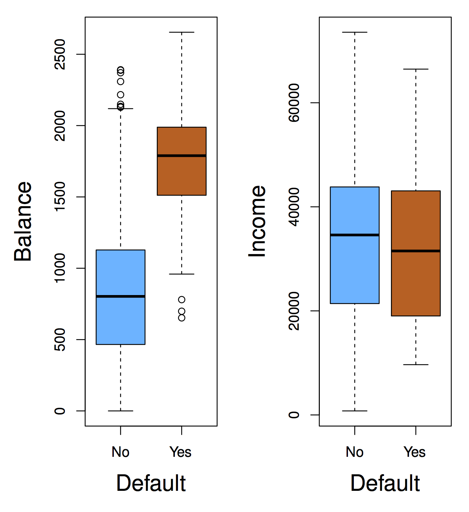

# Linear models for classification

```{r logreg_setup, include=FALSE}
knitr::opts_chunk$set(cache=TRUE)
```


The general classification setting is: can we predict categorical response/output $Y$, from set of predictors $X_1,X_2,\ldots,X_p$? As in the regression case, we assume training data $(\mathbf{x}_1, y_1), \ldots, (\mathbf{x}_n, y_n)$. In this case, however, responses $y_i$ are categorical and take one of a fixed set of values. 





## An example classification problem

An individual's choice of transportation mode to commute to work. Predictors: income, cost and time required for each of the alternatives: driving/carpooling,  biking, taking a bus, taking the train. Response: whether the individual makes their commute by car, bike, bus or train. 

From a classification model based on this data we could perform an inference task: how do people value price and time when considering their transportation choice. 


## Why not linear regression?

In our previous unit we learned about linear regression. Why can't we use linear regression in the classification setting. For categorical responses with more than two values, if order and scale (units) don't make sense, then it's not a regression problem

$$
Y = 
\begin{cases}
1 & \textrm{if } \mathtt{stroke} \\
2 & \textrm{if } \mathtt{drug overdose} \\
3 & \textrm{if } \mathtt{epileptic seizure}
\end{cases}
$$

For **binary** responses, it's a little better:

$$
Y = 
\begin{cases}
0 & \textrm{if } \mathtt{stroke} \\
1 & \textrm{if } \mathtt{drug overdose} \\
\end{cases}
$$

We could use linear regression in this setting and _interpret_ response $Y$ as a probability (e.g, if $\hat{y} > 0.5$ predict $\mathtt{drug overdose}$)


## Classification as probability estimation problem

This observation motivates how we will address the classification problem in general. Instead of modeling classes 0 or 1 directly, we will model the conditional class probability $p(Y=1|X=x)$, and classify based on this probability. In general, classification approaches use _discriminant_ (think of _scoring_) functions to do classification. _Logistic regression_ is **one** way of estimating the class probability $p(Y=1|X=x)$ (also denoted $p(x)$)

```{r,echo=FALSE, message=FALSE}
library(MASS)

library(RColorBrewer)
mycols <- brewer.pal(8, "Dark2")[c(3,2)]

s <- sqrt(1/5)
set.seed(30)

makeX <- function(M, n=100, sigma=diag(2)*s) {
  z <- sample(1:nrow(M), n, replace=TRUE)
  m <- M[z,]
  return(t(apply(m,1,function(mu) mvrnorm(1,mu,sigma))))
}

M0 <- mvrnorm(10, c(1,0), diag(2)) # generate 10 means
x0 <- makeX(M0) ## the final values for y0=blue

M1 <- mvrnorm(10, c(0,1), diag(2))
x1 <- makeX(M1)

x <- rbind(x0, x1)
y <- c(rep(0,100), rep(1,100))
cols <- mycols[y+1]

GS <- 75 # put data in a Gs x Gs grid
XLIM <- range(x[,1])
tmpx <- seq(XLIM[1], XLIM[2], len=GS)

YLIM <- range(x[,2])
tmpy <- seq(YLIM[1], YLIM[2], len=GS)

newx <- expand.grid(tmpx, tmpy)
colnames(newx) <- c("X1","X2")
```

```{r, echo=FALSE, fig.height=10, fig.width=10}
layout(matrix(1:4, nr=2, byrow=FALSE))
plot(x, col=cols, xlab="X1", ylab="X2", xlim=XLIM, ylim=YLIM, type="n", main="Training Set")
points(x, col=cols)

# logistic regression
dat <- data.frame(X1=x[,1], X2=x[,2])
fit <- glm(y~X1+X2, data=dat,family=binomial)
yhat <- predict(fit, newdata=newx)
yhat <- ifelse(yhat > 0, 2, 1)
colshat <- mycols[yhat]

coefs <- coef(fit)
a <- -coefs[1] / coefs[3]
b <- -coefs[2] / coefs[3]

plot(x, col=cols, xlab="X1", ylab="X2", xlim=XLIM, ylim=YLIM, type="n",main="logistic regression")
points(x, col=cols)
points(newx, col=colshat, pch=".")
abline(a=a,b=b)

# KNN(15)
library(class)
yhat <- knn(x, newx, y, k=15)
colshat <- mycols[as.numeric(yhat)]
plot(x, col=cols, xlab="X1", ylab="X2", xlim=XLIM, ylim=YLIM, type="n",main="KNN(15)")
points(x, col=cols)
points(newx, col=colshat, pch=".")
contour(tmpx, tmpy, matrix(as.numeric(yhat),GS,GS), levels=c(1,2), add=TRUE, drawlabels=FALSE)

# KNN(1)
yhat <- knn(x, newx, y, k=1)
colshat <- mycols[as.numeric(yhat)]
plot(x, col=cols, xlab="X1", ylab="X2", xlim=XLIM, ylim=YLIM, type="n",main="KNN(1)")
points(x, col=cols)
points(newx, col=colshat, pch=".")
contour(tmpx, tmpy, matrix(as.numeric(yhat),GS,GS), levels=c(1,2), add=TRUE, drawlabels=FALSE)
```

## Logistic regression

The basic idea behind _logistic regression_ is to build a **linear** model _related_ to $p(x)$, since linear regression directly (i.e. $p(x) = \beta_0 + \beta_1 x$) doesn't work. Why?

Instead we build a linear model of _log-odds_:

$$
\log \frac{p(x)}{1-p(x)} = \beta_0 + \beta_1 x
$$

Odds are equivalent to ratios of probabilities. For example, "two to one odds that Serena Williams wins the French Open" means "the probability that Serena Williams wins the French Open is double the probability he loses". So, if odds = 2, $p(x)=2/3$. If odds = 1/2, $p(x)=1/3$. In general odds = $\frac{p(x)}{1-p(x)}$.

### Exercises

1. Suppose an individual has a 16% chance of defaulting on their credit card payment. What are the odds that she will default?

2. On average, what fraction of people with an odds of 0.37 of defaulting on their credit card payment will in fact default?

```{r, echo=FALSE, results="hide", fig.width=10, fig.height=10}
library(ISLR)
data(Default)

fit <- glm(default~balance, data=Default, family=binomial)
ilogis <- function(theta) exp(theta) / (1 + exp(theta))

makeplot <- function(beta1) {
  with(Default,
       plot(balance, as.numeric(default)-1,
        ylab="Probability of default",
        main=substitute(list(hat(beta)[0]==beta0, hat(beta)[1]==beta1), 
                        list(beta0=round(coef(fit)[1], digits=2), beta1=round(beta1, digits=3)))))
  curve(ilogis(coef(fit)[1] + beta1 * x), add=TRUE, col="blue", lwd=1.3)
  abline(h=c(0,1), lty=2)
}

layout(matrix(1:4, nr=2, byrow=TRUE))
sapply(c(0.001, coef(fit)[2], 0.01, 0.1), makeplot)
```


Here is how we compute a logistic regression model in R

```{r, message=FALSE}
library(ISLR)
library(dplyr)
library(broom)
library(ggplot2)

data(Default)
default_fit <- glm(default ~ balance, data=Default, family=binomial)
default_fit %>% 
  tidy() %>%
  knitr::kable(digits=4)
```

Interpretation of logistic regression models is slightly different than the linear regression model we looked at. In this case, the **odds** that a person defaults increase by $e^{0.05} \approx `r round(exp(0.05),3)`$ for every dollar in their account balance. As before, the **accuracy** of $\hat{\beta}_1$ as an estimate of the **population** parameter is given its standard error. We can again construct a confidence interval for this estimate as we've done before.

As before, we can do hypothesis testing of a relationship between account balance and the probability of default. In this case, we use a $Z$-statistic $\frac{\hat{\beta}_1}{\mathrm{SE}(\hat{\beta}_1)}$ which plays the role of the t-statistic in linear regression: a scaled measure of our estimate (signal / noise). As before, the P-value is the probability of seeing a Z-value as large (e.g., 24.95) under the null hypothesis that **there is no relationship between balance and the probability of defaulting**, i.e., $\beta_1=0$ in the population.
 
In accordance to the "inverse problem" view we've been developing in class, we require an algorithm required to _estimate_ parameters $\beta_0$ and $\beta_1$ according to a data fit criterion. In logistic regression we use the **Bernoulli** probability model we saw previously (think of flipping a coin weighted by $p(x)$), and _estimate_ parameters to **maximize** the _likelihood_ of the observed training data under this coin flipping (binomial) model. Usually, we do this by _minimizing_ the negative of the log likelihood of the model. I.e.: solve the following optimization problem

$$
\min_{\beta_0, \beta_1} \sum_{i:\, y_i=1} -y_i f(x_i) + \log (1+e^{f(x_i)})
$$

where $f(x_i) = \beta_0 + \beta_1 x_i$. This is a non-linear (but convex) optimization problem. We will see later how to use gradient descent to find these parameters. You can learn more about algorithms to solve it in "Computational Methods" class (CMSC 460)

### Making predictions

We can use a learned logistic regression model to make predictions. E.g., "on average, the probability that a person with a balance of $1,000 defaults is":
 
$$
\hat{p}(1000) = \frac{e^{\hat{\beta}_0 + \hat{\beta}_1 \times 1000}}{1+e^{\beta_0 + \beta_1 \times 1000}} 
\approx \frac{e^{-10.6514 + 0.0055 \times 1000}}{1+e^{-10.6514 + 0.0055 \times 1000}} \\
\approx 0.00576 
$$
 
 
### Multiple logistic regression

This is a classification analog to linear regression:

$$
\log \frac{p(\mathbf{x})}{1-p(\mathbf{x})} = \beta_0 + \beta_1 x_1 + \cdots + \beta_p x_p
$$

```{r}
fit <- glm(default ~ balance + income + student, data=Default, family="binomial")
fit %>% 
  tidy() %>%
  knitr::kable(digits=4)
```

As in multiple linear regression it is essential to avoid **confounding!**. Consider an example of single logistic regression of default vs. student status:

```{r}
fit1 <- glm(default ~ student, data=Default, family="binomial")
fit1 %>% tidy() %>%
  knitr::kable(digits=4)
```

and a multiple logistic regression:

```{r}
fit2 <- glm(default ~ balance + income + student, data=Default, family="binomial")
fit2 %>% tidy() %>%
  knitr::kable(digits=4)
```

```{r, echo=FALSE}
bal_range <- range(Default$balance)
plot(0,0,xlim=bal_range,ylim=c(0,1),xlab="Credit Card Balance", ylab="Default Rate", type="n")
curve(predict(fit1, newdata=data.frame(student="Yes", balance=x), type="response"), add=TRUE, lty=2, col="orange", lwd=1.6)
curve(predict(fit1, newdata=data.frame(student="No", balance=x), type="response"), add=TRUE, lty=2, col="blue", lwd=1.6)
curve(predict(fit2, newdata=data.frame(student="Yes", balance=x, income=mean(Default$income)), type="response"), add=TRUE, lty=1, col="orange", lwd=1.6)
curve(predict(fit2, newdata=data.frame(student="No", balance=x, income=mean(Default$income)), type="response"), add=TRUE, lty=1, col="blue", lwd=1.6)
```

```{r, echo=FALSE}
boxplot(balance~student, data=Default, col=c("blue", "orange"), xlab="Student Status", ylab="Credit Card Balance")
```

### Exercise

1. Suppose we collect data for a group of students in a statistics class with variables X1 = hours studied, X2 = undergrad GPA, and Y = receive an A. We fit a logistic regression and produce estimated coefficients, $\hat{\beta}_0=-6, \hat{\beta}_1=0.05,\hat{\beta}_2=1$.

  Estimate the probability that a student who studies for 40h and has an undergraduate GPA of 3.5 gets an A in the class.

2. With estimated parameters from previous question, and GPA of 3.5 as before, how many hours would the student need to study to have a 50% chance of getting an A in the class?

## Linear Discriminant Analysis

Linear Discriminant Analysis (LDA) is a different linear method to estimate a probability model used for classification. Recall that we want to partition data based on **class probability**:  e.g., _find the $\mathbf{X}$ for which_ $P(\mathrm{default=Yes}|X) > P(\mathrm{default=No}|X)$. In logistic regression, **we made no assumption about $\mathbf{X}$**. In other cases, we **can** make assumptions about $\mathbf{X}$ that improve prediction performance (if assumptions hold, obviously)

```{r, echo=FALSE, results="hide"}
library(tidyverse)

balance_means <- Default %>% 
  group_by(default) %>% 
  summarize(balance_mean=mean(balance))
balance_means

balance_sd <- Default %>% 
  group_by(default) %>%
  mutate(balance_mean = mean(balance)) %>%
  mutate(squared_centered_balance = (balance - balance_mean)^2) %>%
  summarize(rss=sum(squared_centered_balance),
            n=n()) %>%
  summarize(balance_sd=sqrt(sum(rss) / (sum(n)-2)))
balance_sd
```

```{r, echo=FALSE, fig.width=15, fig.height=10}
q <- Default %>% ggplot(aes(x=balance))
q <- q + geom_histogram(data=subset(Default, default=="No"), fill="red", alpha=.3, binwidth=50) +
      geom_histogram(data=subset(Default, default=="Yes"), fill="blue", alpha=.3, binwidth=50) +
      geom_vline(xintercept=balance_means$balance_mean, size=1.5, linetype=2) +
      theme(axis.title=element_text(size=24),
            axis.text=element_text(size=18))
q
```

This suggests we can model `balance` for each of the classes with a normal distribution. WARNING, BIG ASSUMPTION: We will assume `balance` has the same *variance* for both classes (this is what makes LDA linear).
So, we estimate average `balance` for people who _do not_ default:

$$
\hat{\mu}_0 = \frac{1}{n_0} \sum_{i:\, y_i=0} x_i
$$

for people who do default:

$$
\hat{\mu}_1 = \frac{1}{n_1} \sum_{i:\, y_i=1} x_i
$$

and estimate variance for both classes as

$$
\hat{\sigma}^2 = \frac{1}{n-2} \sum_{k=1,2} \sum_{i:\, y_i=k} (x_i - \hat{\mu}_k)^2
$$

```{r, echo=FALSE}
library(tidyverse)

balance_means <- Default %>% 
  group_by(default) %>% 
  summarize(balance_mean=mean(balance))
balance_means

balance_sd <- Default %>% 
  group_by(default) %>%
  mutate(balance_mean = mean(balance)) %>%
  mutate(squared_centered_balance = (balance - balance_mean)^2) %>%
  summarize(rss=sum(squared_centered_balance),
            n=n()) %>%
  summarize(balance_sd=sqrt(sum(rss) / (sum(n)-2)))
balance_sd
```

We can "score" values of `balance` based on these estimates:

$$
f_k(x) = \frac{1}{\sqrt{2\pi}\sigma} \exp \left(-\frac{1}{2\sigma^2} (x-\mu_k)^2 \right)
$$

Remember, what we want is **posterior class probability** $p(Y=k|X)$, for that we need to include the probability that we _observe_ class $k$. This is called **prior class probability**, denoted $\pi_k$, means the proportion of times you expect people to default regardless of any other attribute. We can estimate from training data as the proportion of observations with label $k$. Bayes' Rule (or Theorem) gives us a way of computing $P(Y=k|X)$ using score $f_k(x)$ (from the class normal assumption) and prior $\pi_k$:

$$
P(Y=k|X) = \frac{f_k(x) \pi_k}{\sum_l f_l(x) \pi_l}
$$

If data (conditioned by class) is distributed so that $f_k$ is the right probability function to use, then predicting the class that maximizes $P(Y=k|X)$ is the **optimal** thing to do. This is referred to the _Bayes classifier_ (aka the Holy Grail of classification)

### How to train LDA

Compute class means and squared error based on class mean

```{r}
lda_stats <- Default %>% 
  group_by(default) %>% 
  mutate(class_mean=mean(balance),
         squared_error=(balance-class_mean)^2) 
```


Compute class sizes and sum of squared errors

```{r}
lda_stats <- lda_stats %>%
  summarize(class_mean=first(class_mean),
            class_size=n(),
            sum_squares=sum(squared_error))
```


Compute class prior and variance (note same variance for both classes)

```{r, results="as.is"}
lda_stats <- lda_stats %>%
  mutate(class_prior=class_size/sum(class_size),
         sigma2=sum(sum_squares) / (sum(class_size) - 2)) %>%
  dplyr::select(default, class_mean, class_prior, sigma2)

knitr::kable(lda_stats)
```

How do we predict with LDA? Predict `Yes` if $P(Y=1|X) > P(Y=0|X)$

Equivalently:

$$
\log{\frac{P(Y=1|X)}{P(Y=0|X)}} > 0 \Rightarrow \\
\log f_1(x) + \log \pi_1 > \log f_0(x) + \log \pi_0
$$

This turns out to be a linear function of $x$!


```{r}
lda_log_ratio <- function(balance, lda_stats) {
  n <- length(balance)
  
  # subtract class mean
  centered_balance <- rep(balance, 2) - rep(lda_stats$class_mean, each=n)
  
  # scale by standard deviation
  scaled_balance <- centered_balance / sqrt(lda_stats$sigma2[1])
  
  # compute log normal density and add log class prior
  lprobs <- dnorm(scaled_balance, log=TRUE) + log(rep(lda_stats$class_prior, each=n))
  
  # compute log ratio of class probabilities
  lprobs <- matrix(lprobs, nc=2)
  colnames(lprobs) <- lda_stats$default
  lprobs[,"Yes"] - lprobs[,"No"]
}
```

```{r, fig.width=12}
test_balance <- seq(0, 3000, len=100)
plot(test_balance, lda_log_ratio(test_balance, lda_stats),
     type="l", xlab="Balance", ylab="Log Probability Ratio", cex=1.4)
```

## Classifier evaluation

How do we determine how well classifiers are performing? One way is to compute the _error rate_ of the classifier, the percent of mistakes it makes when predicting class

```{r}
library(MASS)
lda_fit <- lda(default ~ balance, data=Default)
lda_pred <- predict(lda_fit, data=Default)
print(table(predicted=lda_pred$class, observed=Default$default))

# error rate
mean(Default$default != lda_pred$class) * 100

# dummy error rate
mean(Default$default != "No") * 100
```

In this case, it would seem that LDA performs well. But in fact, we can get similar error rate
by always predicting "no default". We can see from this table that LDA errors are not symmetric. It's most common error is that _it misses true defaults_.


We need a more precise language to describe classification mistakes:


|                   | True Class +        | True Class -        | Total |
|------------------:|:--------------------|---------------------|-------|
| Predicted Class + | True Positive (TP)  | False Positive (FP) | P*    |
| Predicted Class - | False Negative (FN) | True Negative (TN)  | N*    |
| Total             | P                   | N                   |       |

Using these we can define statistics that describe classifier performance

| Name                            | Definition | Synonyms                                          |
|--------------------------------:|:-----------|---------------------------------------------------|
| False Positive Rate (FPR)       | FP / N     | Type-I error, 1-Specificity                       |
| True Positive Rate (TPR)        | TP / P     | 1 - Type-II error, power, sensitivity, **recall** |
| Positive Predictive Value (PPV) | TP / P*    | **precision**, 1-false discovery proportion       |
| Negative Predicitve Value (NPV) | FN / N*    |                                                   |

In the credit default case we may want to increase **TPR** (recall, make sure we catch all defaults) at the expense
of **FPR** (1-Specificity, clients we lose because we think they will default)

This leads to a natural question: Can we adjust our classifiers TPR and FPR?

Remember we are classifying `Yes` if 

$$
\log \frac{P(Y=\mathtt{Yes}|X)}{P(Y=\mathtt{No}|X)} > 0 \Rightarrow \\
P(Y=\mathtt{Yes}|X) > 0.5
$$

What would happen if we use $P(Y=\mathtt{Yes}|X) > 0.2$?

```{r, echo=FALSE}
test_balance <- seq(0, 3000, len=100)
plot(test_balance, lda_log_ratio(test_balance, lda_stats),
     type="l", xlab="Balance", ylab="Log Probability Ratio", cex=1.4)
```

```{r, fig.width=12, message=FALSE}
library(ROCR)
pred <- prediction(lda_pred$posterior[,"Yes"], Default$default)

layout(cbind(1,2))
plot(performance(pred, "tpr"))
plot(performance(pred, "fpr"))
```

A way of describing the TPR and FPR tradeoff is by using the **ROC curve** (Receiver Operating Characteristic) 
and the **AUROC** (area under the ROC)

```{r, fig.width=12}
auc <- unlist(performance(pred, "auc")@y.values)
plot(performance(pred, "tpr", "fpr"), 
     main=paste("LDA AUROC=", round(auc, 2)), 
     lwd=1.4, cex.lab=1.7, cex.main=1.5)
```

Consider comparing an LDA model using all predictors in the dataset.

```{r}
full_lda <- lda(default~., data=Default)
full_lda_preds <- predict(full_lda, Default)

pred_list <- list(
  balance_lda = lda_pred$posterior[,"Yes"],
  full_lda = full_lda_preds$posterior[,"Yes"],
  dummy = rep(0, nrow(Default)))

pred_objs <- lapply(pred_list,
  prediction, Default$default)

aucs <- sapply(pred_objs, 
  function(x) unlist(
    performance(x, "auc")@y.values))

roc_objs <- lapply(pred_objs, 
  performance, "tpr", "fpr")
```

```{r, echo=FALSE}
library(RColorBrewer)
palette(brewer.pal(8,"Dark2"))
```

```{r}
for (i in seq(along=roc_objs)) {
  plot(roc_objs[[i]], add = i != 1, col=i, 
       lwd=3, cex.lab=1.5)
}
legend("bottomright", 
       legend=paste(gsub("_", " ", names(pred_list)), "AUROC=",round(aucs, 2)), 
       col=1:3, lwd=3, cex=2)
```

Another metric that is frequently used to understand classification errors and tradeoffs is the precision-recall curve:


```{r, fig.width=10, fig.height=9}
library(caTools)
pr_objs <- lapply(pred_objs, 
  performance, "prec", "rec")

for (i in seq(along=pr_objs)) {
  plot(pr_objs[[i]], add = i != 1, col=i, 
       lwd=3, cex.lab=1.5)
}
legend("bottomleft", 
       legend=paste(gsub("_", " ", names(pred_list))),
      col=1:3, lwd=3, cex=2)
```


## Summary

We approach classification as a class probability estimation problem. Logistic regression and LDA partition predictor space with linear functions. Logistic regression learns parameter using Maximum Likelihood (numerical optimization), while LDA learns parameter using means and variances (and assuming normal distribution)

Error and accuracy statistics are not enough to understand classifier performance. Classifications can be done using probability cutoffs to trade, e.g., TPR-FPR (ROC curve), or precision-recall (PR curve). Area under ROC or PR curve summarize classifier performance across different cutoffs.
