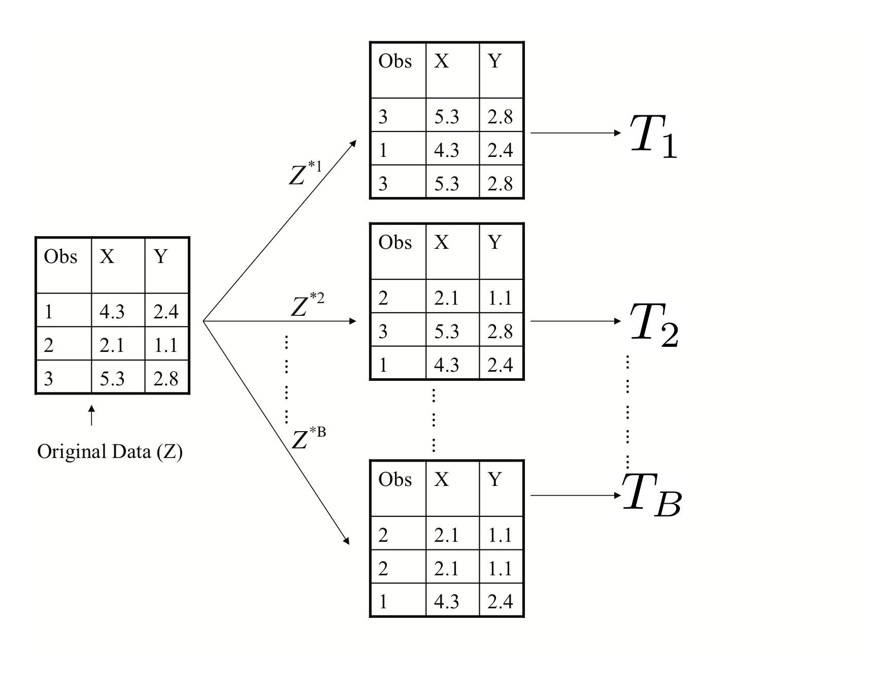

# Tree-Based Methods

```{r, echo=FALSE}
knitr::opts_chunk$set(cache=TRUE)
```

We saw in previous units the limitation of using linear methods for classification. In particular, the partition of predictor space into regions using a linear model like logistic regression is very limiting. In this unit, we look at a set of elegant and versatile methods that allow these regions to take more complex shapes, but still produce models that are interpretable. These are very popular, well-known and studied methods in Statistical Learning. We will concentrate on Regression and Decision Trees and their extension to Random Forests.

## Regression Trees

Consider a task where we are trying to predict a car's fuel consumption in miles per gallon based on the car's weight. A linear model in this case is not a good fit.

```{r, echo=FALSE, cache=FALSE}
library(tree)
library(ISLR)
library(RColorBrewer)
palette(brewer.pal(8, "Dark2"))
data(Auto)


with(Auto, plot(weight, mpg, pch=19, cex=1.4))
```

Let's take a look at what a regression tree estimates in this case.

```{r}
tree <- tree(mpg~weight, data=Auto)
plot(tree)
text(tree, pretty=0, cex=1.3)
```

The decision trees partitions the `weight` predictor into regions based on its value. We can show this graphically as below. The idea behind the regression tree is that outcome $Y$ (`mpg` in this case) is estimated (or predicted) to be it's mean _within each of the data partitions_. Think of it as the conditional mean of $Y$ where conditioning is given by this region partitioning.

```{r, echo=FALSE, cache=FALSE, results="hide"}
library(RColorBrewer)
palette(brewer.pal(8, "Dark2"))

with(Auto, plot(weight, mpg, pch=19, cex=1.4))
#abline(h=subset(tree$frame, grepl("leaf", tree$frame$var))$yval)
abline(v=as.numeric(gsub("<", "", subset(tree$frame, !grepl("leaf", tree$frame$var))$splits[,"cutleft"])))

process_node <- function(i, left, right) {
 if (tree$frame$var[i] == "<leaf>") {
   val <- as.numeric(tree$frame$yval[i])
   segments(left, val, right, val, col="red", lwd=5)
 } else {
   val <- as.numeric(gsub("<","",tree$frame$splits[i, "cutleft"]))
   i <- process_node(i+1, left, val)
   i <- process_node(i+1, val, right)
 }
 i
}

process_node(1, .85*min(Auto$weight), 1.05*max(Auto$weight))
```

Regression and decision trees operate by prediction an outcome variable $Y$ by partitioning feature (predictor) space.

The regression tree model then:

1. Partitions space into $J$ non-overlapping regions, $R_1, R_2, \ldots, R_J$.
2. For every observation that falls within region $R_j$, predict response as mean of response for training observations in $R_j$.

The important observation is that **Regression Trees create partition recursively**


For example, consider finding a good predictor $j$ to partition space its axis. A recursive algorithm would look like this:

1. Find predictor $j$ and value $s$ that minimize RSS:

$$
\sum_{i:\, x_i \in R_1(j,s))} (y_i - \hat{y}_{R_1})^2 +
\sum_{i:\, x_i \in R_2(j,s))} (y_i - \hat{y}_{R_2})^2
$$

Where $R_1$ and $R_2$ are regions resulting from splitting observations on predictor $j$ and value $s$:

$$
R_1(j,s) = \{X|X_j < s\} \mathrm{ and } R_2(j,s) \{X|X_j \geq s\}
$$

This is then applied recursively to regions $R_1$ and $R_2$. Within each region a prediction is made using $\hat{y}_{R_j}$ which is the mean of the response $Y$ of observations in $R_j$.


Consider building a model that used both `horsepower` and `weight`. In this plot the value of the response $Y$ is indicated by the size of the point.

```{r, echo=FALSE}
with(Auto, {
     plot(horsepower, weight, cex=mpg/median(mpg), pch=19)

    qs <- quantile(mpg, p=seq(0,1, len=5))
    legend("bottomright", pch=19, legend=qs, pt.cex=qs/median(mpg))
})
```

This is what a decision tree would look like for these two predictors:

```{r}
tree <- tree(mpg~horsepower+weight, data=Auto)
plot(tree)
text(tree, pretty=0)
```

```{r, echo=FALSE, cache=FALSE}
process_node <- function(i, j, left, right, bottom, top, dat) {
  var <- as.character(tree$frame$var[i])
  is_leaf <- grepl("leaf", var)
  
  if (is_leaf) {
    val <- as.numeric(tree$frame$yval[i])
    dat[j,] <- c(j, left, right, bottom, top, val)
    j <- j + 1
  } else {
    val <- as.numeric(gsub("<","",tree$frame$splits[i, "cutleft"]))
    if (var == "horsepower") {
      res <- process_node(i+1, j, left, val, bottom, top, dat)
      i <- res$i; j <- res$j; dat <- res$dat
      res <- process_node(i+1, j, val, right, bottom, top, dat)
      i <- res$i; j <- res$j; dat <- res$dat
    } else {
      res <- process_node(i+1, j, left, right, bottom, val, dat)
      i <- res$i; j <- res$j; dat <- res$dat
      res <- process_node(i+1, j, left, right, val, top, dat)
      i <- res$i; j <- res$j; dat <- res$dat
    }
  }
  list(i=i, j=j, dat=dat)
}

nleaves <- sum(grepl("leaf", tree$frame$var))
region_dat <- data.frame(j=integer(nleaves),
                  left=numeric(nleaves),
                  right=numeric(nleaves),
                  bottom=numeric(nleaves),
                  top=numeric(nleaves),
                  val=numeric(nleaves))

res <- process_node(1, 1, .85*min(Auto$horsepower), 1.05*max(Auto$horsepower), .85*min(Auto$weight), 1.05*max(Auto$weight), region_dat)
region_dat <- res$dat

with(Auto, {
     plot(horsepower, weight, cex=mpg/median(mpg), pch=19)

    qs <- quantile(mpg, p=seq(0,1, len=5))
    legend("bottomright", pch=19, legend=qs, pt.cex=qs/median(mpg))
})

with(region_dat, {
  segments(left, bottom, right, bottom)
  segments(left, top, right, top)
  segments(left, bottom, left, top)
  segments(right, bottom, right, top)
  text(.5*(left+right), .5*(top+bottom), labels=j, cex=4, col="red")
})
```

```{r, echo=FALSE, eval=FALSE}
plot(tree)
text(tree, pretty=0)
```
## Classification (Decision) Trees

Classification, or decision trees, are used in classification problems, where the outcome is categorical. The same partitioning principle holds, but now, each region predicts the majority class for training observations within region. 

The recursive partitioning method requires a score function to choose predictors (and values) to partition with. In classification we could use a naive approach of looking for partitions that minimize training error. However, better performing approaches use more sophisticated metrics, which we will see shortly. 

Let's look at how a classification tree performs on a credit card default dataset.

```{r, echo=FALSE, dev="png"}
data(Default)

with(Default, {
     plot(balance, income, pch=ifelse(student=="Yes", 19, 21), col=default)
     legend("topright", pch=c(19,21,19,19), col=c("black","black",1,2), legend=c("Student", "Not Student","Not Default","Default"))
})
```

```{r}
default_tree <- tree(default~student+balance+income, data=Default)
plot(default_tree)
text(default_tree, pretty=0)
```


## Specifics of the partitioning algorithm

### The predictor space

Suppose we have $p$ explanatory variables $X_1,\ldots,X_p$ and $N$ observations. 

Each of the $X_i$ can be 

a)   a numeric variable: there are $n-1$ possible splits
b)   an ordered factor (categorical variable): there are $k-1$ possible splits
c)   an unordered factor: $2^{k-1}-1$ possible splits.

### Learning Strategy

The general procedure for tree learning is the following:

1.    **Grow** an overly large tree using forward selection as follows: at each step, find the *best* split among all attributes. Grow until all terminal nodes either

(a) have $< m$ (perhaps $m=1$) data points
(b) are "pure" (all points in a node have [almost] the same outcome).

2.    **Prune** the tree back, creating a nested sequence of trees, decreasing in *complexity*

### Tree Growing

The recursive partitioning algorithm is as follows:

INITIALIZE    All cases in the root node  
REPEAT	      Find optimal allowed split    
	      Partition leaf according to split  
STOP	      Stop when pre-defined criterion is met

A problem in tree construction is how to use the training data to determine the binary splits of dataset $\mathcal{X}$ into smaller and smaller
pieces. The fundamental idea is to select each split of a subset so that the data in each of the descendent subsets are "purer" than the data in the parent subset.

### Deviance as a measure of impurity

A simple approach is to assume a multinomial model and then use deviance as a definition of impurity.

Assume $Y \in \mathcal{G}=\{1,2,\ldots,k\}$.

* At each node $i$ of a classification tree we have a probability distribution $p_{ik}$ over the $k$ classes.

* We observe a random sample $n_{ik}$ from the multinomial distribution specified by the probabilities $p_{ik}$.

* Given $X$, the conditional likelihood is then proportional to $\prod_{(\text{leaves } i)} \prod_{(\text{classes } k)} p_{ik}^{n_{ik}}$.

* Define a deviance $D=\sum D_i$, where $D_i=-2\sum_k n_{ik} \log(p_{ik})$.

* Estimate $p_{ik}$ by $\hat{p}_{ik}=\frac{n_{ik}}{n_i}$.

### Other measures of impurity

Other commonly used measures of impurity at a node $i$ of a
classification tree are

**missclasification rate**: $\frac{1}{n_i} \sum_{j\in A_i} I(y_j \neq k_i)=1-\hat{p}_{ik_i}$  
**entropy**: $\sum p_{ik} \log(p_{ik})$  
**GINI index**: $\sum_{j\neq k} p_{ij}p_{ik} = 1-\sum_k p_{ik}^2$  

where $k_i$ is the most frequent class in node $i$.

For regression trees we use the residual sum of squares:

$$
D = \sum_{\text{cases } j} (y_j-\mu_{[j]})^2
$$

where $\mu_{[j]}$ is the mean values in the node that case $j$ belongs
to.

### Tree Pruning

*	Grow a big tree $T$
*	Consider snipping off terminal subtrees (resulting in
	so-called rooted subtrees)
*	Let $R_i$ be a measure of impurity at leaf $i$ in a
	tree. Define $R=\sum_i R_i$
*	Define size as the number leaves in a tree
*	Let $R_{\alpha} = R + \alpha \times \mathrm{size}$

The set of rooted subtrees of $T$ that minimize $R_{\alpha}$ is
nested.

## Properties of Tree Method

Good properties of Regression and Classification trees include:

* Decision trees are very "natural" constructs, in particular when the explanatory variables are catgorical (and even better when they are binary)
* Trees are easy to explain to non-data analysts
* The models are invariant under transformations in the predictor space
* Multi-factor responses are easily dealt with
* The treatment of missing values is more satisfactory than for most other models
* The models go after interactions immediately, rather than as an afterthought
* Tree growth is much more efficient than described here


However, they do have important issues to address

* Tree space is huge, so we may need lots of data
* We might not be able to find the *best* model at all as it is a greedy algorithm
* It can be hard to assess uncertainty in inference about trees
* Results can be quite variable (tree selection is not very stable)
* Simple trees usually don't have a lot of predictive power

## Random Forests

Random Forests are a **very popular** approach that addresses these shortcomings via resampling of the training data. Their goal is to improve prediction performance and reduce instability by _averaging_ multiple decision trees (a forest constructed with randomness). It uses two ideas to accomplish this.

The first idea is *Bagging* (bootstrap aggregation)
General scheme:
  1. Build many decision trees $T_1, T_2, \ldots, T_B$ from training set  
  2. Given a new observation, let each $T_j$ predict $\hat{y}_j$  
  3. For regression: predict average $\frac{1}{B} \sum_{j=1}^B \hat{y}_j$,
     for classification: predict with majority vote (most frequent class)
     
How do we get many decision trees from a single training set?

For this we use the _bootstrap_ resampling technique. To create $T_j, \, j=1,\ldots,B$ from training set of size $n$:

a) create a bootstrap training set by sampling $n$ observations from training set **with replacement**  
b) build a decision tree from bootstrap training set



The second idea used in Random Forests is to use a random selection of features to split when deciding partitions. Specifically, when building each tree $T_j$, at each recursive partition only consider a randomly selected subset of predictors to check for best split. This reduces correlation between trees in forest, improving prediction accuracy.

Let's look at the same car dataset again

```{r, echo=TRUE, messages=FALSE}
set.seed(1234)
train_indices <- sample(nrow(Auto), nrow(Auto)/2)
train_set <- Auto[train_indices,]
test_set <- Auto[-train_indices,]

library(randomForest)

auto_rf <- randomForest(mpg~cylinders+displacement+horsepower+weight+acceleration+year+origin, importance=TRUE, mtry=3, data=train_set)
```

Let's plot the predicted miles per gallon given by a random forest compared to the observed miiles per gallon in the training dataset.

```{r, echo=FALSE}
plot(train_set$mpg, predict(auto_rf, newdata=train_set), xlab="Observed MPG", ylab="Predicted MPG", main="RF Training Error")
abline(0,1)

rmse <- sqrt( mean( (train_set$mpg - predict(auto_rf, newdata=train_set) )^2 ))

legend("bottomright", legend=paste("RMSE=", round(rmse, digits=2)), cex=2)
```

Now let's look at the same plot on a _testing_ dataset.

```{r, echo=FALSE}
plot(test_set$mpg, predict(auto_rf, newdata=test_set), xlab="Observed MPG", ylab="Predicted MPG", main="RF Testing Error")
abline(0,1)

rmse <- sqrt( mean( (test_set$mpg - predict(auto_rf, newdata=test_set) )^2 ))

legend("bottomright", legend=paste("RMSE=", round(rmse, digits=2)), cex=2)
```

A disadvantage of random forests is that we lose interpretability. However, we can use the fact that a bootstrap sample was used to construct trees to measure _variable importance_ from the random forest.

Here is a table of _variable importance_ for the random forest we just constructed.

```{r, echo=TRUE, results="asis"}
variable_importance <- importance(auto_rf)
knitr::kable(head(round(variable_importance, digits=2)))
```

And a barplot of the same data.

```{r, echo=FALSE}
imp <- importance(auto_rf)[,2]
par(mar=par()$mar+c(0,5,0,0))
o <- order(imp)
barplot(imp[o], horiz=TRUE, xlab="Variable Importance", las=2, cex.names=1.6)
```

## Tree-based methods summary

Tree-based methods are very interpretable _prediction_ models. For which some inferential tasks are possible (e.g., variable importance in random forests), but are much more limited than the linear models we saw previously. These methods are very commonly used across many application domains and Random Forests often perform at state-of-the-art for many tasks.

