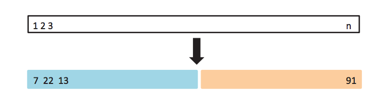
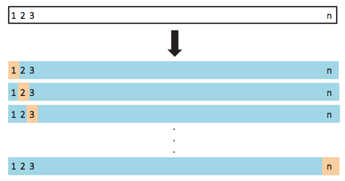
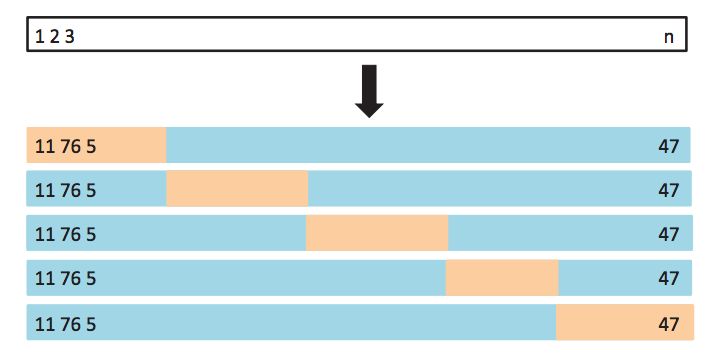

# Model Selection and Evaluation

## Classifier evaluation

So far we have seen how we can use the _error rate_ of a classifier to measure it's generalization performance. How do we determine how well classifiers are performing? One way is to compute the _error rate_ of the classifier, the percent of mistakes it makes when predicting class

```{r}
library(MASS)
logis_fit <- glm(default ~ balance, data=Default, family="binomial")
logis_pred_prob <- predict(logis_fit, type="response") 
logis_pred <- ifelse(logis_pred_prob > 0.5, "Yes", "No")
print(table(predicted=logis_pred, observed=Default$default))

# error rate
mean(Default$default != logis_pred) * 100

# dummy error rate
mean(Default$default != "No") * 100
```

In this case, it would seem that logistic regression performs well. But in fact, we can get similar error rate
by always predicting "no default". We can see from this table that these errors are not symmetric. It's most common error is that _it misses true defaults_.


We need a more precise language to describe classification mistakes:


|                   | True Class +        | True Class -        | Total |
|------------------:|:--------------------|---------------------|-------|
| Predicted Class + | True Positive (TP)  | False Positive (FP) | P*    |
| Predicted Class - | False Negative (FN) | True Negative (TN)  | N*    |
| Total             | P                   | N                   |       |

Using these we can define statistics that describe classifier performance

| Name                            | Definition | Synonyms                                          |
|--------------------------------:|:-----------|---------------------------------------------------|
| False Positive Rate (FPR)       | FP / N     | Type-I error, 1-Specificity                       |
| True Positive Rate (TPR)        | TP / P     | 1 - Type-II error, power, sensitivity, **recall** |
| Positive Predictive Value (PPV) | TP / P*    | **precision**, 1-false discovery proportion       |
| Negative Predicitve Value (NPV) | FN / N*    |                                                   |

In the credit default case we may want to increase **TPR** (recall, make sure we catch all defaults) at the expense
of **FPR** (1-Specificity, clients we lose because we think they will default)

This leads to a natural question: Can we adjust our classifiers TPR and FPR?

Remember we are classifying `Yes` if 

$$
\log \frac{P(Y=\mathtt{Yes}|X)}{P(Y=\mathtt{No}|X)} > 0 \Rightarrow \\
P(Y=\mathtt{Yes}|X) > 0.5
$$

What would happen if we use $P(Y=\mathtt{Yes}|X) > 0.2$?

```{r, fig.width=12, message=FALSE}
library(ROCR)
pred <- prediction(logis_pred_prob, Default$default)

layout(cbind(1,2))
plot(performance(pred, "tpr"))
plot(performance(pred, "fpr"))
```

A way of describing the TPR and FPR tradeoff is by using the **ROC curve** (Receiver Operating Characteristic) 
and the **AUROC** (area under the ROC)

```{r, fig.width=12}
auc <- unlist(performance(pred, "auc")@y.values)
plot(performance(pred, "tpr", "fpr"), 
     main=paste("LDA AUROC=", round(auc, 2)), 
     lwd=1.4, cex.lab=1.7, cex.main=1.5)
```

Consider comparing a logistic regression model using all predictors in the dataset, including an interaction term between balance and student.

```{r}
full_logis <- glm(default~balance*student + income, data=Default, family="binomial")
full_logis_probs <- predict(full_logis, Default, type="response")
full_logis_preds <- ifelse(full_logis_probs > 0.5, "Yes", "No")
print(table(logis_pred, full_logis_preds, Default$default))

pred_list <- list(
  balance_logis = logis_pred_prob,
  full_logis = full_logis_probs,
  dummy = rep(0, nrow(Default)))

pred_objs <- lapply(pred_list,
  prediction, Default$default)

aucs <- sapply(pred_objs, 
  function(x) unlist(
    performance(x, "auc")@y.values))

roc_objs <- lapply(pred_objs, 
  performance, "tpr", "fpr")
```

```{r, echo=FALSE}
library(RColorBrewer)
palette(brewer.pal(8,"Dark2"))
```

```{r}
for (i in seq(along=roc_objs)) {
  plot(roc_objs[[i]], add = i != 1, col=i, 
       lwd=3, cex.lab=1.5)
}
legend("bottomright", 
       legend=paste(gsub("_", " ", names(pred_list)), "AUROC=",round(aucs, 2)), 
       col=1:3, lwd=3, cex=2)
```

Another metric that is frequently used to understand classification errors and tradeoffs is the precision-recall curve:


```{r, fig.width=10, fig.height=9}
library(caTools)
pr_objs <- lapply(pred_objs[1:2], 
  performance, "prec", "rec")

for (i in seq(along=pr_objs)) {
  plot(pr_objs[[i]], add = i != 1, col=i, 
       lwd=3, cex.lab=1.5)
}

auprs <- sapply(pr_objs, 
  function(pr_obj) {
    pr_x <- unlist(pr_obj@x.values)
    pr_y <- unlist(pr_obj@y.values)
    keep <- is.finite(pr_x) & is.finite(pr_y)
    pracma::trapz(pr_x[keep], pr_y[keep])
  }
)

legend("bottomleft", 
       legend=paste(gsub("_", " ", names(pr_objs)), "AUPR=",round(auprs, 2)),
      col=1:3, lwd=3, cex=1.3)
```

Here we see a marginal difference between the two models, with the full model showing a slightly higher precision at the same recall values and slightly higher
area under the precision-recall curve. This is commonly found in datasets where
there is a skewed distribution of classes (e.g., there are many more "No" than "Yes" in this dataset). The area under the PR curve tends to distinguish classifier
performance than area under the ROC curve in these cases.

## Model selection

Our discussion on regression and classification has been centered on fitting models by minizing error or maximizing likelihood given a dataset (also referred to as training data). This is usually fine when we want to use our model for _explanatory_ or _inferential_ tasks. Or when we use relatively inflexible models, like linear regression or logistic regression. However, as our interests shift to _prediction_ and more complex models, like non-linear regression, Tree-based methods or Support Vector Machines, this is usually not sufficient.

In these cases, our goal is to avoid building models that are too _specific_ for the dataset we have on hand. Complex models can easily **overfit** our training data, in which case we don't learn much about the _population_ from which we obtain the training data and instead learn only about the training data itself. We say that we want to learn, or train models that **generalize** beyond the training data to other, unseen, data from the same population.

This leads to a bit of an issue. How do we measure our models ability to predict unseen data, when we only have access to training data?

### Cross Validation

The most common method to evaluate model **generalization** performance is _cross-validation_. It is used in two essential data analysis phases: _Model Selection_ and _Model Assessment_. 

  
In _Model Selection_, we decide how complex of a model we should fit. Consider a linear regression example: I will fit a linear regression model, what predictors should be included?, interactions?, data transformations? Another example is what classification tree depth to use.


In _Model Assessment_, we determine how well does our selected model performs as a **general** model. Example: I've built a linear regression models, with specific predictors. How well will it perform on unseen data? The same question can be asked of a classification tree (of specific depth).

Cross-validation is a _resampling_ method to obtain estimates of **test error rate** (or any other performance measure on unseen data). In some instances, you will have a large predefined test dataset **that you should never use when training**. In the absence of access to this kind of dataset, cross validation can be used.

### Validation Set

The simplest option to use cross-validation is to create a _validation_ set, where our dataset is **randomly** divided into _training_ and _validation_ sets. Then the _validation_ is set aside, and not used at until until we are ready to compute **test error rate** (once, don't go back and check if you can improve it).



Let's look at our running example using automobile data, where we want to build a
regression model capable of predicting miles per gallon given other auto attributes.
We saw in previous lectures that a linear regression model was not appropriate for this dataset. So instead we will use _polynomial_ regression as an illustrative example.

```{r, echo=TRUE, message=FALSE}
library(ggplot2)
library(ISLR)

data(Auto)
ggplot(Auto, aes(x=horsepower, y=mpg)) + geom_point() + geom_smooth()
```

In this case our regression model (for a single predictor $x$) is given as a $d$ degree polynomial.

$$
\mathbb{E}[Y|X=x] = \beta_0 + \beta_1 x + \beta_2 x^2 + \cdots + \beta_d x^d
$$

In the _Model Selection_ case, we want to decide what degree $d$ we should use to model this data. Using the _validation set_ method, we split our data into a training set, fit the regression model with different polynomial degrees $d$ on the training set, and measure test error on the validation set.

```{r, echo=TRUE}
set.seed(1234)

in_validation <- sample(nrow(Auto), nrow(Auto)/2)
validation_set <- Auto[in_validation,]
training_set <- Auto[-in_validation,]

library(broom)
library(dplyr)

degrees <- seq(1, 10)
error_rates <- sapply(degrees, function(deg) {
  fit <- lm(mpg~poly(horsepower, degree=deg), data=training_set)
  predicted <- predict(fit, newdata=validation_set)
  mean((validation_set$mpg - predicted)^2)
})

plot(degrees, error_rates, type="b", xlab="Polynomial Degree", ylab="Mean Squared Error", pch=19, lwd=1.4, cex=1.4)
```

### Resampled validation set

This approach can be prone to sampling issues. It can be highly variable as error rate is a random quantity and depends on observations in training and validation sets. We can improve our estimate of _test error_ by averaging multiple measurements of it (remember the law of large numbers). We can do so by replicating our validation resampling 10 times (with different validation and training sets) and averaging the resulting test errors.


```{r, echo=FALSE, warning=FALSE, message=FALSE}
set.seed(1234)
library(RColorBrewer)

palette(brewer.pal(10, "Dark2"))

degrees <- seq(1, 10)

error_rates <- replicate(10, {
  in_validation <- sample(nrow(Auto), nrow(Auto)/2)
  validation_set <- Auto[in_validation,]
  training_set <- Auto[-in_validation,]

  sapply(degrees, function(deg) {
    fit <- lm(mpg~poly(horsepower, degree=deg), data=training_set)
    predicted <- predict(fit, newdata=validation_set)
    mean((validation_set$mpg - predicted)^2)
  })
})

matplot(degrees, error_rates, type="b", pch=19, xlab="Polynomial Degree", ylab="Mean Squared Error", lwd=1.4, cex=1.4)
```

### Leave-one-out Cross-Validation

This approach still has some issues. Each of the training sets in our validation approach only uses 50% of data to train, which leads to models that may not perform as well as models trained with the full dataset and thus we can overestimate error. To alleviate this situation, we can extend our approach to the extreme. Make each single training point it's own validation set.

Procedure:  
For each observation $i$ in data set:  
  a. Train model on all but $i$-th observation  
  b. Predict response for $i$-th observation  
  c. Calculate prediction error  

This gives us the following _cross-validation_ estimate of error.

$$
CV_{(n)} = \frac{1}{n} \sum_i (y_i - \hat{y}_i)^2
$$



The advantages of this approach is that now we use $n-1$ observations to train each model and there is no randomness introduced since error is estimated on each sample. However, it has
disadvantages as well. Depending on the models we are trying to fit, it can be very costly to train $n-1$ models. Also, the error estimate for each model is highly variable (since it comes from a single datapoint).

```{r, echo=FALSE}
error_rates <- sapply(degrees, function(deg) {
  mean(sapply(seq(len=nrow(Auto)), function(i) {
    fit <- lm(mpg~poly(horsepower, degree=deg), data=Auto[-i,])
    (Auto$mpg[i] - predict(fit, newdata=Auto[i,,drop=FALSE]))^2
    }))
})
```

```{r, echo=FALSE}
plot(degrees, error_rates, pch=19, cex=1.4, lwd=1.4, xlab="Polynomial Degree", ylab="Cross Validation Error", type="b")
```

For linear models (and some non-linear models) there is a nice trick that allows one to compute (exactly or approximately) LOOCV from the full data model fit which we will not get into here.

### k-fold Cross-Validation

This discussion leads us to the most commonly used cross-validation approach _k-fold Cross-Validation_.

Procedure:  
Partition observations randomly into $k$ groups (folds).  

For each of the $k$ groups of observations:
- Train model on observations in the other $k-1$ folds  
- Estimate test-set error (e.g., Mean Squared Error)  

Compute average error across $k$ folds  




$$
CV_{(k)} = \frac{1}{k} \sum_i MSE_i
$$

where $MSE_i$ is mean squared error estimated on the $i$-th fold

In this case, we have fewer models to fit (only $k$ of them), and there is less variance in each of the computed test error estimates in each fold. It can be shown that there is a slight bias (over estimating usually) in error estimate obtained from this procedure.
 
```{r, echo=FALSE}
set.seed(1234)
k <- 10
n <- nrow(Auto)

fold_size <- ceiling(n/k)
permuted_indices <- rep(NA, k * fold_size)
permuted_indices[1:n] <- sample(n)
fold_indices <- matrix(permuted_indices, nc=k)

cv10_error_rates <- sapply(seq(1,k), function(fold_index) {
    test_indices <- na.omit(fold_indices[,fold_index])
    train_set <- Auto[-test_indices,]
    test_set <- Auto[test_indices,]
    
    res <- sapply(degrees, function(deg) {
      fit <- lm(mpg~poly(horsepower, degree=deg), data=train_set)
      mean((Auto$mpg[test_indices] - predict(fit, newdata=test_set))^2)
    })
    res
  })
```

```{r, echo=FALSE}
matplot(degrees, cv10_error_rates, pch=19, type="b", lwd=1.4, cex=1.4, xlab="Polynomial Degrees", ylab="10-fold CV Error Rate")
```

### Cross-Validation in Classification

Each of these procedures can be used for classification as well. In this case we would substitute MSE with performance metric of choice. E.g., error rate, accuracy, TPR, FPR, AUROC. Note however that not all of these work with LOOCV (e.g. AUROC since it can't be defined over single data points).

### Comparing models statistically using cross-validation

Suppose you want to compare two classification models (logistic regression vs. a decision tree) on the `Default` dataset. We can use Cross-Validation to determine if one model is better than the other, using hypothesis testing with a paired $t$-test for example.

```{r, echo=TRUE, message=FALSE}
library(ISLR)
library(cvTools)
library(tree)

data(Default)
fold_indices <- cvFolds(n=nrow(Default), K=10)

error_rates <- sapply(1:10, function(fold_index) {
  test_indices <- which(fold_indices$which == fold_index)
  test_set <- Default[test_indices,]
  train_set <- Default[-test_indices,]
  
  logis_fit <- glm(default~., data=train_set, family="binomial")
  logis_pred <- ifelse(predict(logis_fit, newdata=test_set, type="response") > 0.5, "Yes", "No")
  logis_error <- mean(test_set$default != logis_pred)
  
  tree_fit <- tree(default~., data=train_set)
  pruned_tree <- prune.tree(tree_fit, best=3)

  tree_pred <- predict(pruned_tree, newdata=test_set, type="class")
  tree_error <- mean(test_set$default != tree_pred)
  c(logis_error, tree_error)
  })
rownames(error_rates) <- c("logis", "tree")
error_rates <- as.data.frame(t(error_rates))

library(tidyr)
library(dplyr)

error_rates <- error_rates %>%
  mutate(fold=1:n()) %>%
  gather(method,error,-fold)

error_rates %>%
  head() %>%
  knitr::kable("html")
```

```{r, echo=TRUE, message=FALSE}
dotplot(error~method, data=error_rates, ylab="Mean Prediction Error")
```
```{r, echo=TRUE}
lm(error~method, data=error_rates) %>% 
  tidy() %>%
  knitr::kable()
```

In this case, we do not observe any significant difference between these methods.

## Summary

Error and accuracy statistics are not enough to understand classifier performance. Classifications can be done using probability cutoffs to trade, e.g., TPR-FPR (ROC curve), or precision-recall (PR curve). Area under ROC or PR curve summarize classifier performance across different cutoffs.

Model selection and assessment are critical steps of data analysis. Resampling methods are general tools used for this purpose. 


