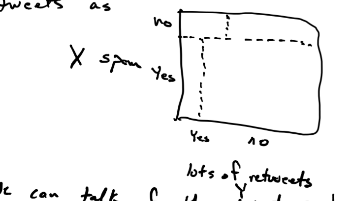

```{r setup, include=FALSE}
knitr::opts_chunk$set(echo = TRUE)
```

One of the purposes of this class is for you to learn Statistical and Machine Learning techniques commonly used in data analysis. By the end of the term, you should be able to read papers that use these methods critically and analyze data using them.

When using any of these tools we will be we will be asking ourselves if our findings are "statistically significant". For example, if we make use of a classification algorithm and find that we can correctly predict an outcome in 70 out of our 100 cases, how can we determine if this could have happened by chance alone? To be able to answer these questions, we need to understand some basic probabilistic and statistical principles. In this section we will review some of these principles.

## Variation, randomness and stochasticity

In the preceeding sections of the class we have not spoken too much about randomness and stochasticity. We have spoken about _variation_ though. When we discussed the notion of _spread_ in a given dataset, measured by the sample standard deviation, for example, we are referring to the fact that in a population of entities (e.g., images of cats) there is naturally occuring variation in measurements. Notice that we can discuss the notation of _variation_ without referring to any randomness, stochasticity or noise. 

Why probability then? Because, we do want to distinguish, when possible, between natural occuring variation and randomness or stochasticity. For instance, suppose we want to learn something about education loan debt for 19-30 year olds in Maryland. We could find loan debt for **all** 19-30 year old Maryland residents, and calculate average and standard deviation. But that's difficult to do for all residents. So, instead we sample (say by randomly sending Twitter surveys), and _estimate_ the average and standard deviation of debt in this population from the sample. The issue is, we could do the same from a different random sample and get a different set of estimates. Why? Because there is naturally-occuring variation in this population.  

So, a simple question to ask is, how good are our _estimates_ of debt mean and standard deviation from sample of 19-30 year old Marylanders? 

Now, suppose we build a predictive model of loan debt for 19-30 year old Marylanders based on other variables (e.g., sex, income, education, wages, etc.) from our sample. How good will this model perform when predicting debt in general?

We use probability and statistics to answer these questions. We use probability to capture stochasticity in the sampling process and model naturally occuring variation in measurements in a population of interest.

One final word, the term _population_ which we use extensively here means **the entire** collection of entities we want to model. This could include people, but also images, text, GO positions, etc.


### Random variables

The basic concept in our discussion of probability is the _random variable_. Consider a situation where you are tasked with performing spam detection in tweets. You sample a tweet at random from the set of all tweets ever written and have a human expert decide if it is spam or not. You can denote this as random variable $X \in \{0,1\}$, with value $1$ if the tweet is spam and 0 otherwise. Why is this a random value? Because it depends on the tweet that was _randomly_ sampled.

### (Discrete) Probability distributions

Now we can start talking about the distribution of values of a random variable. In our example, random variable $X$ can take values 0 or 1. We would like to specify how these values are distributed over the set of all possible tweets one can randomly sample. We use a probability distribution to do this.

A _probability distribution_ is a function $P$ over all values $X$ can take to the interval $[0,1]$ describing how values of $X$ are distributed. We start with a _probability mass function_ $p$ which must satisfy two properties:

a. $p(X=x) \geq 0$ for all values $x$ that random variable $X$ can take, and  
b. $\sum_{\mathrm{values } X \mathrm{ can take}} p(X=x) = 1$

Now, how do we interpret $p(X=1)$?

a. the probability that a uniformly random samples tweet is spam, which implies  
b. the proportion of tweets that are spam in the set of "all" tweets.

I say "all" because it's really the set of tweets one could possibly sample.

Armed with a _probability mass function_ we can talk about a _cumulative probability distribution_ that describes the sum of probability up to a given value. We saw a similar concept for the empirical distribution of data when we discussed quantiles.

### The oracle of TWEET

Suppose we have a magical oracle and know for a _fact_ that 70%% of "all" tweets are spam. In that case $p(X=1) = .7$ and $p(X=0)=1-.7=.3$. 

### Expectation

What if I randomly chose $n=100$ tweets, how many of those do I _expect_ to be spam? _Expectation_ is a formal concept in probability:

$$
\mathbb{E} X = \sum_{\mathrm{values } X \mathrm{ can take}} x p(X=x)
$$

What is the expectation of $X$ in our tweet example? 

$$
0 \times p(X=0) + 1 \times p(X=1) = \
0 \times .3 + 1 \times .7 = .7
$$

Now, what is the expectation of $Y=X_1 + X_2 + \cdots + X_{100}$? What, what is $Y$? Remember we want to know what is my expectation of the number of spam tweets in a sample of $n=100$ tweets. We have $X_i=\{0,1\}$ for each of the $n=100$ tweets, each a random variable, which we obtained by uniformly and _independently_ sampling for the set of all tweets. With that, now random variable $Y$ equals the number of spam tweets in my sample of $n=100$ tweets.

In that case:

$$
\begin{aligned}
\mathbb{E} Y & = \mathbb{E} (X_1 + X_2 + \cdots + X_{100}) \\
{} & = \mathbb{E} X_1 + \mathbb{E} X_2 + \cdots + \mathbb{E} X_{100} \\
{} & = .7 + .7 + \cdots + .7 \\
{} & = 100 \times .7 \\
{} & = 70
\end{aligned}
$$

This uses some facts about expectation you can show in general.

(1) For any pair of random variables $X_1$ and $X_2$, $\mathbb{E} (X_1 + X_2) = \mathbb{E} X_1 + \mathbb{E} X_2$.  

(2) For any random variable $X$ and _constant_ a, $\mathbb{E} aX = a \mathbb{E} X$.

### Estimation

Our discussion so far has assumed that we know that $p(X=1)=.7$, but we _don't_. For our tweet analysis task, we need to _estimate_ the proportion of "all" tweets that are spam. This is where our probability model and the expectation we derive from it comes in.

Given data $x_1, x_2, x_3, \ldots, x_{100}$, with 67 of those tweets labeled as spam (i.e., $x_i=1$ for 67 of them), we can say $y=\sum_i x_i=67$. Now from our discussion above, we _expect_ $y=np$ where $p=p(X=1)$, so let's use that observation to _estimate_ $p$!

$$
\begin{aligned}
np = 67 & \Rightarrow \\
100p = 67 & \Rightarrow \\
\hat{p} = \frac{67}{100} & \Rightarrow \\
\hat{p} = .67
\end{aligned}
$$

Our estimate is close (remember we had an oracle of TWEET), but is it any good? Notice that our estimate of $p$, $\hat{p}$ is the sample _mean_ of $x_1,x_2,\ldots,x_n$. Let's go back to our oracle of tweet to do a thought experiment and replicate how we derived our estimate from 100 tweets a few thousand times. 

```{r}
# proportion of spam in the the tweet population
# as given by the oracle of TWEET
p <- 0.7

# let's sample 100 tweets
# this function chooses between values in a vector (0 and 1)
# with probability given by vector prob
# we need 100 samples from this vector with replacement
# since there are fewer items in the vector than the size
# of the sample we are making
x <- sample(c(0,1), size=100, replace=TRUE, prob=c(1-p,p))

# and the proportion that are spam (using the sample mean)
phat <- mean(x)

# if we had an oracle that let's us do this cheaply,
# we could replicate our experiment 1000 times
# (you don't in real life)

# first let's write a function that gets an estimate
# from a random sample
get_estimate <- function(n,p=0.7) mean(sample(c(0,1), size=n, replace=TRUE, prob=c(1-p,p)))
phats_100 <- replicate(1000, get_estimate(100))
hist(phats_100, xlab="p hat", xlim=c(0.5,1), main="Distribution of p estimates from 100 tweets")
```

Now what if instead of sampling $n=100$ tweets we used other sample sizes?

```{r}
par(mfrow=c(2,3))
# what if we sample 10 tweets
phats_10 <- replicate(1000, get_estimate(10))
hist(phats_10, main="10 tweets", xlab="p hat", xlim=c(.5,1), probability=TRUE)

# what if we sample 100 tweets
phats_100 <- replicate(1000, get_estimate(100))
hist(phats_100, main="100 tweets", xlab="p hat", xlim=c(.5,1), probability=TRUE)

# what if we sample 500 tweets
phats_500 <- replicate(1000, get_estimate(500))
hist(phats_500, main="500 tweets", xlab="p hat", xlim=c(.5,1), probability=TRUE)

# what about 1000 tweets
phats_1000 <- replicate(1000, get_estimate(1000))
hist(phats_1000, main="1000 tweets", xlab="p hat", xlim=c(.5,1), probability=TRUE)

# what about 5000 tweets
phats_5000 <- replicate(1000, get_estimate(5000))
hist(phats_5000, main="5000 tweets", xlab="p hat", xlim=c(.5,1), probability=TRUE)

# what about 10000 tweets
phats_10000 <- replicate(1000, get_estimate(10000))
hist(phats_10000, main="10000 tweets", xlab="p hat", xlim=c(.5,1), probability=TRUE)
```

We can make a couple of observations:

1. The distribution of estimated $\hat{p}$ is _centered_ at $p=.7$, our unknown population proportion, and   
2. The _spread_ of the distribution depends on the number of samples $n$.

This is an illustration of two central tenets of statistics that serves as the foundation of much of what we will do later in the course to interpret the models we build from data.

### Law of large numbers (LLN)

Given random variables $X_1,X_2,\cdots,X_n$ with $\mathbb{E} X_i=\mu$ for all $i$:

$$
\mathbb{E} Y=\frac{1}{n} \sum_i X_i = \mu
$$

(under some assumptions beyond the scope of this class).

This says that if you have samples from a random variable (regardless of how it is distributed) the sample mean will tend to the population mean. I.e., for averages, using the sample mean is the right thing to estimate parameters by matching expectation! In statistics speak we say that the sample mean is an _unbiased_ estimate of $\mu$.

### Central Limit Theorem (CLT)

The LLN says that estimates built using the sample mean will be centered around the correct answer, the CLT describes how these estimates are _spread_ around the correct answer.

Here we will use the concept of _variance_ which is expected _spread_, measured in squared distance, from the _expected value_ of a random variable:

$$
\mathrm{var(X)} = \mathbb{E} (X - \mathbb{E} X)^2
$$

Example: consider the variance of our random tweet example:

$$
\begin{aligned}
\mathrm{var(X)} & = \sum_{\mathrm{all values } X \mathrm{ can take}} (x-\mathbb{E} X)^2 p(X=x) \\
{} & = (0 - p)^2 \times (1-p) + (1 - p)^2 \times p \\
{} & = p^2(1-p) + (1-p)^2p \\
{} & = p(1-p) (p + (1-p)) \\
{} & = p(1-p) (p - p + 1) \\
{} & = p(1-p)
\end{aligned}
$$

Now, we can state the CLT:

$$
Y = \frac{1}{n} \sum_{i=1} X_i
$$

tends _towards_ a **normal** distribution as $n \rightarrow \infty$. This says, that as sample size increases the distribution of sample means is well approximated by a normal distribution.

### The normal distribution

It describes the distribution of _continuous_ random variables over the range $(-\infty,\infty)$ using two parameters: mean $\mu$ and standard deviation $\sigma$.
We write "$Y$ is normally distributed with mean $\mu$ and standard deviation $\sigma$" as $Y\sim N(\mu,\sigma)$. We write its _probability density function_ as:

$$
p(Y=y) = \frac{1}{\sqrt{2\pi}\sigma} \mathrm{exp} \left\{ -\frac{1}{2} \left( \frac{y-\mu}{\sigma} \right)^2 \right\}
$$

Here are three examples of probability density functions of normal distributions with mean $\mu=60,50,60$ and standard deviation $\sigma=2,2,6$:

```{r}
# 100 equally spaced values between 40 and 80
yrange <- seq(40, 80, len=100)

# values of the normal density function
density_values_1 <- dnorm(yrange, mean=60, sd=2)
density_values_2 <- dnorm(yrange, mean=50, sd=2)
density_values_3 <- dnorm(yrange, mean=60, sd=6)

# now plot the function
plot(yrange, density_values_1, type="l", col="red", lwd=2, xlab="y", ylab="density")
lines(yrange, density_values_2, col="blue", lwd=2)
lines(yrange, density_values_3, col="orange", lwd=2)
legend("topright", legend=c("mean 60, sd 2", "mean 50, sd 2", "mean 60, sd 6"), col=c("red","blue","orange"), lwd=2)
```

Like the discrete case, probability density functions for continuous random variables need to satisfy certain conditions:

a. $p(Y=y) \geq 0$ for all values $Y \in (-\infty,\infty)$, and  
b. $\int_{-\infty}^{\infty} p(Y=y) dy = 1$

One way of remembering the density function of the normal distribution is that probability decays exponentially with rate $\sigma$ based on squared distance to the mean $\mu$. (Here is squared distance again!)

Also, notice the term inside the squared?

$$
z = \left( \frac{y - \mu}{\sigma} \right)
$$

this is the _standardization_ transformation we saw in previous lectures. In fact the name _standardization_ comes from the _standard normal distribution_ $N(0,1)$ (mean 0 and standard deviation 1), which is very convenient to work with because it's density function is much simpler:

$$
p(Z=z) = \frac{1}{\sqrt{2\pi}} \mathrm{exp} \left\{ -\frac{1}{2} z^2 \right\}
$$

In fact, if random variable $Y \sim N(\mu,\sigma)$ then random variable $Z=\frac{Y-\mu}{\sigma} \sim N(0,1)$.

### CLT continued

We need one last bit of terminology to finish the statement of the CLT. Consider data 
$X_1,X_2,\cdots,X_n$ with $\mathbb{E}X_i= \mu$ for all $i$, **and** $\mathrm{sd}(X_i)=\sigma$ for all $i$, and their sample mean $Y=\frac{1}{n} \sum_i X_i$. The standard deviation of $Y$ is called the _standard error_:

$$
\mathrm{se}(Y) = \frac{\sigma}{\sqrt{n}}
$$

Ok, now we can make the CLT statement precise: the distribution of $Y$ tends _towards_ $N(\mu,\frac{\sigma}{\sqrt{n}})$ as $n \rightarrow \infty$. This says, that as sample size increases the distribution of sample means is well approximated by a normal distribution, and that the spread of the distribution goes to zero at the rate $\sqrt{n}$.

Disclaimer: there a few mathematical sublteties. Two important ones are that

a. $X_1,\ldots,X_n$ are iid (independent, identically distributed) random variables, and  
b. $\mathrm{var}X < \infty$

Let's redo our simulated replications of our tweet samples to illustrate the CLT at work:

```{r}
# we can calculate standard error for each of the
# settings we saw previously and compare these replications
# to the normal distribution given by the CLT

# let's write a function that adds a normal density
# plot for a given sample size
draw_normal_density <- function(n) {
  se <- sqrt(p*(1-p))/sqrt(n)
  f <- dnorm(seq(0.5,1,len=1000), mean=p, sd=se)
  lines(seq(0.5,1,len=1000), f, col="red", lwd=1.6)
}

par(mfrow=c(2,3))
# what if we sample 10 tweets
phats_10 <- replicate(1000, get_estimate(10))
hist(phats_10, main="10 tweets", xlab="p hat", xlim=c(.5,1), probability=TRUE)
draw_normal_density(10)

# what if we sample 100 tweets
phats_100 <- replicate(1000, get_estimate(100))
hist(phats_100, main="100 tweets", xlab="p hat", xlim=c(.5,1), probability=TRUE)
draw_normal_density(100)

# what if we sample 500 tweets
phats_500 <- replicate(1000, get_estimate(500))
hist(phats_500, main="500 tweets", xlab="p hat", xlim=c(.5,1), probability=TRUE)
draw_normal_density(500)

# what about 1000 tweets
phats_1000 <- replicate(1000, get_estimate(1000))
hist(phats_1000, main="1000 tweets", xlab="p hat", xlim=c(.5,1), probability=TRUE)
draw_normal_density(1000)

# what about 5000 tweets
phats_5000 <- replicate(1000, get_estimate(5000))
hist(phats_5000, main="5000 tweets", xlab="p hat", xlim=c(.5,1), probability=TRUE)
draw_normal_density(5000)

# what about 10000 tweets
phats_10000 <- replicate(1000, get_estimate(10000))
hist(phats_10000, main="10000 tweets", xlab="p hat", xlim=c(.5,1), probability=TRUE)
draw_normal_density(10000)

```

Here we see the three main points of the LLN and CLT: 

(1) the normal density is centered around $\mu=.7$,  
(2) the normal approximation gets better as $n$ increases, and  
(3) the standard error goes to 0 as $n$ increases.

### Inference

Now let's use the CLT and LLN in data analysis. The picture of how we use probability in data analysis (statistical and machine learning) is somewhat like this:


The LLN tells us that our parameter $\hat{p}$ will be close to $p$ on average, the CLT lets us answer how confident are we that we found $p$. We do this by constructing a _confidence interval_ as follows. Since $\hat{p} \sim N(p,\frac{\sqrt{p(1-p)}}{\sqrt{n}})$, we want to find an interval $[\hat{p}_{-}, \hat{p}_{+}]$, with $\hat{p}$ at its center, with 95%% of the probability specified by the CLT. Why? In that case, there is 95% that the value of parameter $p$ will be within that interval.

Now, how do we calculate this interval, since we want the interval to contain 95%% of the probability, the probability for the tails (values outside this interval) will be $(1-.95)/2$ (since there are two tails). 

So, the lower value of the interval will be one where the normal probability distribution (with mean $\hat{p}$ and standard deviation $\frac{\sqrt{\hat{p}(1-\hat{p})}}{\sqrt{n}}$) is such that $P(Y \leq \hat{p}_{-}) = .05/2$, which we can calculate using the function `qnorm` function in R: 

$$
\begin{align}
\hat{p}_{-} & = \mathtt{qnorm}(.05/2, \hat{p}, \frac{\sqrt{\hat{p}(1-\hat{p})}}{\sqrt{n}}) \\
{} & = \hat{p} + \mathtt{qnorm}(.05/2,0, \frac{\sqrt{\hat{p}(1-\hat{p})}}{\sqrt{n}})
\end{align}
$$

The upper value of the interval is computed with probability $1-(.05/2)$, which by the symmetry of the normal distribution is given by $\hat{p}_{+} = \hat{p} + -\mathtt{qnorm}(.05/2,0, \frac{\sqrt{\hat{p}(1-\hat{p})}}{\sqrt{n}})$.

Let's see how these intervals look for our twitter spam example:

```{r, message=FALSE}
library(dplyr)

set.seed(1)
# let's construct confidence intervals for samples of size n=10,100,500,1000,10000
tab <- data.frame(sample_size=c(10,100,500,1000,10000)) %>%
  mutate(phat = sapply(sample_size,get_estimate)) %>%
  mutate(se = sqrt(phat*(1-phat)) / sqrt(sample_size)) %>%
  mutate(lower = phat + qnorm(.05/2, sd=se)) %>%
  mutate(upper = phat + -qnorm(.05/2, sd=se))

knitr::kable(tab)
```

For our sample of $n=500$, we would say that our estimate of $p$ is $`r round(tab$phat[3],2)` \pm `r round(qnorm(.05/2,sd=tab$se[3]),2)`$. A compact way of writing that is that our estimate of $p$ is ${}_{`r round(tab$lower[3],2)`}`r round(tab$phat[3],2)`_{`r round(tab$upper[3],2)`}$.  

### Hypothesis testing

How else is this framework useful? Suppose that before I sampled tweets I thought (hypothesized) that 50%% of tweets are spam. Under this hypothesis, estimates $\hat{p}$ from $n$ samples would be distributed as $N(.5, \frac{\sqrt{.5(1-.5)}}{\sqrt{n}}). Once we do have our sample of $n$ tweets we can _test_ this hypothesis:

$$
\begin{align}
H_0: \, & p=.5 & \textrm{(null)} \\
H_1: \, & p\neq .5 & \textrm{(alternative)}
\end{align}
$$

If we see that $\hat{p}$ (sample mean from our sample of tweets) is _too far_ from $p=.5$ then we could reject our hypothesis, since the data we obtain is not statistically consistent with the hypothesis. Now, how do we say it's too far? The probability model given by the CLT. If $P(|Y| \geq \hat{p}) \geq .95$ under the null model (of $p=.5$), we say it is too far and we reject.


This 95%% rejection threshold is conservative, but somewhat arbitrary. So we use on more metric, $P(|Y| \geq \hat{p})$ (the infamous p-value) to say: we could reject this hypothesis for all thresholds greater than this p-value.

Let's see how testing the $p=.5$ would look like for our tweet example

```{r}
tab <- tab %>%
  mutate(p_value = 1-pnorm(abs(phat), mean=.5, sd=se))
knitr::kable(tab)
```

Notice that rejection occurs when the parameter value for the null hypothesis $p=.5$ is outside the 95%% confidence interval.

### Summary

**Inference**: estimate parameter from data based on assumed probability model (for example, matching expectation. We'll see later another method called maximum likelihood).

For _averages_ the LLN and CLT tells us how to compute probabilities from a single parameter estimate, that is, derived from one dataset of samples. With these probabilities we can construct confidence intervals for our estimate.

**Testing**: Having a hypothesis about our parameter of interest, we can use probability _under this hypothesis_ to see how statistically consistent our data is with that hypothesis, and reject the hypothsis if data is not statistically consistent enough (again using probability from CLT when dealing with averages).

### Probability Distributions

In this example we saw three distributions:

#### Bernoulli

Notation: $X \sim \mathrm{Bernoulli}(p)$.  
Values: $X \in \{0,1\}$  
Parameter: $p$, $p(X=1)=p$ (probability of success).  
Expected Value: $\mathbb{E} X = p$  
Variance: $\mathrm{var}(X) = p(1-p)$.

We can write the probability mass function as 

$$
p(X=x)=p^x(1-p)^{(1-x)}
$$

#### Binomial

This corresponds to the number of $1$'s in a draw of $n$ independent $\mathrm{Bernoulli}(p)$ random variables.

Notation: $X \sim \mathrm{Bin(n,p)}$.  
Values: $X \in 0,1,2,\ldots,n$  
Parameters: $p$ (probability of success), $n$ number of Bernoulli draws  
Expected Value: $\mathbb{E} X=np$  
Variance: $\mathrm{var}(X) = np(1-p)$

Here the probability mass function is a little more complicated since we have many different ways in which $n$ draws of independent Bernoulli random variables result in the same number of successess 

$$
p(X=k) = \binom{n}{k} p^k(1-p)^{n-k}
$$

#### Normal (Gaussian) distribution

Notation: $X \sim N(\mu,\sigma)$  
Values: $X \in \mathbb{R}$  
Parameters: mean $\mu$, standard deviation $\sigma$  
Expected Value: $\mathbb{E} X = \mu$  
Variance: $\mathrm{var}(X) = \sigma^2$

The probability density function was given above.

A useful reference for probability distributions can be found here: [https://blog.cloudera.com/blog/2015/12/common-probability-distributions-the-data-scientists-crib-sheet/](https://blog.cloudera.com/blog/2015/12/common-probability-distributions-the-data-scientists-crib-sheet/)

### Distributions in R

For a majority of common distributions, R has the so-called `d,p,q,r` family of functions:

| function | use |
|----------|-----|
| `d` | probability density (or mass) function |
| `p` | cumulative probability function |
| `q` | quantile function |
| `r` | random value generator |

For example, to use these for the Binomial distribution:

```{r, eval=FALSE}
# using n=10, p=.3

# compute probability mass function value for k=4 successess
dbinom(4, n=10, p=.3)

# compute cumulative probability function for k=4 successess
pbinom(4, n=10, p=.3)

# compute the number of success corresponding to the .80th quantile
qbinom(.8, n=10, p=.3)

# generate a random value k
rbinom(1, n=10, p=.3)
```

### Joint and conditional probability

Suppose that for each tweet I sample I can also say if it has _a lot_ of retweets or not. So, I have another binary random variable $Y \in \{0,1\}$ where $Y=1$ indicates the sampled tweet has a lot of retweets. (Note, we could say $Y\sim \mathrm{Bernoulli}(p_Y))$. So we could illustrate the population of "all" tweets as



We can talk of the joint probability distribution of $X$ and $Y$: $p(X=x, Y=y)$. Here we have the same conditions:

1. $p(X=x,Y=y)\geq 0$ for all combination of values $x$ and $y$, and  
2. $\sum_{\mathrm{all combination of values } X,Y \mathrm{ can take}} p(X=x,Y=y) = 1$

We can also talk about _conditional probability_ where we look at the probability of a tweet being spam _conditioned_ on it not having lots of retweets:

$$
p(X=x | Y=y)
$$

which also needs to satisfy the properties of a probability distribution. So to make sure

$$
\sum_{\mathrm{all values } X \mathrm{ can take}} p(X=x|Y=y) = 1
$$

we define

$$
p(X=x | Y=y) = \frac{p(X=x,Y=y)}{p(Y=y)}
$$

This also lets us talk about _conditional independence_: if the probabilty of spam _does not_ depend on a tweet having lots of retweets, that is $p(X=x) = p(X=x|Y=y)$ for all $y$, then we say $X$ is _conditionally independent_ of $Y$. 

Consider the tweet diagram above, is $X$ conditionally independent of $Y$? What would the diagram look like if $X$ was conditionally independent of $Y$?

One more note, you can also see that for conditionally independent variables, the joint probability has an easy form $p(X=x,Y=y)=p(X=x)p(Y=y)$, which generalizes to more than two independent random variables.

### Conditional expectation

With conditional probabilty we can start talking about conditional expectation, which generalizes the concept of expectation we saw before. For example, the _conditional expected value_ (conditional mean) of $X$ given $Y=y$ is

$$
\mathbb{E} [ X|Y=y ] = \sum_{\mathrm{all values } X \mathrm{ can take}} x p(X=x|Y=y)
$$

This notion of conditional expectation, which follows from conditional probability, will serve as the basis for our Machine Learning method studies in the next few lectures!

### Maximum likelihood

One last note. We saw before how we estimated a parameter from matching expectation from a probability model with what we observed in data. The most popular method of estimation uses a similar idea: given data $x_1,x_2,\ldots,x_n$ and an assumed model of their distribution, e.g., $X_i\sim \mathrm{Bernoulli}(p)$ for all $i$, and they are iid, let's find the value of parameter $p$ that maximizes the likelihood (or probability) of the data we observe under this assumed probability model.

We call the resulting estimate the _maximum likelihood estimate_. Here are some fun exercises to try:

1) Given a sample $x_1$ with $X_1 \sim N(\mu,1)$, show that the maximum likelihood estimate of $\mu$, $\hat{\mu}=x_1$.

It is most often convinient to _minimize negative log-likelihood_ instead of maximizing likelihood. So in this case:

$$
\begin{align}
-\mathscr{L}(\mu) & = - \log p(X_1=x_1) \\
{} & = \log{\sqrt{2\pi}} + \frac{1}{2}(x_1 - \mu)^2
\end{align}
$$

To minimize this function of $\mu$ we can ignore all terms that are independent of $\mu$, and concentrate only on minimizing the last term. Now, this term is always positive, so the smallest value it can have is 0. So, we minimize it by setting $\hat{\mu}=x_1$.

2) Given a sample $x_1,x_2,\ldots,x_n$ of $n$ iid random variables with $X_i \sim N(\mu,1)$ for all $i$, show that the maximum likelihood estimate of $\mu$, $\hat{\mu}=\overline{x}$ the sample mean!

Here we would follow a similar approach, write out the negative log likelihood as a function $f(\mu;x_i)$ of $\mu$ that depends on data $x_i$. Two useful properties here are:

1. $p(X_1=x_1,X_2=x_2,\ldots,X_n=x_n)=p(X_1=x_1)p(X_2=x_2)\cdots p(X_n=x_n)$, and  
2. $\log \prod_i f(\mu;x_i) = \sum_i \log f(\mu;x_i)$

Then find a value of $\mu$ that minimizes this function. Hint: we saw this when we showed that the sample mean is the minimizer of total squared distance in our exploratory analysis unit!
