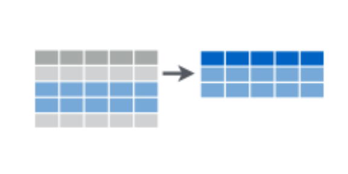

Data Wrangling
========================================================
author: Hector Corrada Bravo
date: CADi 2015

Tidy Data
========================================================

1. Each variable forms a column
2. Each observation forms a row
3. Each type of observational unit forms a table

Next section
=====================================

- Manipulating tidy data
- Missing data
- Transforming data

Manipulation
======================================

The `dplyr` package: one of the most beautiful tools created for data analysis

- Clearly defines and efficiently implements most common data manipulation operations (verbs)
- Built around tidy data principles
- Uniform treatment of multiple kinds of data sources (in memory files, partially loaded files, databases)
- Pipes (`%>%`) can be used to elegantly chain multiple manipulation operations
- An introduction: http://cran.rstudio.com/web/packages/dplyr/vignettes/introduction.html

Manipulation
===================

Single table verbs:
- `filter()` and `slice()`
- `arrange()`
- `select()` and `rename()`
- `distinct()`
- `mutate()` and `transmutate()`
- `summarize()` 
- `sample_n()` and `sample_frac()`

Subsetting Observations
========================================

Selecting or filtering rows (observations) of a tidy
data table by condition or sampling.

 


```r
# include only flights on United Airlines
flights %>% filter(carrier == "UA")
```

Subsetting Variables
========================================
Selecting or filtering columns (variables) of a tidy
data table by condition 

 


```r
# select only month carrier and origin variables
flights %>% select(month,carrier,origin)
```

Creating New Variables
=========================================

Use existing variables to create new observations
- Transformation of single variable
- Functions of multiple variables

 

Creating New Variables
=========================================

 


```r
# add new variable with total delay
flights %>% mutate(delay=dep_delay + arr_delay)
```

Summarizing Data
==========================================

Summarize multiple observations (rows) for a variable (column) into 
a single value

 


```r
# compute mean total delay across all flights
flights %>% 
  mutate(delay = dep_delay + arr_delay) %>%
  summarize(mean(delay, na.rm=TRUE))
```

Grouping Data
=========================================

Group observations (rows) with same value of one or
more variables (columns). Usually used with
`summarize` or `mutate` to aggregate or transform
variables *conditioned* on other variables.

 


```r
# compute mean total delay per carrier
flights %>%
  mutate(delay = dep_delay + arr_delay) %>%
  group_by(carrier) %>%
  summarize(delay=mean(delay, na.rm=TRUE))
```

Two-table verbs
=========================================

Efficient methods to combine data from multiple tables. Drawn from DB literature.

Verbs differ on how non-matching observations are handled
- `left_join()`
- `right_join()`
- `inner_join()`
- `full_join()`

Two-table verbs
============================

*Left Join*: All observations on left operand (LHS) are retained:

 

 


```r
flights %>%
  left_join(airlines, by="carrier")
```

RHS variables for LHS observations with no matching RHS observations are coded as `NA`.

Two-table verbs
============================

*Right Join*: All observations on right operand (RHS) are retained:

 

 


```r
flights %>%
  right_join(airlines, by="carrier")
```

LHS variables for RHS observations with no matching LHS observations are coded as `NA`.

Two-table verbs
============================

*Inner Join*: Only observations matching on both tables are retained

 

 


```r
flights %>%
  inner_join(airlines, by="carrier")
```

Two-table verbs
============================

*Full Join*: All observations are retained, regardless of matching condition

 

 


```r
flights %>%
  full_join(airlines, by="carrier")
```

All values coded as `NA` for non-matching observations as appropriate.

Join Conditions
==========================

All of these joins are based on a matching condition:


```r
flights %>%
  left_join(airlines, by="carrier")
```

specifies to join observations where `flights$carrier` equals `airlines$carrier`.

Join Conditions
==========================

All of these joins are based on a matching condition:


```r
flights %>%
  left_join(airlines)
```

By default this performs a *natural join* where all variables with the same name in both tables are used in join condition.


```r
flights %>%
  left_join(airlines, by=c("carrier" = "name"))
```

Specifies `flights$carrier` must `airlines$name`.

Filtering Joins
==========================

We've just seen *mutating joins* that create new tables.

*Filtering joins* use join conditions to filter a specific table.


```r
flights %>% anti_join(airlines, by="carrier")
```

```
Source: local data frame [0 x 16]

Variables not shown: year (int), month (int), day (int), dep_time (int),
  dep_delay (dbl), arr_time (int), arr_delay (dbl), carrier (chr), tailnum
  (chr), flight (int), origin (chr), dest (chr), air_time (dbl), distance
  (dbl), hour (dbl), minute (dbl)
```

Filters the `flights` table to only include flights from airlines that
*are not* included in the `airlines` table.

Final note on `dplyr`
========================================
- Very efficient implementation on these operations. Much more efficient than 'standard' R code
- More info: [http://cran.rstudio.com/web/packages/dplyr/vignettes/introduction.html](http://cran.rstudio.com/web/packages/dplyr/vignettes/introduction.html)
- Cheatsheet: [http://www.rstudio.com/wp-content/uploads/2015/02/data-wrangling-cheatsheet.pdf](http://www.rstudio.com/wp-content/uploads/2015/02/data-wrangling-cheatsheet.pdf)


