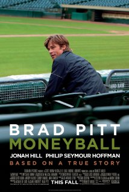

```{r setup, include=FALSE}
knitr::opts_chunk$set(echo = TRUE)
```

**Posted:** March 27, 2018    
**Last Updated:** `r format(Sys.Date(), "%b %d, %Y")`  
**Due:** April 6, 2018    

In this project you will apply your data wrangling and exploratory data analysis
skills to baseball data. In particular, we want to know how well did Moneyball work
for the Oakland A's. Was it worthy of a movie?



# A bit of background

We'll be looking at data about teams in Major League Baseball. A couple of important points to remember:

- Major League Baseball is a professional baseball league, where teams pay players to play baseball.
- The goal of each team is to win as many games out of a 162 game season as possible.
- Teams win games by scoring more runs than their adversary.
- In principle, better players are costlier, so teams that want good players need to spend more money.
- Teams that spend the most, frequently win the most.

So, the question is, how can a team that can't spend so much win? The basic idea that Oakland (and other teams)
used is to *redefine* what makes a player *good*. I.e., figure out what player characteristics translated into *wins*. Once they
realized that teams were not really pricing players using these characteristics, they could exploit this to pay for undervalued players,
players that were *good* according to their metrics, but were not recognized as such by other teams, and therefore not as expensive.

You can get more information about this period in baseball history from:

- [Wikipedia](http://en.wikipedia.org/wiki/Moneyball)  
- [The Moneyball book](http://www.amazon.com/Moneyball-The-Winning-Unfair-Game/dp/0393324818)  
- [The Moneyball movie](http://www.imdb.com/title/tt1210166/)  

BTW, you may find this post informative: https://fivethirtyeight.com/features/dont-be-fooled-by-baseballs-small-budget-success-stories/

# The Data

We will be using the same dataset as HW2 (the SQL homework). Remember this is a useful database on baseball teams, players and seasons curated by Sean Lahman available at [http://www.seanlahman.com/baseball-archive/statistics/](http://www.seanlahman.com/baseball-archive/statistics/). The database has been made available as a `sqlite` database [https://github.com/jknecht/baseball-archive-sqlite](https://github.com/jknecht/baseball-archive-sqlite). You can check that homework again for instructions setting up.


# The question

We want to understand how efficient teams have been historically at spending money and getting wins in return. In the case of Moneyball, one would expect that Oakland was not much more efficient than other teams in their spending before 2000, were much more efficient (they made a movie about it after all) between 2000 and 2005, and by then other teams may have caught up. Your job in this project is to see how this is reflected in the data we have.

# Wrangling

The data you need to answer these questions is in the `Salaries` and `Teams` tables of the database.

**Problem 1** Using SQL compute a relation containing the total payroll and winning percentage (number of wins / number of games * 100) for each team (that is, for each `teamID` and `yearID` combination). You should include other columns that will help when performing EDA later on (e.g., franchise ids, number of wins, number of games).

As in HW2 you will write your query inside an Rmarkdown document. You can use something like this in your Rmarkdown:

```{r echo=FALSE, comment=""}
cat(htmltools::includeText("project2_sql.Rmd"))
```

More info on using sql within Rmarkdown here: https://rmarkdown.rstudio.com/authoring_knitr_engines.html#sql

Include a sentence or two indicating how you dealt with any missing data in these two relations. Specifically, indicate if there is missing data in either table, and how the type of join you used determines how you dealt with this missing data. One note, for SQL you have to be mindful of integer vs. float division.

_Note_: This combination of SQL and R (which you will use shortly). Is a very common workflow in Data Science projects. For data in databases, you use SQL to extract data (aggregates for example) computed on the database server itself. Then use those results for exploratory and other downstream analysis in R or python.

# Exploratory data analysis

## Payroll distribution

**Problem 2**. Write code to produce a plot (or plots) that illustrate the distribution of payrolls across teams conditioned on time (from 1990-2014). Note: you may
create a single plot as long as the distributions for
each year are **clearly** distinguishable (e.g., a single plot overlaying histograms is not OK).

**Question 1**. What statements can you make about the distribution of payrolls conditioned on time based on these plots? Remember you can make statements in terms of central tendency, spread, etc.

**Problem 3**. Write code to produce plots that specifically show at least one of the statements you made in Question 1. For example, if you make a statement that there is a trend for payrolls to decrease over time, make a plot of a statistic for central tendency (e.g., mean payroll) vs. time to show that specficially.

## Correlation between payroll and winning percentage

**Problem 4**. Write code to discretize year into five time periods (using the `cut` function with parameter `breaks=5`) and then make a scatterplot showing mean winning percentage (y-axis) vs. mean payroll (x-axis) for each of the five time periods. You could add a regression line (using `geom_smooth(method=lm)`) in each scatter plot to ease interpretation.

**Question 2**. What can you say about team payrolls across these periods? Are there any teams that standout as being particularly good at paying for wins across these time periods? What can you say about the Oakland A's spending efficiency across these time periods (labeling points in the scatterplot can help interpretation).

# Data transformations

## Standardization across years

It looks like comparing payrolls across years is problematic so let's do a transformation that will help with these comparisons.

**Problem 5**. Write `dplyr` code to create a new variable in your dataset that standardizes payroll conditioned on year. So, this column for team $i$ in year $j$ should equal

$$
\mathrm{standardized\_payroll}_{ij}=\frac{\mathrm{payroll}_{ij} - \overline{\mathrm{payroll}_{\cdot j}}}{s_{\cdot j}}
$$

where $\overline{\mathrm{payroll}_{\cdot j}}$ is the average payroll for year $j$, and $s_{\cdot j}$ is the
standard deviation of payroll for year $j$.

**Problem 6**. Repeat the same plots as Problem 4, but use this new standardized payroll variable.

**Question 3**. Discuss how the plots from Problem 4 and Problem 6 reflect the transformation you did on the payroll variable.

## Expected wins

It's hard to see global trends across time periods using these multiple plots, but now that we have standardized payrolls across time, we can look at a single plot showing correlation between winning percentage and payroll across time.

**Problem 7**. Make a single scatter plot of winning percentage (y-axis) vs. standardized payroll (x-axis). Add a regression line to highlight the relationship (again using `geom_smooth(method=lm)`).

The regression line gives you expected winning percentage as a function of standardized payroll. Looking at the regression line, it looks like teams
that spend roughly the average payroll in a given year will win 50% of their games (i.e. `win_pct` is 50 when `standardized_payroll` is 0), and teams increase 5% wins for every 2 standard units of payroll (i.e., `win_pct` is 55 when `standardized_payroll` is 2). We will see how this is done in general using linear regression later in the course.

From these observations we can calculate the _expected win percentage_ for team $i$ in year $j$ as

$$
\mathrm{expected\_win\_pct}_{ij} = 50 + 2.5 \times \mathrm{standardized\_payroll}_{ij}
$$

## Spending efficiency

Using this result, we can now create a single plot that makes it easier to compare teams efficiency. The idea is to create a new measurement unit for each team based on their winning percentage and their expected winning percentage that we can plot across time summarizing how efficient each team is in their spending.

**Problem 8**. Write `dplyr` code to calculate spending efficiency for each team

$$
\mathrm{efficiency}_{ij} = \mathrm{win\_pct}_{ij} - \mathrm{expected\_win\_pct}_{ij}
$$

for team $i$ in year $j$, where `expected_win_pct` is given above.

Make a line plot with year on the x-axis and efficiency on the y-axis. A good set of teams to plot are Oakland, the New York Yankees, Boston, Atlanta and Tampa Bay (teamIDs `OAK`, `BOS`, `NYA`, `ATL`, `TBA`). That plot can be hard to read since there is so much year to year variation for each team. One way to improve it is to use `geom_smooth` instead of `geom_line`.

**Question 4**. What can you learn from this plot compared to the set of plots you looked at in Question 2 and 3? How good was Oakland's efficiency during the Moneyball period?

## Submission

Prepare and knit to PDF an Rmarkdown file that includes for each Problem: (a) code to carry out the step discussed, (b) output showing enough of the result of your code to understand the result, and (c) a short prose description of how your code works. Remember, the writeup you are preparing is intended to communicate your data analysis effectively. Thoughtlessly showing large amounts of output in your writeup defeats that purpose.  

All axes in plots should be labeled in an informative manner. Your answers to any question that refers to a plot should include both (a) a text description of your plot, and (b) a sentence or two of interpretation as it relates to the question asked.

