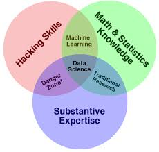

class: title-slide, center, middle
count: false

.banner[]

.title[CMSC320 Introduction to Data Science]

.author[Héctor Corrada Bravo]

.other-info[
University of Maryland, College Park, USA  
CMSC320: `r Sys.Date()`
]

.logo[]

---

```{r setup, include=FALSE}
options(htmltools.dir.version = FALSE)
knitr::opts_chunk$set(cache=TRUE)
```

## TL;DR

Course Webpage: http://bit.ly/hcb-ids

---

## Why Data Science?

> “The ability to take data—to be able to understand it, to process it, to extract value from it, to visualize it, to communicate it—that’s going to be a hugely important skill in the next decades, not only at the professional level but even at the educational level for elementary school kids, for high school kids, for college kids.”

> Hal Varian, Chief Economist at Google
(http://www.mckinsey.com/insights/innovation/hal_varian_on_how_the_web_challenges_managers)

---
class: middle, center

## Data Science

.image-50[]

---
layout: false

## Course organization

This course will cover basics of how to represent, model and communicate about data and data analyses using the R environment for Data Science

- Area 0: tools and skills  
- Area 1: Data types and operations
- Area 2: Data wrangling
- Area 3: Modeling
- Area 4: Applications
- Area 5: Communication

---
layout: false

## Evaluation

Four projects with _real_ data
  - Astronomy (Data Cleaning)
  - Business (Baseball) (Exploratory Data Analysis)
  - Macroenomics (Regression)
  - Real Estate (Prediction)
  - Crime Statistics (Interactive Visualization)
  
Two midterms  
5-6 short assignments  
Final project (no final exam)

