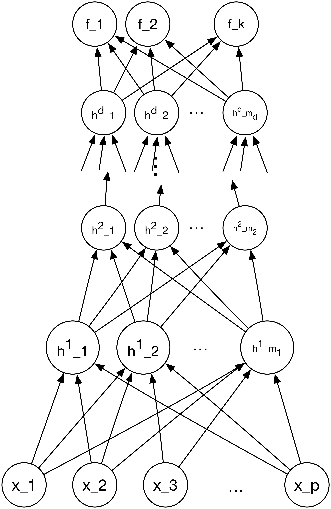

class: title-slide, center, middle
count: false

.banner[]

.title[Deep Learning]

.author[Héctor Corrada Bravo]

.other-info[
University of Maryland, College Park, USA  
CMSC 643: `r Sys.Date()`
]

.logo[]

---
class: split-50
exclude: true

## What does my group do?

.column[
Study the **molecular** basis of *variation* in development and disease

Using **high-throughput** experimental methods  
]

.column[.image-80[]]

---
layout: true
class: split-50

## Deep Feed-Forward Neural Networks

.column[
.center[.image-60[]]
]

---

.column[
The general form of feed-forward network can be extended by adding additional _hidden layers_.
]

---

.column[
The same principles we saw before:

- We arrange computation using a computing graph

- Use Stochastic Gradient Descent

- Use Backpropagation for gradient calculation along the computation graph.
]

---

.column[
Empirically, it is found that by using more, thinner, layers, better expected prediction error is obtained.

However, each layer introduces more linearity into the network.

Making optimization markedly more difficult.
]

---

.column[
We may interpret hidden layers as progressive derived representations of the input data.

Since we train based on a loss-function, these derived representations should make modeling the outcome of interest progressively easier.
]

---

.column[
In many applications, these derived representations are used for model interpretation.
]

---
layout: false

## Deep Feed-Forward Neural Networks

Advanced parallel computation systems and methods are used in order to train these deep networks, with billions of connections.

The applications we discussed previously build this type of massive deep network.

--

They also require massive amounts of data to train.

--

However, this approach can still be applicable to moderate datasizes with careful network design, regularization and training.

---
layout: true

## Regularization of Deep NNs

---

Regularization by penalizing parameter norm is frequently used in these cases.

The obective function to minimize in this case is

$$J(\theta; X, y) = L(\theta; X, y) + \lambda \Omega(\theta)$$

--

- $\theta$ includes all parameters of the network

- $L$ is a task appropriate loss function (e.g. least squares for regression)

- $\Omega$ is a penalty function on the parameters

---

Commonly used functions are

- L2 normalization, $\Omega(\theta) = \sum w_{kl}^2$ for all weight parameters $w_{kl}$

- L1 normalization, $\Omega(\theta) = \sum |w_{kl}|$ for all weight parameters $w_{kl}$

In both of these cases, SGD is easily adapted.

---
layout: true
class: split-50

## Early Stopping

.column[

]

---

.column[
Another technique frequently used to regularize models is early stopping.
]

---

.column[
This is based on the empirical observation that as more training is done, overfitting becomes worse.
]

---

.column[
There are _meta-algorithms_ designed to determine when to stop training based on improvement of expected prediction error, and the rate at which parameter models change between training iterations.
]

---
layout: true
class: split-60

## Dropout

.column[
.image-80[]
]

---

.column[
A popular method for regularization, that also addresses the multiple minimum problem is _dropout_.
]

---

.column[
Bagging is used to build an ensemble of specifically constructed networks.
]

---

.column[
In this case, subnetworks of the network being trained are selected randomly.

Each network is trained independently on a bootstrap sample of data.

Averaging is used to combine predictions.
]

---
layout: true

## Long-term Dependencies

---

A significant issue in training deep networks.

As deeper networks are used, multiplication of gradients causes major issues.

---

Consider the case of a computational graph where a weight matrix $W$ is repeatedly multiplied.

--

Suppose matrix $W$ has eigen-value decomposition $W=V\mathrm{diag}(\mathbf{\lambda})V'$

--

After $t$ steps, we obtain matrix $W^t=V\mathrm{diag}(\mathbf{\lambda})^tV'$

--

What do we expect to happen to weights?

---
layout: true
class: split-50

## Supervised Pre-training

---

.column[
.image-60[]
]

.column[A clever idea for training deep networks.

Train each layer successively on the outcome of interest.

Use the resulting weights as initial weights for network with one more additional layer.]

---

.column[
.image-50[]
]

.column[
Train the first layer as a single layer feed forward network. 

Weights initialized as standard practice.

This fits $W^1_h$.
]

---

.column[
.image-50[]
]

.column[
Now train two layer network.

Weights $W^1_h$ are initialized to result of previous fit.
]

---

This procedure continues until all layers are trained.

Hypothesis is that training each layer on the outcome of interest moves the weights to parts of parameter space that lead to good performance.

Minimizing updates can ameliorate dependency problem.

---

This is one strategy others are popular and effective

- Train each layer as a single layer network using the hidden layer of the previous layer as inputs to the model. 

- In this case, no long term dependencies occur at all.

- Performance may suffer.

---

This is one strategy others are popular and effective

- Train each layer as a single layer on the hidden layer of the previous layer, but also add the original input data as input to every layer of the network.

- No long-term dependency

- Performance improves

- Number of parameters increases.

---
layout: true
## Parameter Sharing

---

Another method for reducing the number of parameters in a deep learning model.

When predictors $X$ exhibit some internal structure, parts of the model can then share parameters.

---

Two important applications use this idea:

- Image processing: local structure of nearby pixels
- Sequence modeling: structure given by sequence

The latter includes modeling of time series data.

---
class: split-50

.column[]

.column[_Convolutional Networks_ are used in imaging applications.

Input is pixel data. 

Parameters are shared across nearby parts of the image.
]
---
layout: true
class: split-50

## Recurrent Networks

.column[]

---

.column[
_Recurrent Networks_ are used in sequence modeling applications.

For instance, time series and forecasting.

Parameters are shared across a time lag.
]

---

The _long short-term memory_ (LSTM) model is very popular in time series analysis

---
layout: false

## Summary

Deep Learning is riding a big wave of popularity.

State-of-the-art results in many applications.

Best results in applications with massive amounts of data.

However, newer methods allow use in other situations.

---

## Summary

Many of recent advances stem from computational and technical approaches to modeling.

Keeping track of these advances is hard, and many of them are ad-hoc.

Not straightforward to determine a-priori how these technical advances may help in a specific application.

Require significant amount of experimentation.

---

## Summary

The interpretation of hidden units as _representations_ can lead to insight.

There is current research on interpreting these to support some notion of statistical inference.

Excellent textbook: http://deeplearningbook.org

---
exclude: true

## Conclusion

Thank you for listening.

Discussion:

- Inference vs. prediction
- Computation vs. modeling
- Forecasting
- How do you see ML methods fitting within your goals?
