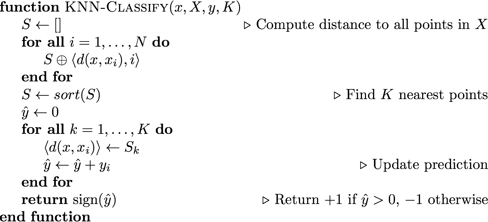

class: title-slide, center, middle
count: false

.banner[]

.title[Introduction to Data Science: Data Analysis with Geometry]

.author[Héctor Corrada Bravo]

.other-info[
University of Maryland, College Park, USA  
`r Sys.Date()`
]

.logo[]

```{r setup1, include=FALSE}
options(htmltools.dir.version = FALSE)
knitr::opts_chunk$set(cache=TRUE)
```

---
layout: true

## Data Analysis with Geometry

---

A common situation: 

- an outcome attribute (variable) $Y$, and   
- one or more independent covariate or predictor attributes $X_1,\ldots,X_p$. 

One usually observes these variables for multiple "instances" (or entities).  

---

One may be interested in various things: 

- What effects do the covariates $X_i$ have on the outcome $Y$? 
- How well can we quantify these effects? 
- Can we predict outcome $Y$ using covariates $X_i$?, etc...

---

## Motivating Example: Credit Analysis

```{r, echo=FALSE, message=FALSE}
library(ISLR)
library(tidyverse)

data(Default)
Default %>%
  head() %>%
  knitr::kable(format="html")
```

---

**Task** predict account default

What is the outcome $Y$?  
What are the predictors $X_j$?

---
exclude: true

We will sometimes call attributes $Y$ and $X$ the
outcome/predictors, sometimes observed/covariates, and even
input/output. We may call each entity an observation or example.
We will denote predictors with $X$ and outcomes with $Y$
(quantitative) and $G$ (qualitative). Notice $G$ are not numbers, so
we cannot add or multiply them. We will use $G$ to denote the set of possible
values. For gender it would be $G=\{Male,Female\}$. 

---
layout: true

## From data to feature vectors

---

The vast majority of ML algorithms we see in class treat instances as "feature vectors". 

We can represent each instance as a _vector_ in Euclidean space $\langle x_1,\ldots,x_p,y \rangle$. 

--

- every measurement is represented as a continuous value
- in particular, categorical variables become numeric (e.g., one-hot encoding)

---

Here is the same credit data represented as a matrix of feature vectors

```{r, cache=TRUE, echo=FALSE}

default_mat <- Default %>%
  mutate(default=case_when(
    default == "Yes" ~ +1,
    TRUE ~ -1
  )) %>%  
  mutate(student=case_when(
    student == "Yes" ~ 1,
    TRUE ~ 0
  )) %>%
  as.matrix()

default_mat %>%
  as_tibble() %>%
  group_by(default) %>%
  sample_n(3) %>%
  ungroup() %>%
  sample_frac(1.0) %>%
  knitr::kable(format="html")
```

---
layout: true

## Technical notation

---

- Observed values will be denoted in lower case. So $x_i$
means the $i$th observation of the random variable $X$. 

- Matrices are
represented with bold face upper case. For example $\mathbf{X}$ will
represent all observed predictors. 
- $N$ (or $n$) will usually mean the number of
observations, or length of $Y$. $i$ will be used to denote which
observation and $j$ to denote which covariate or predictor. 

---

- Vectors
will not be bold, for example $x_i$ may mean all predictors for
subject $i$, unless it is the vector of a particular predictor
$\mathbf{x}_j$. 
- All vectors are assumed to be column vectors, so the
$i$-th row of $\mathbf{X}$ will be $x_i'$, i.e., the transpose of
$x_i$.

---
layout: true

## Geometry and Distances

---

Now that we think of instances as vectors we can do some interesting operations.

Let's try a first one: define a distance between two instances using Euclidean distance

$$d(x_1,x_2) = \sqrt{\sum_{j=1}^p(x_{1j}-x_{2j})^2}$$

---

### K-nearest neighbor classification

Now that we have a distance between instances we can create a classifier. Suppose we want to predict the class for an instance $x$. 

K-nearest neighbors uses the closest points in predictor space predict $Y$. 


$$
\hat{Y} = \frac{1}{k} \sum_{x_k \in N_k(x)} y_k.
$$

$N_k(x)$ represents the $k$-nearest points to $x$. How would you use $\hat{Y}$ to make a prediction?


---



---

### Inductive bias

The assumptions we make about our data that allow us to make predictions. 

In KNN, our _inductive bias_ is that points that are **nearby** will be of the same class. 

---

Parameter $K$ is a _hyper-parameter_, it's value may affect prediction accuracy significantly.

Question: which situation may lead to _overfitting_, high or low values of $K$? Why?

---
layout: true

## The importance of transformations

---
class: split-40

Feature scaling is an important issue in distance-based methods.

.column[
Which of these two features will affect distance the most?]

.column[
```{r, echo=FALSE, message=FALSE, fig.width=7, fig.align="center", fig.height=5}
default_mat %>%
  as_tibble() %>%
  ggplot(aes(x=student,y=balance,color=factor(default))) +
    geom_point() 
```
]

---
layout: true

## Quick vector algebra review

---

- A (real-valued) vector is just an array of real values, for instance $x = \langle 1, 2.5, −6 \rangle$ is a three-dimensional
vector. 

- Vector sums are computed pointwise, and are only defined when dimensions match, so 

$$\langle 1, 2.5, −6 \rangle + \langle 2, −2.5, 3 \rangle =  \langle 3, 0, −3 \rangle$$.

In general, if $c = a + b$ then $cd = ad + bd$
for all vectors $d$. 

---

Vector addition can
be viewed geometrically as taking a vector $a$, then tacking on $b$ to the end of it; the new end point is
exactly $c$.

```{r, echo=FALSE, out.width="20%",fig.align="center"}

```

---

_Scalar Multiplication_: vectors can be scaled by real values; 

$$2\langle 1, 2.5, −6 \rangle = \langle 2, 5, −12\rangle$$

In general, $ax = \langle ax_1, ax_2, \ldots, ax_p\rangle$

---
The norm of a vector $x$, written $\|x\|$ is its length. 

Unless otherwise specified, this is its Euclidean length,
namely: 

$$\|x\| = \sqrt{\sum_{j=1}^p x_j^2}$$

---

### Quiz 

Write Euclidean distance of vectors $u$ and $v$ as a 
vector norm

---

The _dot product_, or _inner product_ of two vectors $u$ and $v$ is defined as

$$u'v = \sum_{j=1}^p u_i v_i$$

A useful geometric interpretation of the inner product $v'u$ is that it gives the projection of $v$ onto $u$ (when $\|u\|=1$).

```{r, echo=FALSE, out.width="20%", fig.align="center"}

```

---
layout: false

## The curse of dimensionality

Distance-based methods like KNN can be problematic in high-dimensional problems

Consider the case where we have many covariates. We want to use $k$-nearest neighbor methods.  

Basically, we need to define distance and  look for small
multi-dimensional "balls"
around the target points. 

With many covariates this becomes
difficult. 

---
layout: false

## Summary

- We will represent many ML algorithms geometrically as vectors
- Vector math review
- K-nearest neighbors 
- The curse of dimensionality
