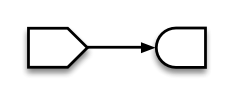
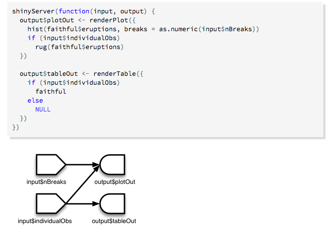
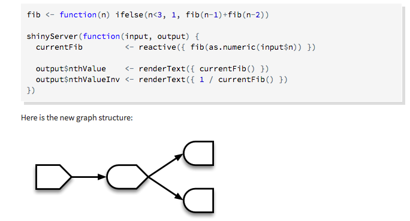

class: title-slide, center, middle
count: false

```{r cowplot_setup, echo=FALSE, message=FALSE}
library(cowplot)
```

.banner[]

.title[Introduction to Data Science: Interactive Visualization]

.author[Héctor Corrada Bravo]

.other-info[
University of Maryland, College Park, USA  
CMSC320: `r Sys.Date()`
]

.logo[]

---

## Why Interactivity?

_Reduce data dimension_: allow user to explore large datasets by quickly switching between dimensions

_Overview first, zoom and filter, details on demand_: Provide big picture, let the user explore details as they desire

_Linked views for high dimensions_: There is a limit to the number of aesthetic mappings in a single graphic, make multiple graphics but link data objects between them

---

## Examples 

_Politics_: [http://www.nytimes.com/interactive/2012/11/02/us/politics/paths-to-the-white-house.html?_r=0](http://www.nytimes.com/interactive/2012/11/02/us/politics/paths-to-the-white-house.html?_r=0)  

_Movies_: [http://www.nytimes.com/interactive/2013/02/20/movies/among-the-oscar-contenders-a-host-of-connections.html](http://www.nytimes.com/interactive/2013/02/20/movies/among-the-oscar-contenders-a-host-of-connections.html)

_Sports_: https://projects.fivethirtyeight.com/2018-march-madness-predictions/

---

## Web-based interactive visualization

Take advantage of HTML document description and the [Document Object Model](http://www.w3.org/DOM/) interface to _bind_ data to page elements.

- [Shiny](http://shiny.rstudio.com): bind data to controls
- [Data-driven Documents (d3.js)](http://d3js.org): bind data to svg elements directly

---
class: split-50

## HTML and DOM

Web pages are structured using Hypertext Markup Language

.column[
Basic idea is to only specify _content_ and _structure_ but not specify directly _how_ to render pages.
]

.column[
```{html}
<!DOCTYPE html>
<html>
  <head>
    <title>Page Title</title>
  </head>
  <body>
    <h1>Page Title</h1>
    <p>This is a really interesting paragraph.</p>
  </body>
</html>
```
]


---
class: split-50

## HTML and DOM

Web pages are structured using Hypertext Markup Language

.column[
Structure is provided by page _elements._
An important element we'll see later is the arbitrary grouping/containment element `div`.
]

.column[
```{html}
<!DOCTYPE html>
<html>
  <head>
    <title>Page Title</title>
  </head>
  <body>
    <h1>Page Title</h1>
    <p>This is a really interesting paragraph.</p>
  </body>
</html>
```
]

---
class: split-50

## HTML and DOM

Web pages are structured using Hypertext Markup Language

.column[
The hierarchical structure of elements in a document are defined by the _Document Object Model_ (DOM).
]

.column[
```{html}
<!DOCTYPE html>
<html>
  <head>
    <title>Page Title</title>
  </head>
  <body>
    <h1>Page Title</h1>
    <p>This is a really interesting paragraph.</p>
  </body>
</html>
```
]

---

## CSS

Cascading Style Sheets are used to style elements in the DOM.

```
body {
  background-color: white;
  color: black;
}
```

---

## CSS

In general:

```
selectorA,
selectorB,
selectorC {
  property1: value;
  property2: value;
  property3: value;
}
```

---

## SVG

Scalable Vector Graphics (SVG) is special element used to create graphics with text.

```
<svg width="50" height="50">
  <circle cx="25" cy="25" r="22" fill="blue" stroke="gray" stroke-width="2"/>
</svg>
```
---

## SVG

Elements have _geometric_ attributes and _style_ attributes.

```
<circle cx="250" cy="25" r="25"/>
```

`cx`: x-coordinate of circle center  
`cy`: y-coordinate of circle center  
`r`: radius of circle

---

## SVG

Elements have _geometric_ attributes and _style_ attributes.

```
<rect x="0" y="0" width="500" height="50"/>
```

`x`: x-coordinate of left-top corner  
`y`: y-coordinate of left-top corner  
`width`, `height`: width and height of rectangle

---

## SVG

_style_ attributes

```
<circle cx="25" cy="25" r="22" fill="yellow" stroke="orange" stroke-width="5"/>
```

can be styled by class as well

```
svg .pumpkin {
  fill: yellow;
  stroke: orange;
  stroke-width: 5;
}
```

```
<circle cx="25" cy="25" r="22" class="pumpkin">
```
---

## Shiny and D3

Shiny: construct DOM and bind data (variables for example) to elements (a slide control for example) http://shiny.rstudio.com

D3: bind data to SVG element attributes (position, size, color, transparency, etc.) http://d3js.org

---

## Reactivity

Interactivity and binding in Shiny achieved using _reactive programming_. Where objects _react_ to changes in other objects.



---

## Reactivity

Example: 



---

## Reactivity

With intermediate objects:



---

## Reactivity

A standard paradigm for interactive (event-driven) application development

A nice review paper: [http://dl.acm.org/citation.cfm?id=2501666](http://dl.acm.org/citation.cfm?id=2501666)

---

## Binding data to graphical elements

With Shiny we can bind data objects to document elements.  
More examples: [http://shiny.rstudio.com/gallery/](http://shiny.rstudio.com/gallery/)

We can also bind data directly to _graphical_ elements since using SVG these are also document elements (D3).
 
---

## D3 Tutorial

[Slides](https://docs.google.com/presentation/d/1YgWaiW7dfQ8C3a_LFiIA9heEaKthY27ajNG0uDuvpws/edit#slide=id.g12bafcc19b_0_105)

---

## D3 Alternatives

- If you want to use a toolkit of standard charts based on d3:
[NVD3](http://nvd3.org/)
- An alternative declarative library: [Vega](https://trifacta.github.io/vega/)

- A no-hassle interactive vis library for multiple languages: 
  - [plotly R](https://plotly.com/r/)  
  - [plotly python](https://plotly.com/python/)  
  - [plotly JS](https://plotly.com/javascript/)
  
---

## D3 and R

- We saw previously that D3 can access external data through `json`
- That's how we can pass data from R to the Javascript browser

---

## D3 and R


- [rCharts](http://ramnathv.github.io/rCharts/): Most mature. Provides binding between R and a small set of javascript viz libraries.
- [ggvis](http://ggvis.rstudio.com/): Uses grammar of graphics like ggplot2, bindings to [Vega](https://trifacta.github.io/vega/) to define JS charts.
- [htmlwidgets](http://www.htmlwidgets.org/index.html) a formalization of how to bind R to JS libraries. 
- [Roll your own](https://github.com/jcheng5/shiny-js-examples) 

---

## D3 and jupyter

In jupyter you can use HTML and javascript directly, and use D3 and other JS 
libraries through that.

For more info: https://blog.thedataincubator.com/2015/08/embedding-d3-in-an-ipython-notebook/

---

## Interactive visualization

Essential tool for exploration

Helps manage high-dimensionality of data (don't go 3D, link charts!!)
