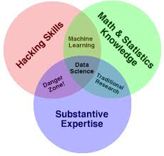

class: title-slide, center, middle
count: false

.banner[]

.title[CMSC320 Introduction to Data Science: Course Introduction and Overview]

.author[Héctor Corrada Bravo]

.other-info[
University of Maryland, College Park, USA  
CMSC320: `r Sys.Date()`
]

.logo[]

---

```{r setup, include=FALSE}
options(htmltools.dir.version = FALSE)
knitr::opts_chunk$set(cache=TRUE)
```

## Business First

Course Webpage: http://bit.ly/hcb-ids

---

## What is Data Science?

Data science encapsulates the interdisciplinary activities required to create data-centric artifacts and applications that address specific scientific, socio-political, business, or other questions.

---

### Data

Measureable units of information gathered or captured from activity of people, places and things.

--

### Specific Questions

Seeking to understand a phenomenon, natural, social or other

--

Can we formulate specific questions for which an answer posed in terms of patterns observed, tested and or modeled in data is appropriate.

---

### Interdisciplinary Activities

- Formulating a question, assessing the appropriateness of the data and findings used to find an answer require understanding of the specific subject area. 

--

- Deciding on the appropriateness of models and inferences made from models based on the data at hand requires understanding of statistical and computational methods.

---

### Data-centric artifacts and applications

- Answers to questions derived from data are usually shared and published in meaningful, succint but sufficient, reproducible artifacts (papers, books, movies, comics). 

--

- Going a step further, interactive applications that let others explore data, models and inferences are great.

---
class: middle, center

## Data Science

.image-50[]

---

## Why Data Science?

The granularity, size and accessibility data, comprising both physical, social, commercial and political spheres has exploded in the last decade or more. 

> I keep saying that the sexy job in the next 10 years will be statisticians”

> Hal Varian, Chief Economist at Google (http://www.nytimes.com/2009/08/06/technology/06stats.html?_r=0)

---

## Why Data Science?

> “The ability to take data—to be able to understand it, to process it, to extract value from it, to visualize it, to communicate it—that’s going to be a hugely important skill in the next decades, not only at the professional level but even at the educational level for elementary school kids, for high school kids, for college kids.”

> Hal Varian
(http://www.mckinsey.com/insights/innovation/hal_varian_on_how_the_web_challenges_managers)

---

## Why Data Science?

> “Because now we really do have essentially free and ubiquitous data. So the complimentary scarce factor is the ability to understand that data and extract value from it.”

> Hal Varian
(http://www.mckinsey.com/insights/innovation/hal_varian_on_how_the_web_challenges_managers)

---

## Data Science in Society

Large amounts of data produced across many
spheres of human activity, 

--

Many societal questions may be addressed by characterizing patterns in data. 

---

## Data Science in Society

This can range from unproblematic questions:

- how to dissect a large creative corpora, say music, literature, based on raw characteristics of those works, text, sound and image. 

--

To more problematic questions

- analysis of intent, understanding, appreciation and valuation of these creative corpora.

---

## Data Science in Society

Issues of fairness and transparency in the current era of big data are especially problematic. 

- Is data collected representative of population for which inferences are drawn? 

--

- Are methods employed learning latent unfair factors from ostensibly fair data? 

--

- These are issues that the research community is now starting to address.

---


## Data Science in Society

In all settings, issues of ethical collection of data, application of models, and deployment of data-centric artifacts are essential to grapple with. 

Issues of privacy are equally important.

---
class: split-50

## Data Science in Society

.column[
.center[.image-70[]]
]

--

.column[
.center[.image-50[]]
]

---
class: split-50

## Data Science in Society

.column[
In the early 2000's the Oakland A's were winning as much as teams with much bigger payrolls by evaluating players using data differently than other teams.
]

.column[
.image-50[]
]

---
## Data Science in Society

### Data Journalism

[http:://fivethirtyeight.com](http:://fivethirtyeight.com)

```{r five38, echo=FALSE}
knitr::include_url("http://fivethirtyeight.com/")
```

---

## Data Science in Society

### Data Journalism

[http://www.nytimes.com/section/upshot](http://www.nytimes.com/section/upshot)

```{r upshot, echo=FALSE}
knitr::include_url("http://www.nytimes.com/section/upshot"
)
```

---
layout: true
## Data Science in Society

---

### The story of the Netflix Prize

In October 2006 Netflix announced a prize around their movie recommendation engine. 

--

Supervised Machine Learning (ML) task: 

- Dataset of users and their ratings, (1,2,3,4 or 5 stars), of movies they have rated. 
- Build an ML model that given predicts a specific user's rating to a movie they have not rated. 

--

They can recommend movies to users if they predict high rating.

---

Netflix would award $1M for the first ML system that provided a 10% improvement to their existing system

---
class: split-30

.column[
Existing system had a 0.9514 mean squared error
]

.column[
.image-60[
]]

---
class: split-30

.column[
Within three weeks, at least 40 teams had improved upon the existing Netflix system. 

The top teams were showing improvement over 5%. 
]

.column[
.image-60[
]]

---
class: split-50

## Machine Learning

.column[
Self driving cars make use of ML models for sensor processing. 
]

.column[
.image-50[.center[]]
]

---
class: split-50

## Machine Learning

.column[
Image recognition software uses ML to identify individuals in photos. 
]

.column[
.image-50[]
]

---
class: split-50

## Machine Learning

.column[
ML models have been applied to medical imaging to yield expert-level prognosis. 
]

.column[
.image-50[]
]

---
layout: false

## Course organization

This course will cover basics of how to represent, model and communicate about data and data analyses using the R environment for Data Science

--
- Area 0: tools and skills  

--
- Area 1: Data types and operations

--
- Area 2: Data wrangling

--
- Area 3: Modeling

--
- Area 4: Applications

--
- Area 5: Communication

---
class: split-70

## General Workflow

.column[
.left[.image-70[]]
]

.column[
.source[Zumel and Mount]
]

---
class: split-50

### Defining the goal

.column[
- What is the question/problem?
- Who wants to answer/solve it?
- What do they know/do now?
- How well can we expect to answer/solve it?
- How well do they want us to answer/solve it?
]

.column[
.image-50[]
]

---
class: split-50

### Data collection and Management

.column[
- What data is available?
- Is it good enough?
- Is it enough?
- What are sensible measurements to derive from this data?
  Units, transformations, rates, ratios, etc.
]

.column[
.image-50[]
]

---
class: split-50

### Modeling

.column[
- What kind of problem is it?
  E.g., classification, clustering, regression, etc.
- What kind of model should I use?
- Do I have enough data for it?
- Does it really answer the question?
]

.column[
.image-50[]
]

---
class: split-50

### Model evaluation

.column[
- Did it work? How well?
- Can I interpret the model?
- What have I learned?
]

.column[
.image-50[]
]

---
class: split-50

### Presentation

.column[
- Again, what are the measurements that tell the real story?
- How can I describe and visualize them effectively?
]

.column[
.image-50[]
]

---
class: split-50

### Deployment

.column[
- Where will it be hosted? 
- Who will use it?
- Who will maintain it?
]

.column[
.image-50[]
]

---

# An Illustrative Analysis

http://fivethirtyeight.com has a clever series of articles on the types of movies different actors make in their careers: https://fivethirtyeight.com/tag/hollywood-taxonomy/

I'd like to do a similar analysis. Let's do this in order:

1) Let's do this analysis for Diego Luna 

2) Let's use a clustering algorithm to determine the different types of movies they make

3) Then, let's write an application that performs this analysis for any actor and test it with Gael García Bernal

4) Let's make the application interactive so that a user can change the actor and the number of movie clusters the method learns.

---

## Gathering data

### Movie ratings

For this analysis we need to get the movies Diego Luna was in, along with their Rotten Tomatoes ratings. For that we scrape this webpage: https://www.rottentomatoes.com/celebrity/diego_luna.

```{r, echo=FALSE, message=FALSE}
library(tidyverse)
library(rvest)
library(stringr)
```

```{r read_dl, echo=FALSE, cache=TRUE, message=FALSE}
# URL base for search
base_url <- "https://www.rottentomatoes.com/celebrity/"

# let's see how this works for Diego Luna

# scrape the table from the website
dl_url <- paste0(base_url, "diego_luna")
dl_html <- read_html(dl_url) 
dl_tab <-  dl_html %>%
  html_node("#filmographyTbl") %>%
  html_table() %>%
  as_tibble()

# clean it up
clean_dl_tab <- dl_tab %>% 
  # make sure the movie is rated
  filter(RATING != "No Score Yet") %>% 
  
  # make the rating look numeric
  mutate(RATING = str_replace(RATING, "%", "")) %>%
  
  # remove producer and director credits
  filter(!str_detect(CREDIT, "Prod") &
         !str_detect(CREDIT, "Dir")) %>%
  
  # convert to proper types
  readr::type_convert()
```

```{r, echo=FALSE}
clean_dl_tab %>% head(7) %>% knitr::kable("html")
```

This data includes, for each of the movies Diego Luna has acted in, the rotten tomatoes rating, the movie title, Diego Luna's role in the movie, the U.S. domestic gross and the year of release.

---

### Movie budgets and revenue

For the movie budgets and revenue data we scrape this
webpage: http://www.the-numbers.com/movie/budgets/all

```{r read_budget, eval=FALSE, echo=FALSE, cache=TRUE}
# scrape the webpage
budget_url <- "http://www.the-numbers.com/movie/budgets/all"
budget_html <- read_html(budget_url)
budget_tab <- budget_html %>%
  html_node("table") %>%
  html_table(fill=TRUE) %>%
  select(-1) %>%
  as_tibble()
```

```{r, eval=FALSE, echo=FALSE}
# clean up the result
clean_budget_tab <- budget_tab %>%
  # remove all those NA rows
  filter(!is.na(`Release Date`)) %>%

  # make the budget columns look numeric 
  mutate_at(vars(-1,-2), funs(str_replace(., "\\$", ""))) %>%
  mutate_at(vars(-1,-2), funs(str_replace_all(., ",", ""))) %>%
  
  # rename columns
  rename(release_date=`Release Date`,
         movie=Movie,
         production_budget=`Production Budget`,
         domestic_gross=`Domestic Gross`,
         worldwide_gross=`Worldwide Gross`) %>%
  
  # convert columns to proper types
  type_convert(cols(release_date=col_date(format="%m/%d/%Y"))) %>%
  
  # represent budget and gross in millions
  mutate_at(vars(-1,-2), funs(. / 1e6))
```

<!--
(Note 01.2018: after the initial version of this analysis,
this website added pagination to this URL. We will be using the
CSV file scraped originally in Summer 2017 for this analysis and leave the issue of dealing with pagination as an exercise.)
-->

```{r read_budget_csv, echo=FALSE, cache=TRUE}
budget_filename <- "data/movie_budgets.csv"
clean_budget_tab <- read_csv(budget_filename)
```


This is part of what we have for that table after scraping and cleaning up:

```{r, echo=FALSE}
clean_budget_tab %>% head(10) %>% knitr::kable("html")
```

---

### Movie budgets and revenue

Now we have data for `r nrow(clean_budget_tab)` movies, including its release date, title, production budget,
US domestic and worlwide gross earnings. The latter three are in millions of U.S. dollars.

---
class: split-40

### Movie budgets and revenue

.column[
One thing we might want to check is if the budget and gross entries in this table are inflation adjusted or not. 
]

.column[
```{r, echo=FALSE}
library(lubridate)

clean_budget_tab %>%
  mutate(year=factor(year(release_date))) %>%
  ggplot() +
  aes(x=year, y=domestic_gross) +
  geom_boxplot() +
  theme_bw()
```
]

---

## Manipulating the data

Next, we combine the datasets we obtained to get closer to the data we need to make the plot we want.

```{r, echo=FALSE}
joined_tab <- clean_dl_tab %>%
  # join the two tables together
  inner_join(clean_budget_tab, by=c(TITLE="movie")) 
```

We combine the two datasets using the movie title, so
that the end result has the information in both tables for each movie.

```{r, echo=FALSE}
joined_tab %>% knitr::kable("html")
```

---

## Visualizing the data

```{r, echo=FALSE, fig.cap="Ratings and U.S. Domestic Gross of Diego Luna's movies.", fig.align="center"}
joined_tab %>%
  ggplot() +
    theme_bw() +
    aes(x=RATING, y=domestic_gross) +
    geom_point(size=3) +
    labs(title="Diego Luna's movies",
         x="Rotten Tomato Rating",
         y="Domestic gross (Millions)")
```

---

## Modeling data

Use a clustering algorithm to partition Diego Luna's movies based on rating and domestic gross.

```{r, echo=FALSE}
library(class)
library(broom)

kmeans_result <- joined_tab %>%
  select(RATING, domestic_gross) %>%
  kmeans(centers=3) 

clustered_tab <- kmeans_result %>%
  augment(data=joined_tab) %>%
  rename(cluster=.cluster) %>%
  as_tibble()

kmeans_centers <- kmeans_result %>%
  tidy() %>%
  as_tibble()
```


```{r, echo=FALSE}
clustered_tab %>%
  select(TITLE, RATING, domestic_gross, cluster) %>%
  arrange(cluster) %>%
  knitr::kable("html")
```

---

## Visualizing model result

```{r, echo=FALSE, fig.align="center"}
final_plot <- clustered_tab %>%
  ggplot() +
    aes(x=RATING, y=domestic_gross, color=cluster) +
    geom_point(size=3.4) +
    theme_bw() +
    labs(title="Diego Luna's movies",
         x="Rotten Tomatoes rating",
         y="Domestic Gross (Millions)")
final_plot
```

---

## Visualizing model result

To make the plot and clustering more interpretable, let's annotate the graph with some movie titles. 

- In the k-means algorithm, each group of movies is represented by an average rating and an average domestic gross. 

--

- Find the movie in each group that is closest to the average and use that movie title to annotate each group in the plot.

```{r, echo=FALSE, message=FALSE}
# join the extended movie table with the centers table
annot_tab <- clustered_tab %>%
  select(title=TITLE, rating=RATING, domestic_gross, cluster) %>%
  left_join(select(kmeans_centers, x1, x2, cluster)) %>%
  
  # calculate the distance of each movie to its center
  mutate(center_dist=sqrt((rating-x1)^2+(domestic_gross-x2)^2)) %>%
  
  # find the movie closest to each center
  group_by(cluster) %>%
  arrange(center_dist) %>%
  slice(1)
```

---

### Visualizing model result

```{r, echo=FALSE, fig.align="center"}
final_plot +
  annotate("text", 
           x=annot_tab$x1,
           y=annot_tab$x2,
           label=annot_tab$title)
```

---

## Abstracting the analysis

While not a tremendous success, we decide we want to carry on with this analysis. We would like to do this for other actors' movies. 

One of the big advantages of using R is that we can write a piece of code that takes an actor's name as input, and reproduces the steps of this analysis for that actor.

We call these _functions_, we'll see them and use them a lot in this course. 

---

## Abstracting the analysis

For our analysis, this function must do the following:

1. Scrape movie ratings from Rotten Tomatoes 
2. Clean up the scraped data
3. Join with the budget data we downloaded previously
4. Perform the clustering algorithm
5. Make the final plot

With this in mind, we can write functions for each of these steps, and then make one final function that puts all of these together.

---

## Abstracting the analysis

For instance, let's write the scraping function. It will take an actor's name and output the scraped data.

```{r, echo=FALSE}
scrape_rt <- function(actor, base_url="https://www.rottentomatoes.com/celebrity/") {
  url <- paste0(base_url, actor)
  html <- read_html(url) 
    
  html %>%
    html_nodes("#filmographyTbl") %>%
    html_table() %>%
    magrittr::extract2(1) %>%
    as_tibble()
}
```

Let's test it with Gael García Bernal:

```{r scrape_ggb, cache=FALSE, echo=FALSE}
ggb_tab <- scrape_rt("gael_garcia_bernal")
```

```{r, echo=FALSE}
ggb_tab %>%
  head(3) %>%
  knitr::kable("html")
```

---
class: split-40
## Abstracting the analysis

.column[
We can then write functions for each of the steps we did with Diego Luna before.

```{r, echo=FALSE}
cleanup_rt_tab <- function(data) {
 data  %>% 
  # make sure the movie is rated
  filter(RATING != "No Score Yet") %>% 
  
  # make the rating look numeric
  mutate(RATING = str_replace(RATING, "%", "")) %>%
  
  # remove producer and director credits
  filter(!str_detect(CREDIT, "Prod") &
         !str_detect(CREDIT, "Dir")) %>%
  
  # convert to proper types
  readr::type_convert()
}
```

```{r, echo=FALSE}
join_budget <- function(data) {
  data %>%
  # join the two tables together
  inner_join(clean_budget_tab, by=c(TITLE="movie")) 
}
```

```{r, echo=FALSE, eval=FALSE}
ggb_tab %>%
  cleanup_rt_tab() %>%
  join_budget() %>%
  head() %>%
  knitr::kable()
```

```{r, echo=FALSE}
cluster_movies <- function(data, k=3) {
  data <- data %>%
    select(rating=RATING, title=TITLE, domestic_gross)
  
  kmeans_result <-  data %>%
    select(rating, domestic_gross) %>%
    kmeans(centers=k) 

  clustered_tab <- kmeans_result %>%
    augment(data=data) %>%
    rename(cluster=.cluster) %>%
    as_tibble()

  kmeans_centers <- kmeans_result %>%
    tidy() %>%
    as_tibble()

   clustered_tab %>%
    left_join(select(kmeans_centers, x1, x2, cluster)) %>%
  
    # calculate the distance of each movie to its center
    mutate(center_dist=sqrt((rating-x1)^2+(domestic_gross-x2)^2))
}
```

```{r, echo=FALSE, eval=FALSE}
ggb_tab %>%
  cleanup_rt_tab() %>%
  join_budget() %>%
  cluster_movies() %>%
  knitr::kable()
```

```{r, echo=FALSE}
plot_movies <- function(data, actor) {
  plt <- data %>% ggplot() +
    aes(x=rating, y=domestic_gross, color=cluster) +
    geom_point(size=2.3) +
    theme_bw() +
    labs(title=paste0(actor, "'s movies"),
         x="Rotten Tomatoes rating",
         y="Domestic Gross (Millions)")
  
  annot_dat <- data %>%
    group_by(cluster) %>%
    arrange(center_dist) %>%
    slice(1)
  
  plt <- plt +
     annotate("text", 
           x=annot_dat$x1,
           y=annot_dat$x2,
           label=annot_dat$title)
  plt
}
```

```{r, echo=FALSE, eval=FALSE}
ggb_tab %>%
  cleanup_rt_tab() %>%
  join_budget() %>%
  cluster_movies() %>%
  plot_movies("Gael García Bernal")
```

```{r, echo=FALSE}
analyze_actor <- function(actor, k=3, base_url="https://www.rottentomatoes.com/celebrity/") {
  # first let's make the name work with RT
  rt_name <- actor %>%
    str_to_lower() %>%
    str_replace_all(" ", "_")
  
  message("Scraping Rotten Tomatoes with name ", rt_name)
  dirty_dat <- scrape_rt(rt_name, base_url=base_url) 
  
  message("Preparing data for analysis")
  clean_dat <- dirty_dat %>%
    cleanup_rt_tab() %>%
    join_budget() 
    
  message("Performing clustering and plotting")
    clean_dat %>% cluster_movies(k=k) %>%
    plot_movies(actor)
}
```

```{r eval=FALSE}
analyze_actor("Gael Garcia Bernal")
```
]

.column[
```{r test_bbg, cache=TRUE, message=FALSE, fig.height=5, echo=FALSE}
analyze_actor("Gael Garcia Bernal")
```
]

---

## Making analyses accessible

Now that we have written a function to analyze an
actor's movies, we can make these analyses easier to produce by creating an interactive application that wraps our new function. The `shiny` R package makes creating this type of application easy. 

https://hcorrada.shinyapps.io/movie_app/

---

## Summary

In this analysis we saw examples of the common steps and operations in a data analysis:

1) Data ingestion: we scraped and cleaned data from publicly accessible sites 

2) Data manipulation: we integrated data from multiple sources to prepare our analysis

---

## Summary

3) Data visualization: we made plots to explore patterns in our data

4) Data modeling: we made a model to capture the grouping patterns in data automatically, using visualization to explore the results of this modeling

5) Publishing: we abstracted our analysis into an application that allows us and others to perform this analysis over more datasets and explore the result of modeling using a variety of parameters


