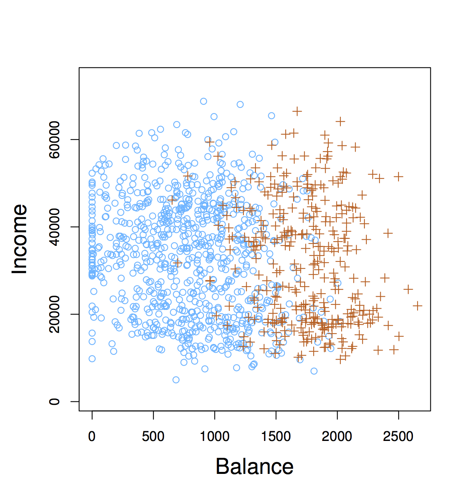

class: title-slide, center, middle
count: false

.banner[]

.title[Introduction to Data Science: Logistic Regression]

.author[Héctor Corrada Bravo]

.other-info[
University of Maryland, College Park, USA  
`r Sys.Date()`
]

.logo[]

```{r setup1, include=FALSE}
options(htmltools.dir.version = FALSE)
knitr::opts_chunk$set(cache=TRUE)
```

---
layout: true

## Linear models for classification

---


The general classification setting is: can we predict categorical response/output $Y$, from set of predictors $X_1,X_2,\ldots,X_p$? 

As in the regression case, we assume training data $(\mathbf{x}_1, y_1), \ldots, (\mathbf{x}_n, y_n)$. 
In this case, however, responses $y_i$ are categorical and take one of a fixed set of values. 

---

.image-40[]
.image-40[]

---

### An example classification problem

An individual's choice of transportation mode to commute to work. 

Predictors: income, cost and time required for each of the alternatives: driving/carpooling,  biking, taking a bus, taking the train. 

Response: whether the individual makes their commute by car, bike, bus or train. 

---

### Why not linear regression?

Why can't we use linear regression in the classification setting. 

For categorical responses with more than two values, if order and scale (units) don't make sense, then it's not a regression problem

---

For **binary** (0/1) responses, it's a little better.

We could use linear regression in this setting and _interpret_ response $Y$ as a probability (e.g, if $\hat{y} > 0.5$ predict $\mathtt{drug overdose}$)

---

.center.image-80[]

---

### Classification as probability estimation problem

Instead of modeling classes 0 or 1 directly, we will model the conditional class probability $p(Y=1|X=x)$, and classify based on this probability. 

In general, classification approaches use _discriminant_ (think of _scoring_) functions to do classification. 

_Logistic regression_ is **one** way of estimating the class probability $p(Y=1|X=x)$ (also denoted $p(x)$)

---

```{r,echo=FALSE, message=FALSE}
library(MASS)

library(RColorBrewer)
mycols <- brewer.pal(8, "Dark2")[c(3,2)]

s <- sqrt(1/5)
set.seed(30)

makeX <- function(M, n=100, sigma=diag(2)*s) {
  z <- sample(1:nrow(M), n, replace=TRUE)
  m <- M[z,]
  return(t(apply(m,1,function(mu) mvrnorm(1,mu,sigma))))
}

M0 <- mvrnorm(10, c(1,0), diag(2)) # generate 10 means
x0 <- makeX(M0) ## the final values for y0=blue

M1 <- mvrnorm(10, c(0,1), diag(2))
x1 <- makeX(M1)

x <- rbind(x0, x1)
y <- c(rep(0,100), rep(1,100))
cols <- mycols[y+1]

GS <- 75 # put data in a Gs x Gs grid
XLIM <- range(x[,1])
tmpx <- seq(XLIM[1], XLIM[2], len=GS)

YLIM <- range(x[,2])
tmpy <- seq(YLIM[1], YLIM[2], len=GS)

newx <- expand.grid(tmpx, tmpy)
colnames(newx) <- c("X1","X2")
```

```{r, echo=FALSE, fig.height=7, fig.width=10,fig.align="center"}
layout(matrix(1:4, nr=2, byrow=FALSE))
plot(x, col=cols, xlab="X1", ylab="X2", xlim=XLIM, ylim=YLIM, type="n", main="Training Set")
points(x, col=cols)

# logistic regression
dat <- data.frame(X1=x[,1], X2=x[,2])
fit <- glm(y~X1+X2, data=dat,family=binomial)
yhat <- predict(fit, newdata=newx)
yhat <- ifelse(yhat > 0, 2, 1)
colshat <- mycols[yhat]

coefs <- coef(fit)
a <- -coefs[1] / coefs[3]
b <- -coefs[2] / coefs[3]

plot(x, col=cols, xlab="X1", ylab="X2", xlim=XLIM, ylim=YLIM, type="n",main="logistic regression")
points(x, col=cols)
points(newx, col=colshat, pch=".")
abline(a=a,b=b)

# KNN(15)
library(class)
yhat <- knn(x, newx, y, k=15)
colshat <- mycols[as.numeric(yhat)]
plot(x, col=cols, xlab="X1", ylab="X2", xlim=XLIM, ylim=YLIM, type="n",main="KNN(15)")
points(x, col=cols)
points(newx, col=colshat, pch=".")
contour(tmpx, tmpy, matrix(as.numeric(yhat),GS,GS), levels=c(1,2), add=TRUE, drawlabels=FALSE)

# KNN(1)
yhat <- knn(x, newx, y, k=1)
colshat <- mycols[as.numeric(yhat)]
plot(x, col=cols, xlab="X1", ylab="X2", xlim=XLIM, ylim=YLIM, type="n",main="KNN(1)")
points(x, col=cols)
points(newx, col=colshat, pch=".")
contour(tmpx, tmpy, matrix(as.numeric(yhat),GS,GS), levels=c(1,2), add=TRUE, drawlabels=FALSE)
```

---

### Logistic regression

The basic idea behind _logistic regression_ is to build a **linear** model _related_ to $p(x)$, since linear regression directly (i.e. $p(x) = \beta_0 + \beta_1 x$) doesn't work. 

---

Instead we build a linear model of _log-odds_:

$$
\log \frac{p(x)}{1-p(x)} = \beta_0 + \beta_1 x
$$

---

```{r, echo=FALSE, results="hide", fig.width=10, fig.height=7, fig.align="center"}
library(ISLR)
data(Default)

fit <- glm(default~balance, data=Default, family=binomial)
ilogis <- function(theta) exp(theta) / (1 + exp(theta))

makeplot <- function(beta1) {
  with(Default,
       plot(balance, as.numeric(default)-1,
        ylab="Probability of default",
        main=substitute(list(hat(beta)[0]==beta0, hat(beta)[1]==beta1), 
                        list(beta0=round(coef(fit)[1], digits=2), beta1=round(beta1, digits=3)))))
  curve(ilogis(coef(fit)[1] + beta1 * x), add=TRUE, col="blue", lwd=1.3)
  abline(h=c(0,1), lty=2)
}

layout(matrix(1:4, nr=2, byrow=TRUE))
sapply(c(0.001, coef(fit)[2], 0.01, 0.1), makeplot)
```
---

Here is how we compute a logistic regression model in R

```{r, message=FALSE, echo=FALSE}
library(ISLR)
library(dplyr)
library(broom)
library(ggplot2)

data(Default)
```

```{r}
default_fit <- glm(default ~ balance, data=Default, family=binomial)
default_fit %>% 
  tidy() 
```

---

Interpretation of logistic regression models is slightly different than the linear regression model we looked at. 

In this case, the **odds** that a person defaults increase by $e^{0.05} \approx `r round(exp(0.05),3)`$ for every dollar in their account balance. 

---

As before, the **accuracy** of $\hat{\beta}_1$ as an estimate of the **population** parameter is given its standard error. 

We can again construct a confidence interval for this estimate as we've done before.

---

As before, we can do hypothesis testing of a relationship between account balance and the probability of default. 

In this case, we use a $Z$-statistic $\frac{\hat{\beta}_1}{\mathrm{SE}(\hat{\beta}_1)}$ which plays the role of the t-statistic in linear regression: a scaled measure of our estimate (signal / noise). 

---

As before, the P-value is the probability of seeing a Z-value as large (e.g., 24.95) under the null hypothesis that **there is no relationship between balance and the probability of defaulting**, i.e., $\beta_1=0$ in the population.

---

We require an algorithm required to _estimate_ parameters $\beta_0$ and $\beta_1$ according to a data fit criterion. 

In logistic regression we use the **Bernoulli** probability model we saw previously (think of flipping a coin weighted by $p(x)$), and _estimate_ parameters to **maximize** the _likelihood_ of the observed training data under this coin flipping (binomial) model. 

---

Usually, we do this by _minimizing_ the negative of the log likelihood of the model. I.e.: solve the following optimization problem

$$\min_{\beta_0, \beta_1} \sum_{i:\, y_i=1} -y_i f(x_i) + \log (1+e^{f(x_i)})$$

where $f(x_i) = \beta_0 + \beta_1 x_i$. This is a non-linear (but convex) optimization problem. 


---

### Making predictions

We can use a learned logistic regression model to make predictions. E.g., "on average, the probability that a person with a balance of $1,000 defaults is":
 
$$
\hat{p}(1000) = \frac{e^{\hat{\beta}_0 + \hat{\beta}_1 \times 1000}}{1+e^{\beta_0 + \beta_1 \times 1000}} 
\approx \frac{e^{-10.6514 + 0.0055 \times 1000}}{1+e^{-10.6514 + 0.0055 \times 1000}} \\
\approx 0.00576 
$$
 

---

### Multiple logistic regression

This is a classification analog to linear regression:

$$
\log \frac{p(\mathbf{x})}{1-p(\mathbf{x})} = \beta_0 + \beta_1 x_1 + \cdots + \beta_p x_p
$$

---

```{r}
fit <- glm(default ~ balance + income + student, data=Default, family="binomial")
fit %>% 
  tidy() 
```

---

As in multiple linear regression it is essential to avoid **confounding!**. 

---

Consider an example of single logistic regression of default vs. student status:

```{r}
fit1 <- glm(default ~ student, data=Default, family="binomial")
fit1 %>% tidy() 
```

---

and a multiple logistic regression:

```{r}
fit2 <- glm(default ~ balance + income + student, data=Default, family="binomial")
fit2 %>% tidy() 
```

---

```{r, echo=FALSE}
bal_range <- range(Default$balance)
plot(0,0,xlim=bal_range,ylim=c(0,1),xlab="Credit Card Balance", ylab="Default Rate", type="n")
curve(predict(fit1, newdata=data.frame(student="Yes", balance=x), type="response"), add=TRUE, lty=2, col="orange", lwd=1.6)
curve(predict(fit1, newdata=data.frame(student="No", balance=x), type="response"), add=TRUE, lty=2, col="blue", lwd=1.6)
curve(predict(fit2, newdata=data.frame(student="Yes", balance=x, income=mean(Default$income)), type="response"), add=TRUE, lty=1, col="orange", lwd=1.6)
curve(predict(fit2, newdata=data.frame(student="No", balance=x, income=mean(Default$income)), type="response"), add=TRUE, lty=1, col="blue", lwd=1.6)
```

```{r, echo=FALSE}
boxplot(balance~student, data=Default, col=c("blue", "orange"), xlab="Student Status", ylab="Credit Card Balance")
```

---
layout: true

## Classifier evaluation

---

How do we determine how well classifiers are performing? 

One way is to compute the _error rate_ of the classifier, the percent of mistakes it makes when predicting class

---

We need a more precise language to describe classification mistakes:


|                   | True Class +        | True Class -        | Total |
|------------------:|:--------------------|---------------------|-------|
| Predicted Class + | True Positive (TP)  | False Positive (FP) | P*    |
| Predicted Class - | False Negative (FN) | True Negative (TN)  | N*    |
| Total             | P                   | N                   |       |

---

Using these we can define statistics that describe classifier performance

| Name                            | Definition | Synonyms                                          |
|--------------------------------:|:-----------|---------------------------------------------------|
| False Positive Rate (FPR)       | FP / N     | Type-I error, 1-Specificity                       |
| True Positive Rate (TPR)        | TP / P     | 1 - Type-II error, power, sensitivity, **recall** |
| Positive Predictive Value (PPV) | TP / P*    | **precision**, 1-false discovery proportion       |
| Negative Predicitve Value (NPV) | FN / N*    |                                                   |
---

In the credit default case we may want to increase **TPR** (recall, make sure we catch all defaults) at the expense
of **FPR** (1-Specificity, clients we lose because we think they will default)

---

This leads to a natural question: Can we adjust our classifiers TPR and FPR?

Remember we are classifying `Yes` if 

$$
\log \frac{P(Y=\mathtt{Yes}|X)}{P(Y=\mathtt{No}|X)} > 0 \Rightarrow \\
P(Y=\mathtt{Yes}|X) > 0.5
$$

What would happen if we use $P(Y=\mathtt{Yes}|X) > 0.2$?

---

A way of describing the TPR and FPR tradeoff is by using the **ROC curve** (Receiver Operating Characteristic) 
and the **AUROC** (area under the ROC)

Another metric that is frequently used to understand classification errors and tradeoffs is the precision-recall curve:

---
layout: true

## Summary

---

We approach classification as a class probability estimation problem. 

Logistic regression partition predictor space with linear functions. 

Logistic regression learns parameter using Maximum Likelihood (numerical optimization)

---

Error and accuracy statistics are not enough to understand classifier performance. 

Classifications can be done using probability cutoffs to trade, e.g., TPR-FPR (ROC curve), or precision-recall (PR curve). 

Area under ROC or PR curve summarize classifier performance across different cutoffs.
