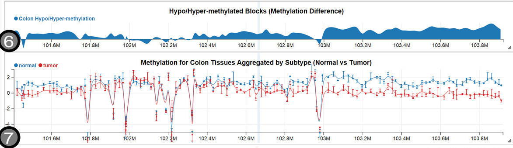

class: title-slide, center, middle
count: false

.banner[]

.title[Model Selection]

.author[Héctor Corrada Bravo]

.other-info[
University of Maryland, College Park, USA  
CMSC320: `r Sys.Date()`
]

.logo[]

---

## Model Selection

```{r, echo=FALSE}
knitr::opts_chunk$set(cache=TRUE)
```

Our goal when we use a learning model like linear or logistic regression, decision trees, etc., is
to learn a model that can predict outcomes for new unseen data.

---

We should therefore think of model evaluation based on _expected predicted error_: what will the prediction error be for data _outside_ the training data.

--

How then, do we measure our models' ability to predict unseen data, when we only have access to training data?

---

## Cross-validation

The most common method to evaluate model **generalization** performance is _cross-validation_. 

It is used in two essential data analysis phases: _Model Selection_ and _Model Assessment_. 

---

## Cross-validation

### Model Selection

Decide what kind, and how complex of a model we should fit. 

--

Consider a regression example: I will fit a linear regression model, what predictors should be included?, interactions?, data transformations? 

--

Another example is what classification tree depth to use.

--

Which kind of algorithm to use, linear regression vs. decision tree vs. random forest

---

## Cross-validation

### Model Assessment 

Determine how well does our selected model performs as a **general** model. 

--

Ex. I've built a linear regression model with a specific set predictors. How well will it perform on unseen data? 

--

The same question can be asked of a classification tree of specific depth.

---

## Cross-validation

Cross-validation is a _resampling_ method to obtain estimates of **expected prediction error rate** (or any other performance measure on unseen data). 

In some instances, you will have a large predefined test dataset **that you should never use when training**. 

In the absence of access to this kind of dataset, cross validation can be used.

---

## Validation Set

The simplest option to use cross-validation is to create a _validation_ set, where our dataset is **randomly** divided into _training_ and _validation_ sets. 

Then the _validation_ is set aside, and not used at until until we are ready to compute **test error rate** (once, don't go back and check if you can improve it).


---
class: split-50

## Validation Set

Let's look at our running example using automobile data, where we want to build a
regression model to predict miles per gallon given other auto attributes.

.column[A linear regression model was not appropriate for this dataset. Use _polynomial_ regression as an illustrative example.
]

.column[
```{r, echo=FALSE, message=FALSE, fig.width=5, fig.height=3}
library(ggplot2)
library(ISLR)

data(Auto)
ggplot(Auto, aes(x=horsepower, y=mpg)) + geom_point() + geom_smooth()
```
]

---

## Validation Set

For polynomial regression, our regression model (for a single predictor $X$) is given as a $d$ degree polynomial.

$$\mathbb{E}[Y|X=x] = \beta_0 + \beta_1 x + \beta_2 x^2 + \cdots + \beta_d x^d$$


For _model selection_, we want to decide what degree $d$ we should use to model this data. 

---
class: split-50

## Validation Set

.column[
Using the _validation set_ method, split our data into a training set, 

fit the regression model with different polynomial degrees $d$ on the training set, 

measure test error on the validation set.
]

```{r, echo=FALSE}
set.seed(1234)

in_validation <- sample(nrow(Auto), nrow(Auto)/2)
validation_set <- Auto[in_validation,]
training_set <- Auto[-in_validation,]

library(broom)
library(dplyr)

degrees <- seq(1, 10)
error_rates <- sapply(degrees, function(deg) {
  fit <- lm(mpg~poly(horsepower, degree=deg), data=training_set)
  predicted <- predict(fit, newdata=validation_set)
  mean((validation_set$mpg - predicted)^2)
})
```

.column[
```{r, echo=FALSE, fig.align='center', fig.height=4.5, fig.width=5}
plot(degrees, error_rates, type="b", xlab="Polynomial Degree", ylab="Mean Squared Error", pch=19, lwd=1.4, cex=1.4)
```
]

---

## Resampled validation set

The validation set approach can be prone to sampling issues. 

It can be highly variable as error rate is a random quantity and depends on observations in training and validation sets. 

--

We can improve our estimate of _test error_ by averaging multiple measurements of it (remember the law of large numbers). 

---
class: split-50

## Resampled validation set

.column[
Resample validation set 10 times (yielding different validation and training sets) and averaging the resulting test errors.]

```{r, echo=FALSE, warning=FALSE, message=FALSE}
set.seed(1234)
library(RColorBrewer)

palette(brewer.pal(10, "Dark2"))

degrees <- seq(1, 10)

error_rates <- replicate(10, {
  in_validation <- sample(nrow(Auto), nrow(Auto)/2)
  validation_set <- Auto[in_validation,]
  training_set <- Auto[-in_validation,]

  sapply(degrees, function(deg) {
    fit <- lm(mpg~poly(horsepower, degree=deg), data=training_set)
    predicted <- predict(fit, newdata=validation_set)
    mean((validation_set$mpg - predicted)^2)
  })
})
```

.column[
```{r, echo=FALSE, fig.width=5}
matplot(degrees, error_rates, type="b", pch=19, xlab="Polynomial Degree", ylab="Mean Squared Error", lwd=1.4, cex=1.4)
```
]

---

## Leave-one-out Cross-Validation

This approach still has some issues. 

Each of the training sets in our validation approach only uses 50% of data to train, which leads to models that may not perform as well as models trained with the full dataset and thus we can overestimate error. 

--

To alleviate this situation, we can extend our approach to the extreme: Make each single training point it's own validation set.

---
class: split-50

## Leave-one-out Cross-Validation

.column[
Procedure:  
For each observation $i$ in data set:  
  a. Train model on all but $i$-th observation  
  b. Predict response for $i$-th observation  
  c. Calculate prediction error  
]

.column[]

---
class: split-50

## Leave-one-out Cross-Validation

.column[
This gives us the following _cross-validation_ estimate of error.

$$
CV_{(n)} = \frac{1}{n} \sum_i (y_i - \hat{y}_i)^2
$$
]

.column[]

---

## Leave-one-out Cross-Validation

Advantages: 

- use $n-1$ observations to train each model
- no sampling effects introduced since error is estimated on each sample

--

<!-- something -->

Disadvantages:

- Depending on the models we are trying to fit, it can be very costly to train $n-1$ models. 
- Error estimate for each model is highly variable (since it comes from a single datapoint).

---

## Leave-one-out Cross-Validation

On our running example

```{r, echo=FALSE}
error_rates <- sapply(degrees, function(deg) {
  mean(sapply(seq(len=nrow(Auto)), function(i) {
    fit <- lm(mpg~poly(horsepower, degree=deg), data=Auto[-i,])
    (Auto$mpg[i] - predict(fit, newdata=Auto[i,,drop=FALSE]))^2
    }))
})
```

```{r, echo=FALSE, fig.align='center', fig.height=4.5}
plot(degrees, error_rates, pch=19, cex=1.4, lwd=1.4, xlab="Polynomial Degree", ylab="Cross Validation Error", type="b")
```

---

## k-fold Cross-Validation

This discussion leads us to the most commonly used cross-validation approach _k-fold Cross-Validation_.

---
class: split-50

## k-fold Cross-Validation

.column[
Procedure:  
Partition observations randomly into $k$ groups (folds).  

For each of the $k$ groups of observations:
- Train model on observations in the other $k-1$ folds  
- Estimate test-set error (e.g., Mean Squared Error) on this fold  
]

.column[]


---
class: split-50

## k-fold Cross-Validation

.column[
Procedure:  

Compute average error across $k$ folds  

$$CV_{(k)} = \frac{1}{k} \sum_i MSE_i$$

where $MSE_i$ is mean squared error estimated on the $i$-th fold
]

.column[]

---

## k-fold Cross-Validation

- Fewer models to fit (only $k$ of them)
- Less variance in each of the computed test error estimates in each fold. 

--

It can be shown that there is a slight bias (over estimating usually) in error estimate obtained from this procedure.

---

## k-fold Cross-Validation

Running Example

```{r, echo=FALSE}
set.seed(1234)
k <- 10
n <- nrow(Auto)

fold_size <- ceiling(n/k)
permuted_indices <- rep(NA, k * fold_size)
permuted_indices[1:n] <- sample(n)
fold_indices <- matrix(permuted_indices, nc=k)

cv10_error_rates <- sapply(seq(1,k), function(fold_index) {
    test_indices <- na.omit(fold_indices[,fold_index])
    train_set <- Auto[-test_indices,]
    test_set <- Auto[test_indices,]
    
    res <- sapply(degrees, function(deg) {
      fit <- lm(mpg~poly(horsepower, degree=deg), data=train_set)
      mean((Auto$mpg[test_indices] - predict(fit, newdata=test_set))^2)
    })
    res
  })
```

```{r, echo=FALSE, fig.align='center', fig.height=4.5}
matplot(degrees, cv10_error_rates, pch=19, type="b", lwd=1.4, cex=1.4, xlab="Polynomial Degrees", ylab="10-fold CV Error Rate")
```

---

## Cross-Validation in Classification

Each of these procedures can be used for classification as well. 

In this case we would substitute MSE with performance metric of choice. E.g., error rate, accuracy, TPR, FPR, AUROC. 

--

Note however that not all of these work with LOOCV (e.g. AUROC since it can't be defined over single data points).


---
class: split-50

## Comparing models using cross-validation

.column[
Suppose you want to compare two classification models (logistic regression vs. a decision tree) on the `Default` dataset. We can use Cross-Validation to determine if one model is better than the other, using a $t$-test for example.
]

```{r, echo=FALSE, message=FALSE}
library(ISLR)
library(cvTools)
library(tree)

data(Default)
fold_indices <- cvFolds(n=nrow(Default), K=10)

error_rates <- sapply(1:10, function(fold_index) {
  test_indices <- which(fold_indices$which == fold_index)
  test_set <- Default[test_indices,]
  train_set <- Default[-test_indices,]
  
  logis_fit <- glm(default~., data=train_set, family="binomial")
  logis_pred <- ifelse(predict(logis_fit, newdata=test_set, type="response") > 0.5, "Yes", "No")
  logis_error <- mean(test_set$default != logis_pred)
  
  tree_fit <- tree(default~., data=train_set)
  pruned_tree <- prune.tree(tree_fit, best=3)

  tree_pred <- predict(pruned_tree, newdata=test_set, type="class")
  tree_error <- mean(test_set$default != tree_pred)
  c(logis_error, tree_error)
  })
rownames(error_rates) <- c("logis", "tree")
error_rates <- as.data.frame(t(error_rates))

library(tidyr)
library(dplyr)

error_rates <- error_rates %>%
  mutate(fold=1:n()) %>%
  gather(method,error,-fold)
```

.column[
```{r, echo=FALSE, message=FALSE, fig.height=4.5, fig.width=5}
dotplot(error~method, data=error_rates, ylab="Mean Prediction Error")
```
]

---
## Comparing models using cross-validation

Using hypothesis testing:

```{r, echo=FALSE}
lm(error~method, data=error_rates) %>% 
  tidy() %>%
  knitr::kable(format='html')
```

In this case, we do not observe any significant difference between these two classification methods.

---

## Summary

Model selection and assessment are critical steps of data analysis. 

Resampling methods are general tools used for this purpose. 

k-fold cross-validation can be used to provide larger training sets to algorithms while stabilizing empirical estimates of expected prediction error


