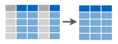
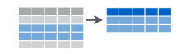
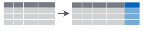
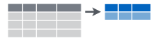
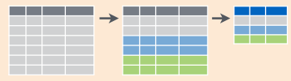

class: title-slide, center, middle
count: false

.banner[]

.title[Introduction to Data Science: Operations]

.author[Héctor Corrada Bravo]

.other-info[
University of Maryland, College Park, USA  
`r Sys.Date()`
]

.logo[]

---

```{r setup1, include=FALSE}
options(htmltools.dir.version = FALSE)
knitr::opts_chunk$set(cache=TRUE)
```

## Principles: Basic Operations

Now that we have a data frame describing our data, let's learn a few fundamental operations we perform on data frames on almost any analysis. 

We divide these first set of operations into two groups: 

- operations on _attributes_ 
- operations on _entitites_. 

```{r vars1, message=FALSE, echo=FALSE, result="hide"}
library(tidyverse)
arrest_tab <- read_csv("data/BPD_Arrests.csv")
```

```{r echo=FALSE, eval=FALSE}
arrest_tab$race <- factor(arrest_tab$race)
arrest_tab$sex <- factor(arrest_tab$sex)
arrest_tab$incidentOffense <- factor(arrest_tab$incidentOffense)
```

---
layout: true

## Operations that subset attributes

---
class: split-60

### `select`

.column[
Suppose we only want to study patterns in these arrests based on a smaller number of attributes.

In that case we would like to create a data frame that contains only those attributes of interest. 
]

.column[
```{r select_img, echo=FALSE, fig.align="center", out.width="30%"}

```
]
---

Let's create a data frame containing only the `age`, `sex` and `district` attributes

```{r select_example}
select(arrest_tab, age, sex, district)
```

The first argument to `select` is a data frame, and the value returned by `select` is also a data frame

---

We can use an operator to describe ranges. E.g., `1:5` would be attributes 1 through 5:
  
```{r select_range}
select(arrest_tab, 1:5)
```

---
layout: true

## Operations that subset entities


---
class: split-60

### `slice`

.column[
We can choose specific entities by their row position. For instance, to choose entities in rows 1,3 and 10, we would use the following:

```{r slice, eval=FALSE}
slice(arrest_tab, c(1, 3, 10))
```
]

.column[
```{r slice_fig, echo=FALSE, fig.align="center", out.width="40%"}

```
]

---

As before, the first argument is the data frame to operate on. 

The second argument is a _vector_ of indices. 

We used the `c` function (for concatenate) to create a vector of indices.

---

We can also use the range operator here:

```{r slice_range}
slice(arrest_tab, 1:5)
```

---

To create general sequences of indices we would use the `seq` function. For example, to select entities in even positions we would use the following:

```{r slice_even}
slice(arrest_tab, seq(2, nrow(arrest_tab), by=2))
```

---

### `filter`

We can also select entities based on attribute properties. For example, to select arrests where age is less than 18 years old, we would use the following:

```{r filter}
filter(arrest_tab, age < 18)
```

---

The second argument is an expression that evaluates to a vector of logical values (`TRUE` or `FALSE`), if the expression evaluates to TRUE for a given entity (row) then that entity (row) is part of the resulting data frame. 

---

Operators used frequently include:

`==`, `!=`: tests equality and inequality respectively (categorical, numerical, datetimes, etc.)  
`<`, `>`, `<=`, `>=`: tests order relationships for ordered data types (not categorical)  
`!`, `&`, `|`: not, and, or, logical operators

---

To select arrests with ages between 18 and 25 we can use

```{r filter_and}
filter(arrest_tab, age >= 18 & age <= 25)
```

---

The filter function can take multiple logical expressions. In this case they are combined with `&`. So the above is equivalent to

```{r filter_and2}
filter(arrest_tab, age >= 18, age <= 25)
```

---

### `sample_n` and `sample_frac`

Frequently we will want to choose entities from a data frame at random. The `sample_n` function selects a specific number of entities at random:

```{r sample_n}
sample_n(arrest_tab, 10)
```

---

The `sample_frac` function selects a fraction of entitites at random:

```{r sample_frac}
sample_frac(arrest_tab, .1)
```

---
layout: false

## Pipelines of operations

All of the functions implementing our first set of operations have the same argument/value structure. 

They take a data frame as a first argument and return a data frame. We refer to this as the _data-->transform-->data_ pattern. 

This is the core a lot of what we will do in class as part of data analyses. 

Specifically, we will combine operations into _pipelines_ that manipulate data frames.

---

In R, the `dplyr` package introduces _syntactic sugar_ to make this pattern explicit. 

```{r sample_frac_pipe}
arrest_tab %>%
  sample_frac(.1)
```

---

The `%>%` binary operator takes the value to its **left** and inserts it as the first argument of the function call to its **right**. So the expression `LHS %>% f(another_argument)` is **equivalent** to the expression `f(LHS, another_argument)`. 

In `pandas`, you can chain `.` calls.

---

Using the `%>%` operator and the _data-->transform-->data_ pattern of the functions we've seen so far, we can create pipelines. 

---

For example, let's create a pipeline that:

1) filters our dataset to arrests between the ages of 18 and 25
2) selects attributes `sex`, `district` and `arrestDate` (renamed as `arrest_date`)
3) samples 50% of those arrests at random

We will assign the result to variable `analysis_tab`

---

```{r pipeline}
analysis_tab <- arrest_tab %>%
  filter(age >= 18, age <= 25) %>%
  select(sex, district, arrest_date=arrestDate) %>%
  sample_frac(.5)
analysis_tab
```


---

**Exercise**: Create a pipeline that:

1) filters dataset to arrests from the "SOUTHERN" district occurring before "12:00" (`arrestTime`)

2) selects attributes, `sex`, `age`

3) samples 10 entities at random

---


# Principles: More Operations

```{r sec06_setup, echo=FALSE, message=FALSE}
knitr::opts_chunk$set(cache=TRUE)

library(tidyverse)
arrest_tab <- read_csv("data/BPD_Arrests.csv")
```

Next, we learn a few more fundamental data operations: sorting, creating new attributes, summarizing and grouping. 

Finally we will take a short detour through a discussion on vectors. 

---
layout: true

## Operations that sort entities

---

Re-order entities based on the value of their `age` attribute, and then `slice` to create a data frame with just the entities of interest

```{r arrange_slice}
arrest_tab %>%
  arrange(age) %>%
  slice(1:10)
```

---

The `arrange` operation sorts entities by increasing attribute values. Use `desc` helper to sort by decreasing value. E.g., find the arrests with the 10 _oldest_ subjects:

```{r arrange_desc_slice}
arrest_tab %>%
  arrange(desc(age)) %>%
  slice(1:10)
```

---
layout: true

## Operations that create new attributes

---

We will often see that for many analyses we will create new attributes based on existing attributes in a dataset. 

- This is helpful for interpretation, visualization and/or statistical modeling.

```{r mutate_fig, echo=FALSE, fig.align="center", out.width="50%"}

```

---

Suppose I want to represent age in months rather than years in our dataset. To do so I would multiply 12 to the existing age attribute. The function `mutate` creates new attributes based on the result of a given expression:

```{r mutate_age}
arrest_tab %>%
  mutate(age_months = 12 * age) %>%
  select(arrest, age, age_months)
```

---
layout: true

## Operations that summarize (aggregate) attribute values over entities

---

Collapse a data frame to a single row containing the desired attribute summaries.

```{r summarize_fig, echo=FALSE, fig.align="center", out.width="60%"}

```


---

Find minmum, maximum and average age in the dataset:


```{r summarize_mean}
summarize(arrest_tab, min_age=min(age), mean_age=mean(age), max_age=max(age))
```

---

| Operation(s) | Result |
|-----------|-------------|
| `mean`, `median` | average and median attribute value |
| `sd` | standard deviation of attribute values |
| `min`, `max` | minimum and maximum attribute values |
| `n`, `n_distinct` | number of attribute values and number of _distinct_ attribute values |
| `any`, `all` | is `any` attribute value TRUE, or are `all` attribute values TRUE |

---

Let's see the number of distinct districts in our dataset:

```{r count_district}
summarize(arrest_tab, n_distinct(district))
```

We may also refer to these summarization operation as **aggregation** since we are computing _aggregates_ of attribute values.

---
layout: true

## Operations that group entities

---

Summarization (aggregation) goes hand in hand with data grouping, where summaries are computed _conditioned_ on other attributes. 

The notion of _conditioning_ is fundamental to data analysis and we will see it very frequently through the course. 

It is the basis of statistical analysis and Machine Learning models and it is essential in understanding the design of effective visualizations.

---

The goal is to group entities with the same value of one or
more attributes. 

The `group_by` function in essence annotates the rows of a data frame as belonging to a specific group based on the value of some chosen attributes. 

```{r groupby_fig, echo=FALSE, fig.align="center", out.width="60%"}

```

---

Group entities by the value of the `district` attribute.

```{r groupby}
group_by(arrest_tab, district)
```

---

Subsequent operations are then performed **for each group independently**. 

For example, when `summarize` is applied to a grouped data frame, summaries are computed for each group of entities, rather than the whole set of entities.

---

Calculate minimum, maximum and average age for each district:

```{r groupby_summarize}
arrest_tab %>%
  group_by(district) %>%
  summarize(min_age=min(age), max_age=max(age), mean_age=mean(age))
```

---

`group_by/summarize` defines new entities. 

The entities in our original dataset are arrests. The entities for the result of the last example are the districts. 

This is a general property of group_by and summarize: it defines a data set where entities are defined by distinct values of the attributes we use for grouping.

---

Another example: average age for subjects 21 years or older grouped by district and sex:

```{r groupby_example}
arrest_tab %>%
  filter(age >= 21) %>%
  group_by(district, sex) %>%
  summarize(mean_age=mean(age))
```

---

**Exercise**: Write a data operation pipeline that

1) filters records to the southern district and ages between 18 and 25
2) computes mean arrest age for each sex

---
layout: true

## Vectors

---

We briefly saw previously operators to create vectors in R. For instance, we can use `seq` to create a vector that consists of a sequence of integers:

```{r seq_example}
multiples_of_three <- seq(3, 30, by=3)
multiples_of_three
```

---

Let's how this is represented in R (the `str` is very handy to do this type of digging around):

```{r class_seq, cache=FALSE}
str(multiples_of_three)
```

---

Like many other languages we use square brackets `[]` to index vectors:

```{r indexing}
multiples_of_three[1]
```

---

We can use ranges as before

```{r index_range}
multiples_of_three[1:4]
```

---

We can use vectors of non-negative integers for indexing:

```{r index_vec}
multiples_of_three[c(1,3,5)]
```

---

Or even logical vectors:

```{r index_logical}
multiples_of_three[c(TRUE, FALSE, TRUE, FALSE, TRUE, FALSE, TRUE, FALSE, TRUE, FALSE)]
```

---

In R, most operations are designed to work with vectors directly (we call that _vectorized_). 

For example, if I want to add two vectors together I would write: (look no `for` loop!):

```{r sum_vec}
multiples_of_three + multiples_of_three
```

This also works for other arithmetic and logical operations (e.g., `-`, `*`, `/`, `&`, `|`). 

---

In data analysis the _vector_ is probably the most fundamental data type (other than basic numbers, strings, etc.). 

Why? Consider getting data about one attribute, say height, for a group of people. What do you get? An vector of numbers, all in the same unit (say feet, inches or centimeters). 

How about their name? Then you get a vector of strings. 

Abstractly, we think of vectors as arrays of values, all of the same _class_ or datatype. 

---
layout: true

## Attributes as vectors

---

Each column, corresponding to an attribute, is a vector. We use the `pull` function to extract a vector from a data frame. 

We can then operate index them, or operate on them as vectors

```{r pull_age}
age_vec <- arrest_tab %>% pull(age)
age_vec[1:10]
```

---

Or, 

```{r add_age}
12 * age_vec[1:10]
```

---

The `$` operator serves the same function. 

```{r dollar}
age_vec <- arrest_tab$age
age_vec[1:10]
```

---

The `pull` function however, can be used as part of a pipeline (using operator `%>%`):

```{r mean_age_vec}
arrest_tab %>%
  pull(age) %>%
  mean()
```

---

## Functions

How to abstract pipelines?  Factor into reusable functions that we can apply in other analyses. E.g., a function that executes the age by district/sex summarization we created before:

```{r func_example}
summarize_district <- function(df) {
  df %>%
    filter(age >= 21) %>%
    group_by(district, sex) %>%
    summarize(mean_age=mean(age))
}
```

---

You can include multiple expressions in the function definition (inside brackets `{}`). Notice there is no `return` statement in this function. When a function is called, it returns the value of the last expression in the function definition. In this example, it would be the data frame we get from applying the pipeline of operations. 

---

You can find more information about vectors, functions and other programming matters we might run into in class in Chapters 17-21 of [R for Data Science](http://r4ds.had.co.nz/program-intro.html)

---

**Exercise** Abstract the pipeline you wrote in the previous unit into a function that works for arbitrary districts. 
The function should take arguments `df` and `district`.
