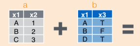

class: title-slide, center, middle
count: false

.banner[]

.title[Introduction to Data Science: Data Representation Models]

.author[Héctor Corrada Bravo]

.other-info[
University of Maryland, College Park, USA  
`r Sys.Date()`
]

.logo[]

---
layout: true

## Overview

---

```{r setup1, include=FALSE}
options(htmltools.dir.version = FALSE)
knitr::opts_chunk$set(cache=TRUE)

library(tidyverse)
```

Principles of preparing and organizing data in a way that is amenable for analysis. 

--

**Data representation model**: collection of concepts that describes how data is represented and accessed. 

--

Thinking abstractly of data structure, beyond a specific implementation, makes it easier to share data across programs and systems, and integrate data from different sources.

---

- **Structure**: We have assumed that data is organized in rectangular data structures (tables with rows and columns)
- **Semantics**: We have discussed the notion of _values_, _attributes_, and _entities_. 

--

So far, _data semantics_: a dataset is a collection of _values_, numeric or categorical, organized into _entities_ (_observations_) and _attributes_ (_variables_). 

--

Each _attribute_ contains values of a specific measurement across _entities_, and _entities_ collect all measurements across _attributes_. 

---

In the database literature, we call this exercise of defining structure and semantics as _data modeling_. 

--

In this course we use the term _data representational modeling_, to distinguish from _data statistical modeling_. 

---
layout: true

## Data representational modeling

---

- **Data model**: A collection of concepts that describes how data is represented and accessed  
- **Schema**: A description of a specific collection of data, using a given data model  

---

- Modeling Constructs: A collection of concepts used to represent the structure in the data. 

Typically we need to represent types of *entities*, their *attributes*, types of *relationships* between *entities*, and *relationship attributes*  

---

- Integrity Constraints: Constraints to ensure data integrity (i.e., avoid errors)  

--

- Manipulation Languages: Constructs for manipulating the data  
  
---


We desire that models are:

- sufficiently _expressive_ so they can capture real-world data well, 

- _easy to use_, 

- lend themselves to defining computational methods that have good performance.

---

Some examples of data models are

- Relational, Entity-relationship model, XML...
- Object-oriented, Object-relational, RDF...
- Current favorites in the industry: JSON, Protocol Buffers, [Avro](http://avro.apache.org/docs/current/), Thrift, Property Graph

---

- **Data independence:** The idea that you can change the representation of data w/o changing programs that operate on it.  

- **Physical data independence:** I can change the layout of data on disk and my programs won't change
    - index the data
    - partition/distribute/replicate the data
    - compress the data
    - sort the data

---
layout: true

## The Entity-Relationship and Relational Models

---
class: split-50

.column[
Modeling constructs:
- _entities_ and their _attributes_
- _relationships_ and _relationship attributes_. 

Entities are objects represented in a dataset: people, places, things, etc. 

Relationships model just that, relationships between entities.
]

.column[
.center.middle.image-50[]
]

---
class: split-50

.column[
Diagrams:
- rectangles are _entitites_ 
- diamonds and edges indicate _relationships_ 
- Circles describe either entity or relationship _attributes_. 
]

.column[
.center.middle.image-50[]
]

---
class: split-50

.column[
Arrows are used indicate multiplicity of relationships 
]

.column[
.center.middle.image-50[]
]

---

Relationships are defined over _pairs_ of entities. 

Relationship $R$ over sets of entities $E_1$ and $E_2$ is defined over the _cartesian product_ $E_1 \times E_2$. 

For example: if $e_1 \in E_1$ and $e_2 \in E_2$, then  $(e_1, e_2) \in R$.

---

Arrows specify how entities participate in relationships. 

For example: this diagram specifies that entities in $E_1$ appear in _only one_ relationship pair. 

.center.image-50[]

That is, if $e_i \in E_1$, $e_j \in E_2$ and $(e_i, e_j) \in R$, then there is no
other pair $(e_i, e_k) \in R$. 

---

In databases and general datasets we work on, both Entities and Relationships are represented as _Relations_ (tables).

--

Such that a _unique_ entity/relationship is represented by a single tuple (the list of attribute values that represent an entity or relationship). 

--

How can we ensure _uniqueness_ of entities?

--

_keys_ are an essential ingredient to uniquely identify entities and relationships in tables.

---
layout: true

## Formal introduction to keys

---

- Attribute set $K$ is a **superkey** of relation $R$ if values for $K$ are sufficient to identify a unique tuple of each possible relation $r(R)$ 
    - Example:  `{SSN}` and `{SSN,name}` are both superkeys of *person*

--

- Superkey $K$ is a **candidate key** if $K$ is minimal
    - Example:  `{SSN}` is a candidate key for *person*
    
--

- One of the candidate keys is selected to be the **primary key**
    - Typically one that is small and immutable (doesn’t change often)
    - Primary key typically highlighted in ER diagram
    
---

- **Foreign key**: Primary key of a relation that appears in another relation
    - `{SSN}` from *person* appears in *employs*
    - *person* called referenced relation
    - *employs* is the referencing relation 

--

- **Foreign key constraint**: the tuple corresponding to that primary key must exist
    - Imagine:
        - Tuple: `('123-45-6789', 'Apple') `in *employs*
        - But no tuple corresponding to '123-45-6789' in *person*
    - Also called referential integrity constraint

---
layout: true

## Tidy Data

---

We use the term _Tidy Data_ to refer to datasets that are represented in a form that is amenable for manipulation and statistical modeling. 

It is very closely related to the concept of _normal forms_ in the ER model and the process of _normalization_ in the database literature.

---

Here we assume we are working in the ER data model represented as _relations_: rectangular data structures where

1. Each attribute (or variable) forms a column  
2. Each entity (or observation) forms a row  
3. Each type of entity (observational unit) forms a table  

---
class: split-50

Here is an example of a tidy dataset: One entity per row, a single attribute per column. Only information about flights included.

```{r, echo=FALSE}
library(nycflights13)
head(flights) %>% knitr::kable("html")
```

---
layout: true

## Structure Query Language

---

The Structured-Query-Language (SQL) is the predominant language used in database systems. 

It is tailored to the Relational data representation model. 

SQL is a declarative language, we don't write a _procedure_ to compute a relation, we _declare_ what the relation we want to compute looks like.

---

The basic construct in SQL is the so-called `SFW` construct: _select-from-where_ which specifies:

- _select_: which attributes you want the answer to have
- _from_: which relation (table) you want the answer to be computed from
- _where_: what conditions you want to be satisfied by the rows (tuples) of the answer 

---

E.g.: movies produced by Disney in 1990: note the *rename*

```sql        
select m.title, m.year
from movie m
where m.studioname = 'disney' and m.year = 1990
```

---

The **select** clause can contain expressions (this is paralleled by the `mutate` operation we saw previously)

- `select title || ' (' || to_char(year) || ')' as titleyear`
- `select 2014 - year`

---

The **where** clause support a large number of different predicates and combinations thereof (this is parallel to the `filter` operation)

- `year between 1990 and 1995`
- `title like 'star wars%'`
` title like 'star wars _'`


---

We can include ordering, e.g., find distinct movies sorted by title

```sql
select distinct title
from movie
where studioname = 'disney' and year = 1990
order by title;
```
---

### Group-by and summarize

SQL has an idiom for grouping and summarizing 

E.g., compute the average movie length by year

```sql
select name, avg(length) 
from movie
group by year
```

---
layout: true

## Two-table operations

---

So far we have looked at data operations defined over single tables and data frames. 

In this section we look at efficient methods to combine data from multiple tables. 

The fundamental operation here is the `join`, which is a workhorse of database system design and impementation. 

---

### The `join` operation: 

Combines rows from two tables to create a new single table

Based on matching criteria specified over attributes of each of the two tables. 

---

Consider a database of `flights` and `airlines`:

```{r, include=FALSE}
library(nycflights13)
data(flights)
data(airlines)
```

```{r}
flights
```

---

```{r}
airlines
```

---

Here, we want to add airline information to each flight. 

Join the attributes of the respective airline from the `airlines` table with the `flights` table based on the values of attributes `flights$carrier` and `airlines$carrier`. 

---

Every row of `flights` with a specific value for `flights$carrier`, is joined with the the corresponding row in `airlines` with the same value for `airlines$carrier`. 

---

There are multiple ways of performing this operation that differ on how non-matching observations are handled.

---

## Left Join 

In a `left join`, all observations on left operand (LHS) are retained:

.image-50.left[]

.image-30.center[]

---

Other operations:

- _right join_: all observations in RHS are retained

- _outer join_: all observations are retained (full join)

- _inner join_: only matching observations are retained

Details in lecture notes

---

## Join conditions

All join operations are based on a matching condition:

```{r, eval=FALSE}
flights %>%
  inner_join(airlines, by="carrier")
```

specifies to join observations where `flights$carrier` equals `airlines$carrier`.

---

In this case, where no conditions are specified using the `by` argument:

```{r, eval=FALSE}
flights %>%
  left_join(airlines)
```

a *natural join* is perfomed. In this case all variables with the same name in both tables are used in join condition.

---

You can also specify join conditions on arbitrary attributes using the `by` argument.

```{r, eval=FALSE}
flights %>%
  left_join(airlines, by=c("carrier" = "name"))
```

---

## SQL Constructs: Multi-table Queries

Key idea: 
- Do a join to combine multiple tables into an appropriate table
- Use **SFW** constructs for single-table queries

--

For the first part, where we use a join to get an appropriate table, the general SQL construct includes:
  - The name of the first table to join
  - The _type_ of join to do
  - The name of the second table to join
  - The join condition(s)

---

```sql
select title, year, me.name as producerName 
from movies m join movieexec me
where m.producer = me.id;
```

---
layout: true

## Entity Resolution and Record Linkage

---

Often, we will be faced with the problem of _data integration_: 

- combine two (or more) datasets from different sources 

- that may contain information about the same _entities_. 

--

But,... the _attributes_ in the two datasets may not be the same, 

--

Worse: values for the _same_ entity may be different in the two datasets.

---


--


---

These are examples of a general problem referred to as **Entity Resolution** and **Record Linkage**. 

---

### Problem Definition

**Given**: Entity sets $E_1$ and $E_2$,  

**Find**: Linked entities $(e_1,e_2)$ with $e_1 \in E_1$ and $e_2 \in E_2$.

---

### One approach: similarity function

- Define a _similarity_ function between entities $e_1$ and $e_2$ 

- Link entities with high similarity. 

---

Define similarity as an _additive_ function over some set of shared attributes $A$:

$$s(e_1,e_2) = \sum_{j \in A} s_j(e_1[j], e_2[j])$$

with $s_j$ a similarity function defined for _each_ attribute $j$, 

---
layout: true

## Entity Resolution and Record Linkage

### Example attribute functions

---

**Categorical attribute**: pairs of entities with the same value are more similar to each other than pairs of entities with different values. E.g.,

$$
s_j(e_1[j],e_2[j]) =
\begin{cases}
1 & \mathrm{ if } \; e_1[j] == e_2[j] \\
0 & \mathrm { o.w. }
\end{cases}
$$

---

**Continuous attribute**: pairs of entities with values that are _close_ to each other are more similar than pairs of entities with values that are _farther_ to each other. 

Note that to specify _close_ or _far_ we need to introduce some notion of _distance_. We can use Euclidean distance for example,

$$
d_j(e_1[j],e_2[j]) = (e_1[j] - e_2[j])^2; \\
s_j(e_1[j],e_2[j]) = e^{-d_j(e_1[j],e_2[j])}
$$

---

**Text attributes**: based on _edit distance_ between strings rather than Euclidean distance. 
We can use domain knowledge to specify similarity. 

For example, fact that `John` and `Johnathan` are similar requires domain knowledge of common usage of English names.

---
layout: true

## Solving the resolution problem

---

Need a rule to match entities we think are linked. 

This depends on assumptions we make about the dataset, similar to assumptions we made when performing joins. 

---

Model the entity resolution problem as an _optimization_ problem: 

maximize _objective function_ (based on similarity) 

over possible sets $V$ of _valid_ pairs $(e_1,e_2)$, where set $V$ constraints pairs based on problem-specific assumptions.

$$R = \arg \max_{V} \sum_{(e_1,e_2) \in V} s(e_1,e_2)$$

---

### Many-to-one resolutions

Constrain sets $V$ to represent many-to-one resolutions. 

Thus, entities in $e_1$ can only appear once in pairs in $V$, but entities $e_2$ may appear more than once. 

In this case, we can match $(e_1,e_2)$ where 

$$e_2 = \arg \max_{e \in E_2} s(e_1,e)$$
---

### One-to-one resolutions

Suppose we constrain sets $V$ to those that represent one-to-one resolutions:

If $(e_1,e_2) \in V$ then $e_1$ and $e_2$ appear in only one pair in $V$. 

In this case, we have a harder computational problem. In fact, this is an instance of the _maximum bipartite matching problem_, and would look at network flow algorithms to solve.

---

### Other constraints

We can add additional constraints to $V$ to represent other information we have about the task. 

A common one would be to only allow pairs $(e_1,e_2) \in V$ to have similarity above some threshold $t$. I.e., $(e_1, e_2) \in V$ only if $s(e_1,e_2) \geq t$.

---

### Discussion

The procedure outlined above is an excellent first attempt to solve the Entity Resolution problem. 

This is a classical problem in Data Science for which a variety of approaches and methods are in use. 

---
layout: true

## Database Query Optimization
---

Earlier we made the distinction that SQL is a _declarative_ language rather than a _procedural_ language. 

A reason why data base systems rely on a declarative language is that it allows the system to decide how to _evaluate_ a query _most efficiently_. 

---

Consider a Baseball database where we have two tables `Batting` and `Master` 

_what is the maximum batting "average" for a player from the state of California_?

```{r, echo=FALSE, eval=FALSE}
db <- DBI::dbConnect(RSQLite::SQLite(), "data/lahman2016.sqlite")
```

```sql
select max(1.0 * b.H / b.AB) as best_ba
from Batting as b join Master as m on b.playerId = m.playerId
where b.AB >= 100 and m.birthState = "CA"
```

---

Now, let's do the same computation using `dplyr` operations:

```{r, include=FALSE}
library(Lahman)
library(tidyverse)
```

Version 1:

```{r, message=FALSE, warning=FALSE}
Batting %>%
  inner_join(Master, by="playerID") %>%
  filter(AB >= 100, birthState == "CA") %>%
  mutate(AB=1.0 * H / AB) %>%
  summarize(max(AB))
```

---

Version 2:

```{r, message=FALSE, warning=FALSE}
Batting %>%
  filter(AB >= 100) %>%
  inner_join(
    filter(Master, birthState == "CA")) %>%
  mutate(AB = 1.0 * H / AB) %>%
  summarize(max(AB))
```

---

Which should be most efficient? Think about a simple _cost_ model. The costliest operation here is the join between two tables. 

.center.image-80[]

---

What is the cost of this algorithm? $|T1| \times |T2|$. 

For the rest of the operations, let's assume we perform this with a single pass through the table. 

For example, we assume that `filter(T)` has cost $|T|$. 

---

Let's write out the cost of each of the two pipelines. 

```{r, eval=FALSE}
Batting %>%
  inner_join(Master, by="playerID") %>% # cost: |Batting| x |Master|
  filter(AB >= 100, birthState == "CA") %>% # cost: |R1|
  mutate(AB=1.0 * H / AB) %>% # cost: |R|
  summarize(max(AB)) # cost: |R|
```

---

Cost of version 1 is

$|\mathrm{Batting}|\times|\mathrm{Master}| + |R1| + 2|R|$ 

$R1$: inner join between `Batting` and `Master` $R$: is $R1$ filtered to rows with `AB >=100 & birthState == "CA"`. 

```{r, echo=FALSE}
batting_size <- nrow(Batting)
master_size <- nrow(Master)

r1 <- Batting %>% inner_join(Master, by="playerID")
r1_size <- nrow(r1)

r <- filter(r1, AB>=100, birthState == "CA")
r_size <- nrow(r)

total_cost_v1 <- batting_size * master_size + r1_size + 2*r_size
```

In this example: `r format(total_cost_v1,digits=3,scientific=TRUE)`

---

Now, let's look at the second version. 

```{r, eval=FALSE}
Batting %>%
  filter(AB >= 100) %>% # cost: |Batting|
  inner_join(
    Master %>% filter(birthState == "CA") # cost: |Master|
  ) %>% # cost: |B1| x |M1|
  mutate(AB = 1.0 * H / AB) %>% # cost |R|
  summarize(max(AB)) # cost |R|
```

---

Cost of version 2 is $|\mathrm{Batting}| \times |\mathrm{Master}| + |B1|\times|M1|+2|R|$ 

$B1$: `Batting` filtered to include only rows with `AB >= 100`
$M2$: `Master` filtered to include  
`birthState == "CA"`. 

```{r, echo=FALSE}
b1 <- filter(Batting, AB>=100)
b1_size <- nrow(b1)

m1 <- filter(Master, birthState == "CA")
m1_size <- nrow(m1)

total_cost_v2 <- batting_size + master_size + b1_size * m1_size + 2*r_size
```

In our example: `r format(total_cost_v2, digits=3,scientific=TRUE)`

---

Version 1 (join tables before filtering) is `r format(total_cost_v1 / total_cost_v2, digits=2)` times costlier. 

When using SQL in a database system we only write the one query describing our desired result, 

With the _procedural_ (`dplyr`) we need to think which of the two versions is more efficient.

---

Database systems use _query optimization_ to decide how to evaluate queries efficiently. 

The goal of query optimization is to decide the most efficient query _plan_ to use to evaluate a query out of the many possible candidate plans it could use. 

It needs to solve two problems: search the space of possible plans, approximate the _cost_ of evaluating a specific plan. 

---

Think of the two procedural versions above as two candidate plans that the DB system _could_ use to evaluate the query. 

Query optimzation _approximates_ what it would cost to evaluate each of the two plans and decides to use the most efficient plan. 

```{r, echo=FALSE, eval=FALSE}
DBI::dbDisconnect(db)
```

---
layout: true

## Semi-structured Data Representation Model

---

The Entity-Relational data model we have described so far is mostly defined for _structured data_: where a specific and consistent schema is assumed.

Data models like XML and JSON are instead intended for *semi-structured* data.

---

#### XML: eXtensible Markup Language 

Data models like XML rely on flexible, self-describing schemas: 

```xml
<?xml version="1.0" encoding="UTF-8"?>
<!-- Edited by XMLSpy -->
<CATALOG>
  <CD>
    <TITLE>Empire Burlesque</TITLE>
    <ARTIST>Bob Dylan</ARTIST>
    <COUNTRY>USA</COUNTRY>
    <COMPANY>Columbia</COMPANY>
    <PRICE>10.90</PRICE>
    <YEAR>1985</YEAR>
  </CD>
  <CD>
    <TITLE>Hide your heart</TITLE>
    <ARTIST>Bonnie Tyler</ARTIST>
    <COUNTRY>UK</COUNTRY>
    <COMPANY>CBS Records</COMPANY>
    <PRICE>9.90</PRICE>
    <YEAR>1988</YEAR>
  </CD>
  ...
```
---

### JSON: Javascript Object Notation
        
```json
{
  "firstName": "John",
  "lastName": "Smith",
  "isAlive": true,
  "age": 25,
  "height_cm": 167.6,
  "address": {
    "streetAddress": "21 2nd Street",
    "city": "New York",
    "state": "NY",
    "postalCode": "10021-3100"
  },
  "phoneNumbers": [
    {
      "type": "home",
      "number": "212 555-1234"
    },
    {
      "type": "office",
      "number": "646 555-4567"
    }
  ],
  "children": [],
  "spouse": null
}
```

---

This is the format most contemporary data REST APIs use to transfer data. For instance, here is part of a JSON record from a Twitter stream:

```json
{
  "created_at":"Sun May 05 14:01:34+00002013",
  "id":331046012875583488,
  "id_str":"331046012875583488",
  "text":"\u0425\u043e\u0447\u0443, \u0447\u0442\u043e\u0431 \u0442\u044b \u0441\u0434\u0435\u043b\u0430\u043b \u0432\u0441\u0451 \u043d\u0435\u043e\u0431\u0445\u043e\u0434\u0438\u043c\u043e\u0435.\n \\,,\\ *_* \/,,\/",
  "source":"\u003ca href=\"http:\/\/twitterfeed.com\"rel=\"nofollow\"\u003etwitterfeed\u003c\/a\u003e",
  "in_reply_to_user_id_str":null,
  "user":{
    "id":548422428,
    "id_str":"548422428",
    "name":"\u0410\u0439\u0433\u0435\u0440\u0438\u043c \u041f\u043e\u0433\u043e\u0434\u0438\u043d\u0430",
    "screen_name":"paddybyrny",
    "location":"\u0420\u043e\u0441\u0441\u0438\u044f;\u0412\u043b\u0430\u0434\u0438\u0432\u043e\u0441\u0442\u043e\u043a",
    "followers_count":4188,
    "friends_count":4281,
    "lang":"en",
    "profile_background_image_url":"http:\/\/a0.twimg.com\/images\/themes\/theme1\/bg.png",
  },
  "geo":null,
  "coordinates":null,
  "entities":{
    "hashtags":[],"symbols":[],"urls":[],"user_mentions":[]
  },"favorited":false,"retweeted":false,"filter_level":"medium","lang":"ru"}
```

---
layout: true

## Summary

---

We have looked at specifics of **Data Representation Modeling**

- Entity Relationship and Relational Models

- Definition of _Tidy Data_

- Joining tables

- Entity Resolution

- Models for semi-structured data

