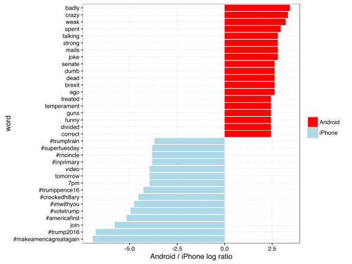

class: title-slide, center, middle
count: false

.banner[]

.title[Introductory Thoughts on Stats]

.author[Héctor Corrada Bravo]

.other-info[
University of Maryland, College Park, USA  
CMSC320: `r Sys.Date()`
]

.logo[]

---

```{r setup, include=FALSE}
options(htmltools.dir.version = FALSE)
knitr::opts_chunk$set(cache=TRUE)
```

# Why Stats?

In this class we learn _Statistical and Machine Learning_ techniques for data analysis.

By the time we are done, you should 

- be able to read **critically** papers or reports that use these methods.
- be able to use these methods for daata analysis

---

# Why Stats?

In either case, you will need to ask yourself if findings are **statistically significant**. 

---
class: split-50

# Why Stats?

.column[
- Use a classification algorithm to distinguish images
- Accurate 70 out of 100 cases.
- Could this happen by chance alone? 

]

.column[
.image-50[]
]

---

# Why Stats?

To be able to answer these question, we need to understand some basic probabilistic and statistical principles. 

In this course unit we will review some of these principles.

---
layout: true

# Variation, randomness and stochasticity

---
class: split-30

So far, we have not spoken about _randomness_ and _stochasticity_. 
We have, however, spoken about _variation_. 

.column[_spread_ in a dataset refers to the fact that in a population of entities
there is naturally occuring variation in measurements]

.column[
```{r, echo=FALSE, message=FALSE, warning=FALSE, fig.height=5}
library(tidyverse)
theme_set(theme_bw())

library(nycflights13)
flights %>%
  mutate(log_dep_delay = sign(dep_delay) * log(abs(dep_delay + 1))) %>%
  ggplot(aes(x=log_dep_delay)) +
    geom_histogram(bins=20)
```
]

---
class: split-50

.column[
Another example: in sets of tweets there is natural variation in the frequency of word usage.
]

.column[
.image-50[]
]

---

In summary, we can discuss the notion of _variation_ without referring to any randomness, stochasticity or noise. 

---
layout: true

# Why Probability?

---


Because, we **do** want to distinguish, when possible:

  - natural occuring variation, vs.
  - randomness or stochasticity

---

Example: want to learn something about education loan debt for 19-30 year olds in Maryland. 

- Find loan debt for **all** 19-30 year old Maryland residents, and calculate mean and standard deviation. 

--

- That's difficult to do for all residents. 

--

- Instead we sample (say by randomly sending Twitter surveys), and _estimate_ the average and standard deviation of debt in this population from the sample. 

---

Now, this presents an issue since we could do the same from a different random sample and get a different set of estimates. Why? 

--

Because there is naturally-occuring variation in this population.  

---

So, a simple question to ask is: 

> How good are our _estimates_ of debt mean and standard deviation from sample of 19-30 year old Marylanders? 

---

Another example: suppose we build a predictive model of loan debt for 19-30 year old Marylanders based on other variables (e.g., sex, income, education, wages, etc.) from our sample. 

--

> How good will this model perform when predicting debt in general?

---

We use probability and statistics to answer these questions. 

--

- Probability captures stochasticity in the sampling process, while

--

- we _model_ naturally occuring variation in measurements in a population of interest.

---
layout: false

# One final word

The term _population_ means 

> **the entire** collection of entities we want to model 

This could include people, but also images, text, chess positions, etc.
