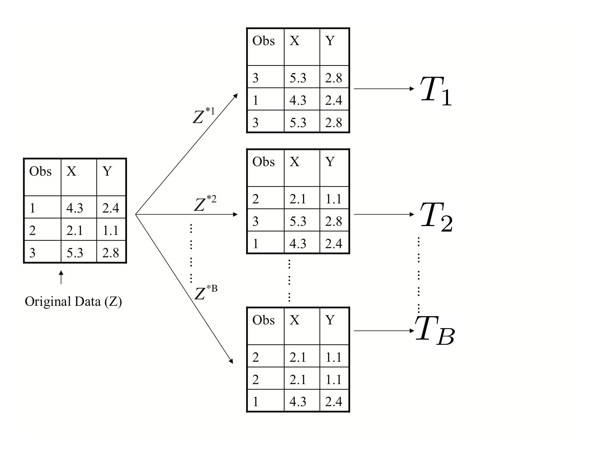

```{r, echo=FALSE}
knitr::opts_chunk$set(cache=TRUE)
```

class: title-slide, center, middle
count: false

.banner[]

.title[Introduction to Data Science: Tree-based Methods]

.author[Héctor Corrada Bravo]

.other-info[
University of Maryland, College Park, USA  
`r Sys.Date()`
]

.logo[]

---

## Tree-based Methods

We saw in previous units the limitation of using linear methods for regression classification. 

--

In this unit, we look at tree-based methods.

--

These are elegant and versatile methods that allow modeling of predictor space with regions that take complex, non-linear, shapes

--

But still produce models that are interpretable. 

--

We will concentrate on Regression and Decision Trees and their extension to Random Forests.

---
class: split-30

## Regression Trees

.column[
Consider a task where we are trying to predict a car's fuel consumption in miles per gallon based on the car's weight. A linear model in this case is not a good fit.
]

.column[
```{r trees_load, echo=FALSE, cache=FALSE, message=FALSE}
library(tree)
library(ISLR)
library(RColorBrewer)
palette(brewer.pal(8, "Dark2"))
data(Auto)
```

```{r trees_auto_plot, echo=FALSE, fig.align="center"}
with(Auto, plot(weight, mpg, pch=19, cex=1.4))
```
]

---
class:split-50

## Regression Trees

Let's take a look at what a regression tree estimates in this case.

.column[
```{r, echo=FALSE, fig.height=6}
tree <- tree(mpg~weight, data=Auto)
plot(tree)
text(tree, pretty=0, cex=1.7)
```
]

.column[
```{r, echo=FALSE, fig.width=6, fig.height=5.5}
with(Auto, plot(weight, mpg, pch=19, cex=1.4))
```
]

---
class:split-50

## Regression trees

The decision trees partitions the `weight` predictor into regions based on its value. 

.column[
```{r, echo=FALSE, fig.height=6}
plot(tree)
text(tree, pretty=0, cex=1.7)
```
]

```{r, echo=FALSE, cache=FALSE, results="hide", fig.width=6,fig.height=5.5}
library(RColorBrewer)
palette(brewer.pal(8, "Dark2"))

process_node <- function(i, left, right) {
 if (tree$frame$var[i] == "<leaf>") {
   val <- as.numeric(tree$frame$yval[i])
   segments(left, val, right, val, col="red", lwd=5)
 } else {
   val <- as.numeric(gsub("<","",tree$frame$splits[i, "cutleft"]))
   i <- process_node(i+1, left, val)
   i <- process_node(i+1, val, right)
 }
 i
}
```

.column[
```{r, echo=FALSE, fig.height=5.5, fig.width=6}
with(Auto, plot(weight, mpg, pch=19, cex=1.4))
abline(v=as.numeric(gsub("<", "", subset(tree$frame, !grepl("leaf", tree$frame$var))$splits[,"cutleft"])))

process_node(1, .85*min(Auto$weight), 1.05*max(Auto$weight))
```
]

---
class: split-50

## Regression Trees

Outcome $Y$ (`mpg` in this case) is predicted to be the mean _within each of the data partitions_. 

.column[
```{r, echo=FALSE, fig.height=6}
plot(tree)
text(tree, pretty=0, cex=1.7)
```
]

.column[
```{r, echo=FALSE, fig.height=5.5, fig.width=6}
with(Auto, plot(weight, mpg, pch=19, cex=1.4))
abline(v=as.numeric(gsub("<", "", subset(tree$frame, !grepl("leaf", tree$frame$var))$splits[,"cutleft"])))

process_node(1, .85*min(Auto$weight), 1.05*max(Auto$weight))
```
]

---
class: split-50

## Regression Trees

Thus provides an empirical estimate of $E[Y|X=x]$ where conditioning is given by this region partitioning.

.column[
```{r, echo=FALSE,fig.height=6}
plot(tree)
text(tree, pretty=0, cex=1.7)
```
]

.column[
```{r, echo=FALSE, fig.height=5.5, fig.width=6}
with(Auto, plot(weight, mpg, pch=19, cex=1.4))
abline(v=as.numeric(gsub("<", "", subset(tree$frame, !grepl("leaf", tree$frame$var))$splits[,"cutleft"])))

process_node(1, .85*min(Auto$weight), 1.05*max(Auto$weight))
```
]

---

## Tree models

Regression and decision trees operate by prediction an outcome variable $Y$ by partitioning feature (predictor) space.

--

In general, the regression tree model:

1. Partitions space into $J$ non-overlapping regions, $R_1, R_2, \ldots, R_J$.
2. For every observation that falls within region $R_j$, predict response as mean of response for training observations in $R_j$.

--

The important observation is that **Regression Trees create partitions recursively**


---

## Tree Models

For example, consider finding a good predictor $j$ to partition space along its axis. A recursive algorithm would look like this:

- Find predictor $j$ and value $s$ that minimize RSS:

$$\sum_{i:\, x_i \in R_1(j,s))} (y_i - \hat{y}_{R_1})^2 +
\sum_{i:\, x_i \in R_2(j,s))} (y_i - \hat{y}_{R_2})^2$$

Where $R_1$ and $R_2$ are regions resulting from splitting observations on predictor $j$ and value $s$:

$$
R_1(j,s) = \{X|X_j < s\} \, \mathrm{ and } \, R_2(j,s) \{X|X_j \geq s\}
$$

---

## Tree Models

For example, consider finding a good predictor $j$ to partition space along its axis. A recursive algorithm would look like this:

- Find predictor $j$ and value $s$ that minimize RSS:

$$\sum_{i:\, x_i \in R_1(j,s))} (y_i - \hat{y}_{R_1})^2 +
\sum_{i:\, x_i \in R_2(j,s))} (y_i - \hat{y}_{R_2})^2$$

- Apply recursively to regions $R_1$ and $R_2$. 

---

## Tree Models

Within each region a prediction $\hat{y}_{R_j}$ is made as the mean of the response $Y$ of observations in $R_j$.


---
class: split-50

## Regression Trees

Consider building a model that used both `horsepower` and `weight`. 

.column[
Here, value of the response $Y$ is indicated by the size of the point.
]

.column[
```{r, echo=FALSE, fig.width=6, fig.height=5.5}
with(Auto, {
     plot(horsepower, weight, cex=mpg/median(mpg), pch=19)

    qs <- quantile(mpg, p=seq(0,1, len=5))
    legend("bottomright", pch=19, legend=qs, pt.cex=qs/median(mpg))
})
```
]

---
class: split-50

## Regression Trees

This is what a decision tree would look like for these two predictors:

.column[
```{r, echo=FALSE, fig.height=5}
tree <- tree(mpg~horsepower+weight, data=Auto)
plot(tree)
text(tree, pretty=0)
```
]

```{r, echo=FALSE, cache=FALSE}
process_node <- function(i, j, left, right, bottom, top, dat) {
  var <- as.character(tree$frame$var[i])
  is_leaf <- grepl("leaf", var)
  
  if (is_leaf) {
    val <- as.numeric(tree$frame$yval[i])
    dat[j,] <- c(j, left, right, bottom, top, val)
    j <- j + 1
  } else {
    val <- as.numeric(gsub("<","",tree$frame$splits[i, "cutleft"]))
    if (var == "horsepower") {
      res <- process_node(i+1, j, left, val, bottom, top, dat)
      i <- res$i; j <- res$j; dat <- res$dat
      res <- process_node(i+1, j, val, right, bottom, top, dat)
      i <- res$i; j <- res$j; dat <- res$dat
    } else {
      res <- process_node(i+1, j, left, right, bottom, val, dat)
      i <- res$i; j <- res$j; dat <- res$dat
      res <- process_node(i+1, j, left, right, val, top, dat)
      i <- res$i; j <- res$j; dat <- res$dat
    }
  }
  list(i=i, j=j, dat=dat)
}

nleaves <- sum(grepl("leaf", tree$frame$var))
region_dat <- data.frame(j=integer(nleaves),
                  left=numeric(nleaves),
                  right=numeric(nleaves),
                  bottom=numeric(nleaves),
                  top=numeric(nleaves),
                  val=numeric(nleaves))

res <- process_node(1, 1, .85*min(Auto$horsepower), 1.05*max(Auto$horsepower), .85*min(Auto$weight), 1.05*max(Auto$weight), region_dat)
region_dat <- res$dat
```

.column[
```{r, echo=FALSE, fig.width=6, fig.height=5.5}
with(Auto, {
     plot(horsepower, weight, cex=mpg/median(mpg), pch=19)

    qs <- quantile(mpg, p=seq(0,1, len=5))
    legend("bottomright", pch=19, legend=qs, pt.cex=qs/median(mpg))
})

with(region_dat, {
  segments(left, bottom, right, bottom)
  segments(left, top, right, top)
  segments(left, bottom, left, top)
  segments(right, bottom, right, top)
  text(.5*(left+right), .5*(top+bottom), labels=j, cex=4, col="red")
})
```
]

---
class: split-50

## Regression Trees

.column[
```{r, echo=FALSE}
plot(tree)
text(tree, pretty=0)
```
]

.column[
_Quiz_ What would this tree predict as `mpg` for an instance with variable values

- `horsepower=85`
- `weight=2800`
]

---

## Classification (Decision) Trees

Classification, or decision trees, are used in classification problems, where the outcome is categorical. 

--

The same partitioning principle holds, but now, each region predicts the majority class for training observations within region. 

--

The recursive partitioning method requires a score function to choose predictors (and values) to partition with. 

--

A naive approach would looking for partitions that minimize training error. 

--

Better performing approaches use more sophisticated metrics.

---
class: split-50

## Decision Trees

Let's look at how a classification tree performs on a credit card default dataset.

```{r, echo=FALSE, cache=FALSE}
library(ggplot2)
data(Default)
```
.column[
```{r, echo=FALSE, fig.width=5, fig.height=4.3}
ggplot(Default, aes(x=balance, y=income, 
                    color=student, shape=default)) +
  geom_point(size=1.9)
```
]

```{r, echo=FALSE, cache=FALSE}
library(rpart)
library(rpart.plot)
```

.column[
```{r, echo=FALSE, fig.width=5, fig.height=4.3}
default_tree <- rpart(default~student+balance+income, 
                     data=Default)
rpart.plot(default_tree)
#text(default_tree, pretty=0)
```
]

---

## Specifics of the partitioning algorithm

### The predictor space

Suppose we have $p$ predictor attributes $X_1,\ldots,X_p$ and $n$ observations. 

--

Each of the $X_i$ can be 

a)   a numeric variable: there are $n-1$ possible splits  
b)   an ordered factor (categorical variable): there are $k-1$ possible splits  
c)   an unordered factor: $2^{k-1}-1$ possible splits.

---

## Specifics of the partitioning algorithm

### Learning Strategy

The general procedure for tree learning is the following:

**Grow**: an overly large tree using forward selection as follows: at each step, find the *best* split among all attributes. Grow until all terminal nodes either

(a) have $< m$ (perhaps $m=1$) data points  
(b) are "pure" (all points in a node have [almost] the same outcome).

---

## Specifics of the partitioning algorithm

### Learning Strategy

The general procedure for tree learning is the following:

**Grow**: an overly large tree using forward selection 

**Prune**: the tree back, creating a nested sequence of trees, decreasing in *complexity*

---

## Specifics of the partitioning algorithm

### Tree Growing

The recursive partitioning algorithm is as follows:

INITIALIZE    All cases in the root node  
REPEAT	      Find optimal allowed split; Partition leaf according to split  
STOP	        Stop when pre-defined criterion is met

---

## Specifics of the partitioning algorithm

### Tree Growing

An important issue in tree construction is how to use the training data to determine the binary splits of dataset $\mathbf{X}$ 

--

The fundamental idea is to select each split of a subset so that the data in each of the descendent subsets are "purer" than the data in the parent subset.

---
exclude:true

## Specifics of the partitioning algorithm

### Deviance as a measure of impurity

A simple approach is to assume a multinomial model and then use deviance as a definition of impurity.

---
exclude: true

## Specifics of the partitioning algorithm

### Deviance as a measure of impurity

Assume $Y \in \mathcal{G}=\{1,2,\ldots,k\}$.

*      At each node $i$ of a classification tree we have a probability
       distribution $p_{ik}$ over the $k$ classes.

*      We observe a random sample $n_{ik}$ from the multinomial
       distribution specified by the probabilities $p_{ik}$.

---
exclude: true

## Specifics of the partitioning algorithm

### Deviance as a measure of impurity

Assume $Y \in \mathcal{G}=\{1,2,\ldots,k\}$.

*      Given $X$, the conditional likelihood is then proportional to $\prod_{(\text{leaves } i)} \prod_{(\text{classes } k)} p_{ik}^{n_{ik}}$.

*      Estimate $p_{ik}$ by $\hat{p}_{ik}=\frac{n_{ik}}{n_i}$.

*      Define deviance $D=\sum D_i$, where $D_i=-2\sum_k n_{ik} \log(p_{ik})$.

--
exclude: true

Select splits that improve deviance $D$

---
exclude: true

## Specifics of the partitioning algorithm

### Deviance as a measure of impurity

_Quiz_ Compute deviance for the following cases

a) $n_{i1}=6, \, n_{i2}=1, \, n_{i3}=1$  
b) $n_{i1}=9, \, n_{i2}=1, \, n_{i3}=0$  
c) $n_{i1}=90, \, n_{i2}=10, \, n_{i3}=0$  

---

## Specifics of the partitioning algorithm

### Measures of impurity

Commonly used measures of impurity at a node $i$ of a
classification tree are

**missclasification rate**: $\frac{1}{n_i} \sum_{j\in A_i} I(y_j \neq k_i)=1-\hat{p}_{ik_i}$  
**entropy**: $\sum p_{ik} \log(p_{ik})$  
**GINI index**: $\sum_{j\neq k} p_{ij}p_{ik} = 1-\sum_k p_{ik}^2$  

where $k_i$ is the most frequent class in node $i$.

--

In practice, the GINI index is preferred

---

## Specifics of the partitioning algorithm

For regression trees we use the residual sum of squares:

$$D = \sum_{\text{cases } j} (y_j-\mu_{[j]})^2$$

where $\mu_{[j]}$ is the mean values in the node that case $j$ belongs
to.

---
exclude: true

## Specifics of the partitioning algorithm

### Tree Pruning

*	Grow a big tree $T$
*	Consider snipping off terminal subtrees (resulting in
	so-called rooted subtrees)
*	Let $D_i$ be a measure of impurity at leaf $i$ in a
	tree. Define $D=\sum_i D_i$
*	Define size as the number leaves in a tree
*	Let $D_{\alpha} = D + \alpha \times \mathrm{size}$

--
exclude: true

The set of rooted subtrees of $T$ that minimize $D_{\alpha}$ is
nested.

---
exclude: true

## Specifics of the partitioning algorithm

### Tree Pruning

We can prune the tree sequentially

--
exclude: true

Given tree $T$, 
- for every node $R_j$ in tree, compute $D_{\alpha}$ after removing subtree rooted at $R_j$  
- select node $R_j$ that minimizes $D_{\alpha}$
- Remote subtree rooted at $R_j$ from $T$
- Continue until $D_{\alpha}$ increases


---

## Properties of Tree Method

Good properties of Regression and Classification trees include:

* Decision trees are very "natural" constructs, in particular when the explanatory variables are catgorical (and even better when they are binary)


* Trees are easy to explain to non-data analysts

* The models are invariant under transformations in the predictor space

---

## Properties of Tree Method

Good properties of Regression and Classification trees include:

* Multi-factor responses are easily dealt with

* The treatment of missing values is more satisfactory than for most other models

* The models go after interactions immediately, rather than as an afterthought

* Tree growth is much more efficient than described here


---

## Properties of Tree Method

However, they do have important issues to address

* Tree space is huge, so we may need lots of data

* We might not be able to find the *best* model at all as it is a greedy algorithm

* It can be hard to assess uncertainty in inference about trees

---

## Properties of Tree Method

However, they do have important issues to address

* Results can be quite variable (tree selection is not very stable)

* Simple trees usually don't have a lot of predictive power

---

## Random Forests

Random Forests are a **very popular** approach that addresses these shortcomings via resampling of the training data. 

--

Their goal is to improve prediction performance and reduce instability by _averaging_ multiple decision trees (a forest constructed with randomness). 

---

## Random Forests

It uses two ideas to accomplish this. The first idea is *Bagging* (bootstrap aggregation)

General scheme:
  1. Build many decision trees $T_1, T_2, \ldots, T_B$ from training set  
  2. Given a new observation, let each $T_j$ predict $\hat{y}_j$  
  3. For regression: predict average $\frac{1}{B} \sum_{j=1}^B \hat{y}_j$,
     for classification: predict with majority vote (most frequent class)
     
---
class: split-50

## Random Forests

How do we get many decision trees from a single training set?

.column[
Use the _bootstrap_ resampling technique. 
]

.column[
.image-50[]
]

---
class: split-50

## Random Forests

How do we get many decision trees from a single training set?

.column[
To create $T_j, \, j=1,\ldots,B$ from training set of size $n$:

a) create a bootstrap training set by sampling $n$ observations from training set **with replacement**  
]

.column[
.image-50[]
]

---
class: split-50

## Random Forests

How do we get many decision trees from a single training set?

.column[
To create $T_j, \, j=1,\ldots,B$ from training set of size $n$:

b) build a decision tree from bootstrap training set
]

.column[
.image-50[]
]

---

## Random Forests

The second idea used in Random Forests is to use a random selection of features to split when deciding partitions. 

--

Specifically, when building each tree $T_j$, at each recursive partition:

--

_only consider a randomly selected subset of predictors to find best split._ 

--

This reduces correlation between trees in forest, improving prediction accuracy.

---

## Random Forests

```{r, echo=FALSE, messages=FALSE, cache=FALSE, warning=FALSE}
library(randomForest)
```

```{r, echo=FALSE, messages=FALSE}
set.seed(1234)
train_indices <- sample(nrow(Auto), nrow(Auto)/2)
train_set <- Auto[train_indices,]
test_set <- Auto[-train_indices,]

auto_rf <- randomForest(mpg~cylinders+displacement+horsepower+weight+acceleration+year+origin, importance=TRUE, mtry=3, data=train_set)

auto_tree <- tree(mpg~cylinders+displacement+horsepower+weight+acceleration+year+origin, data=train_set)
```

Let's look at the same car dataset again and plot predicted vs. true miles per gallon given by a random forest and a regression tree.

```{r, cache=FALSE, echo=FALSE}
library(tidyverse)

train_error <- data_frame(
  true=train_set$mpg,
  predicted=predict(auto_rf, newdata=train_set),
  method="Random Forest"
) %>%
  bind_rows(data_frame(
    true=train_set$mpg,
    predicted=predict(auto_tree, newdata=train_set),
    method="Regression Tree"
  ))

rmse_df <- train_error %>%
  mutate(sqerror=(true-predicted)^2) %>%
  group_by(method) %>%
  summarize(mse=mean(sqerror)) %>%
  mutate(rmse=sprintf("RMSE: %.2f", sqrt(mse)))
```

```{r, echo=FALSE, fig.align='center', fig.height=5.5, fig.width=9}
train_error %>%
  ggplot(aes(x=true, y=predicted)) +
    facet_wrap(~method) +
    geom_point() +
    labs(title="Training Set Prediction Error",
         x="True MPG", y="Predicted MPG") +
    geom_text(aes(label=rmse,x=40, y=10), data=rmse_df)
```

---

## Random Forests

Now let's look at the same plot on a _testing_ dataset.

```{r, cache=FALSE, echo=FALSE}
test_error <- data_frame(
  true=test_set$mpg,
  predicted=predict(auto_rf, newdata=test_set),
  method="Random Forest"
) %>%
  bind_rows(data_frame(
    true=test_set$mpg,
    predicted=predict(auto_tree, newdata=test_set),
    method="Regression Tree"
  ))

rmse_df <- test_error %>%
  mutate(sqerror=(true-predicted)^2) %>%
  group_by(method) %>%
  summarize(mse=mean(sqerror)) %>%
  mutate(rmse=sprintf("RMSE: %.2f", sqrt(mse)))
```

```{r, echo=FALSE, fig.align='center', fig.height=5.5, fig.width=9}
test_error %>%
  ggplot(aes(x=true, y=predicted)) +
    facet_wrap(~method) +
    geom_point() +
    labs(title="Testing Set Prediction Error",
         x="True MPG", y="Predicted MPG") +
    geom_text(aes(label=rmse,x=40, y=10), data=rmse_df)
```

```{r, echo=FALSE, eval=FALSE}
plot(test_set$mpg, predict(auto_rf, newdata=test_set), xlab="Observed MPG", ylab="Predicted MPG", main="RF Testing Error")
abline(0,1)

rmse <- sqrt( mean( (test_set$mpg - predict(auto_rf, newdata=test_set) )^2 ))

legend("bottomright", legend=paste("RMSE=", round(rmse, digits=2)), cex=2)
```

---

## Random Forests

A disadvantage of random forests is that we lose interpretability. 

--

However, we can use the fact that a bootstrap sample was used to construct trees to measure _variable importance_ from the random forest.

--

Since we used bootstrap samples we can get out-of-bag (OOB) samples for each tree in the random forest.

---

## Random Forests

When the $b$th tree is constructed, use the OOB samples as follows

1. Compute error rate for the OOB samples
2. For each predictor $j$: 

  a. permute its values in the OOB samples and recompute error rate  
  b. calculate increase in error rate 
  
Report increase in error rate over all bootstrap samples

---

## Random Forests

Here is a table of _variable importance_ for the random forest we just constructed.

```{r, echo=FALSE, results="asis"}
variable_importance <- importance(auto_rf)
knitr::kable(head(round(variable_importance, digits=2)), format="html")
```

---

## Random Forests

And a plot of variable importance

```{r, echo=FALSE, fig.align="center", fig.height=6.5, fig.width=8}
varImpPlot(auto_rf, type=1, main="Variable Importance")
```

```{r, echo=FALSE, eval=FALSE}
imp <- importance(auto_rf)[,1]
par(mar=par()$mar+c(0,5,0,0))
o <- order(imp)
barplot(imp[o], horiz=TRUE, xlab="Variable Importance", las=2, cex.names=1.6)
```

---

## Tree-based methods summary

Tree-based methods are highly interpretable _prediction_ models.

--

Some inferential tasks are possible (e.g., variable importance in random forests), but are much more limited than linear models.

--

These methods are very commonly used across many application domains

--

Random Forests often perform at state-of-the-art for many tasks.

